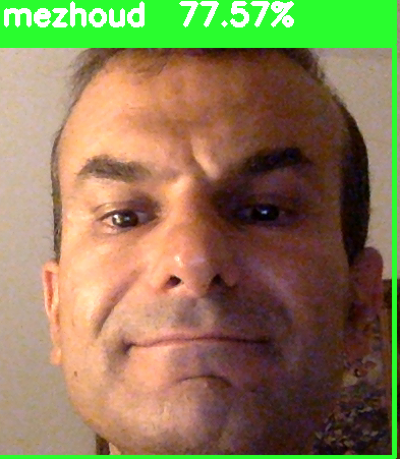

```{r setup, include=FALSE}
knitr::opts_chunk$set(echo=TRUE, error=TRUE, warning =TRUE, results = "hide")
knitr::opts_chunk$set(fig.width=12, fig.height=8) 
```

## Structure of the folder
```
├── detect_face_get_X_Images.py*
├── haarcascade_frontalface_default.xml*
├── images_known_faces.Rmd*
├── images_known_faces.html*
├── recognise_faces_by_trained_model.py*
├── screenshot.png*
└── train_model_from_dataSet.py*
```

## Output example



## set python version and anaconda environment
```{r}
reticulate::use_python("/Users/Mezhoud/venv/bin/python3", required = TRUE)
reticulate::py_config()
```


```{r}
setwd("/Volumes/DATA/learn_by_example/face_recognition/dataset_generator_trained_model/")
```

# Detect and shut images by webcam

```{python , results='hide'}
####################################################
# Modified by Nazmi Asri                           #
# Original code: http://thecodacus.com/            #
# All right reserved to the respective owner       #
####################################################

# Import OpenCV2 for image processing
import cv2
import os
import glob

def assure_path_exists(path):
    dir = os.path.dirname(path)
    if not os.path.exists(dir):
        os.makedirs(dir)
        
def detectAndDisplay(frame):
    frame_gray = cv.cvtColor(frame, cv.COLOR_BGR2GRAY)
    frame_gray = cv.equalizeHist(frame_gray)

# Start capturing video
vid_cam = cv2.VideoCapture(0)

# Detect object in video stream using Haarcascade Frontal Face
face_detector = cv2.CascadeClassifier('haarcascade_frontalface_default.xml')

# For each person, one face id
face_id = 1

# Initialize sample face image
count = 0

assure_path_exists("dataSet/")

# Start looping
while(True):

    # Capture video frame
    _, image_frame = vid_cam.read()

    # Convert frame to grayscale
    gray = cv2.cvtColor(image_frame, cv2.COLOR_BGR2GRAY)
            
    # Detect frames of different sizes, list of faces rectangles
    faces = face_detector.detectMultiScale(gray, 1.3, 5)

    # Loops for each faces
    for (x,y,w,h) in faces:

        # Crop the image frame into rectangle
        cv2.rectangle(image_frame, (x,y), (x+w,y+h), (255,0,0), 2)

        # Increment sample face image
        count += 1

        # Save the captured image into the datasets folder
        cv2.imwrite("dataSet/User." + str(face_id) + '.' + str(count) + ".jpg", gray[y:y+h,x:x+w])

        # Display the video frame, with bounded rectangle on the person's face
        cv2.imshow('frame', image_frame)
        # Wait 5 seconds to take the next capture
        cv2.waitKey(1)
  
    # To stop taking video, press 'q' for at least 100ms
    if   0xFF == ord('q'):
        break
    # If image taken reach 100, stop taking video
    elif count>20:
        # Stop video
        vid_cam.release()
        # Close all started windows
        cv2.destroyAllWindows()
        break


```

```{bash}
#pip install pillow
```


# Train model for dataset

```{python}
import cv2
import os
import numpy as np
from PIL import Image

# Create Local Binary Patterns Histograms for face recognization
recognizer = cv2.face.LBPHFaceRecognizer_create()

# Using prebuilt frontal face training model, for face detection
detector = cv2.CascadeClassifier("haarcascade_frontalface_default.xml");

def getImagesAndLabels(path):
    #get the path of all the files in the folder
    imagePaths=[os.path.join(path,f) for f in os.listdir(path)] 
    #create empth face list
    faceSamples=[]
    #create empty ID list
    Ids=[]
    #now looping through all the image paths and loading the Ids and the images
    for imagePath in imagePaths:
        #loading the image and converting it to gray scale
        pilImage=Image.open(imagePath).convert('L')
        #Now we are converting the PIL image into numpy array
        imageNp=np.array(pilImage,'uint8')
        #getting the Id from the image
        #Id=int(os.path.split(imagePath)[-1].split(".")[0])
        Id = int(imagePath.split('.')[1])
        # extract the face from the training image sample
        faces=detector.detectMultiScale(imageNp)
        #If a face is there then append that in the list as well as Id of it
        for (x,y,w,h) in faces:
            faceSamples.append(imageNp[y:y+h,x:x+w])
            Ids.append(Id)
    return faceSamples,Ids


faces,Ids = getImagesAndLabels('dataSet')
recognizer.train(faces, np.array(Ids))
recognizer.save('models/trained_model.yml')
```


# Detect recognised faces using trained model

```{python}
####################################################
# Modified by Nazmi Asri                           #
# Original code: http://thecodacus.com/            #
# All right reserved to the respective owner       #
####################################################

# Import OpenCV2 for image processing
import cv2
import glob
# Import numpy for matrices calculations
import numpy as np

import os 

def assure_path_exists(path):
    dir = os.path.dirname(path)
    if not os.path.exists(dir):
        os.makedirs(dir)


def getNames_Ids(path):
    #get the path of all the files in the folder
    imagePaths=[os.path.join(path,f) for f in os.listdir(path)] 
    #create empth face list
    names=[]
    #create empty ID list
    Ids=[]
    
    #now looping through all the image paths and loading the Ids and the images
    for imagePath in imagePaths:
        #loading the image and converting it to gray scale
        #pilImage=Image.open(imagePath).convert('L')
        #Now we are converting the PIL image into numpy array
        #imageNp=np.array(pilImage,'uint8')
        #getting the Id from the image
        #Id=int(os.path.split(imagePath)[-1].split(".")[0])
        Id = int(imagePath.split('.')[1])
        # get the name
        name = str(os.path.basename(imagePath).split('.')[0])
        # extract the face from the training image sample
        #faces=detector.detectMultiScale(imageNp)
        #If a face is there then append that in the list as well as Id of it
        Ids.append(Id)
        names.append(name)
        
    return names,Ids


# Create Local Binary Patterns Histograms for face recognization
recognizer = cv2.face.LBPHFaceRecognizer_create()

assure_path_exists("models/")

# Load the trained mode
recognizer.read('models/trained_model.yml')

# Load prebuilt model for Frontal Face
cascadePath = "haarcascade_frontalface_default.xml"

# Create classifier from prebuilt model
faceCascade = cv2.CascadeClassifier(cascadePath);

# Set the font style
font = cv2.FONT_HERSHEY_SIMPLEX

# get names for  Ids
names, Ids = getNames_Ids('dataSet')

# Initialize and start the video frame capture
cam = cv2.VideoCapture(0)

# Loop
while True:
    # Read the video frame
    ret, im =cam.read()

    # Convert the captured frame into grayscale
    gray = cv2.cvtColor(im,cv2.COLOR_BGR2GRAY)

    # Get all face from the video frame
    faces = faceCascade.detectMultiScale(gray, 1.2,5)
    
    # For each face in faces
    for(x,y,w,h) in faces:

        # Create rectangle around the face
        cv2.rectangle(im, (x-20,y-20), (x+w+20,y+h+20), (0,255,0), 4)
         
        # Recognize the face belongs to which ID
        Id, confidence = recognizer.predict(gray[y:y+h,x:x+w])
        
        # get Name
        name = names[Ids.index(Id)]
        
        # Check the ID if exist 
        text = str(name + "  {0:.2f}%").format(round(100 - confidence, 2))

        # Put text describe who is in the picture
        cv2.rectangle(im, (x-22,y-90), (x+w+22, y-22), (0,255,0), -1)
        cv2.putText(im, text,  (x,y-40), font, 1, (255,255,255), 3)

    # Display the video frame with the bounded rectangle
    cv2.imshow('Capture',im) 

    # If 'q' is pressed, close program
    if cv2.waitKey(1) & 0xFF == ord('q'):
        break
# Stop the camera
cam.release()
# Close all windows
cv2.destroyAllWindows()

        
```

