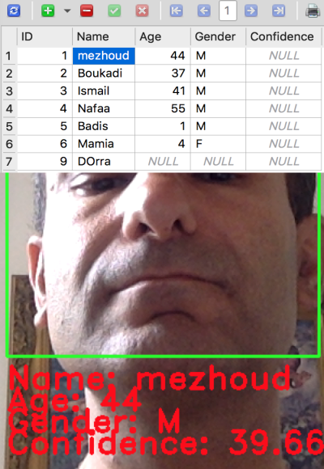

```{r setup, include=FALSE}
knitr::opts_chunk$set(echo=TRUE, error=TRUE, warning =TRUE)
knitr::opts_chunk$set(fig.width=12, fig.height=8) 
```

## Structure of the folder

```
├── dataSet
│   ├── Badis.5.1.jpg
|.. ├── ....
├── models
│   └── trained_from_sqliteDB.yml
├── FaceDataBase.db
├── faceDataBaseGenerator.py
├── faceDataBase_Detector.py
├── faceDataBase_trainer.py
├── haarcascade_eye.xml
└── haarcascade_frontalface_default.xml
```

## Example of output




1. The `faceDataBaseGenerator` receive in inputs the `Id` and the `name` of new detected face from a webcam. And take 20-30 images from this face. It should be ONLY one face in front of the webcam at the time, to avoid confusing between `Ids` and faces. The script same images to `dataSet` folder and corresponding features like `Ids` and `names`  to sqlite database.

2. The `faceDataBase_trainer` train tge model usig `recognizer = cv2.face.LBPHFaceRecognizer_create()` and save the model to `models` folder.

3. The `faceDataBase_Detector` gets faces profiles from database and compaire them to live webcam detected faces. If confidence is greater that a threshold (0.7), the script associate detected face to selected profile.