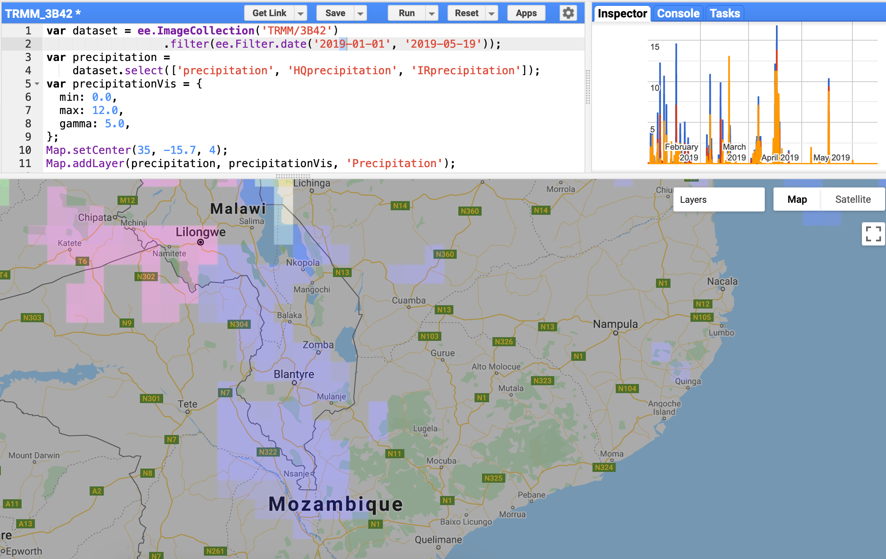
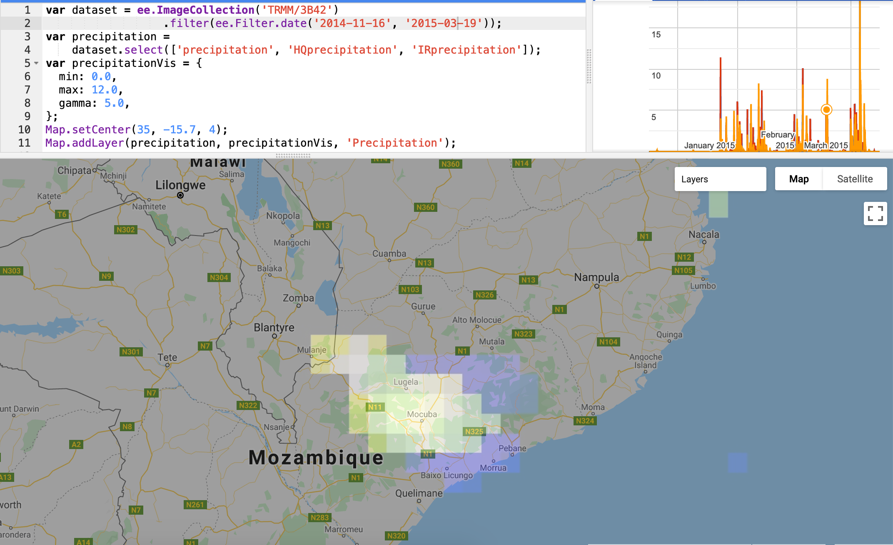

```{r}
# Set python environment and version in RStudio ;-)
reticulate::use_python("/Users/Mezhoud/anaconda3/bin/python3", required = TRUE)
reticulate::py_config()
```


```{r include=FALSE}
library(tidyverse)
library(data.table)
library(leaflet)
library(stringr)
#require(maps)
library(ggplot2)
#require(mapview)
require(scales)
require(RColorBrewer)
require(lubridate)
library(plotly)
require(gganimate)
#require(gifski)
library(caret)
```

```{r}
Train <- fread("Train.csv")
Train <- Train %>%
  rename(`Altitude (m)` = elevation) %>%
  rename(Longitude = X) %>%
  rename(Latitude = Y) %>%
  separate(Square_ID, into = c("Square_ID", "v1", "v2", "v3", "v4"), sep = "-" , remove = FALSE) %>%
  unite("other", v1, v2,v3, v4, sep = "-") %>%
  select(Longitude,Latitude,`Altitude (m)`,  LC_Type1_mode,Square_ID, other , everything()) 
  #filter(row_number()==1 )
Train %>% head()
```


- X, Y coordinates correspond to longitude and latitude.


## Delimitate the area of the study


```{r, fig.height=4, fig.width=10}
lng1 <- min(Train$Longitude)
lng2 <- max(Train$Longitude)

lat1 <- min(Train$Latitude)
lat2 <- max(Train$Latitude)
  
leaflet(Train) %>%
  addTiles() %>%
  setView(lng = (lng1+lng2)/2, lat = (lat1+lat2)/2, zoom = 8.4) %>%
    addRectangles(
    lng1= lng1, lat1= lat1,
    lng2= lng2, lat2=lat2,
    fillColor = "transparent"
  )

  #addProviderTiles("providers$Esri.NatGeoWorldMap") %>%    # "CartoDB.Positron"
  #addMarkers(~X, ~Y,
  #           popup = ~LC_Type1_mode, label = ~Square_ID,
  #           clusterOptions = markerClusterOptions())

```

# Glimpse to Hydrology, Elevation, Landscover, and Population Maps

- [Source](http://www.masdap.mw/search/?title__icontains=malawi&limit=5&offset=0)

```{r, fig.height=6 , fig.width= 10}


Hydrology <- EBImage::readImage("Hydrology_bib.png")
Elevation <- EBImage::readImage("elevation_bib.png")
Landcover <- EBImage::readImage("LandCover_bib.png")
Population <- EBImage::readImage("Population_bib.png")

par(mfrow=c(2,2))
plot(Elevation)
title("Elevation")
plot(Landcover)
title("Landscovers")
plot(Hydrology)
title("Hydrology")
plot(Population)
title("Population")

```

## Glimpse on the Altitude (Elevation) and Type soil  in the region using train dataset 

### Soil Description

- The Color palette and the description of the Soil Name  are loaded from this [link](https://developers.google.com/earth-engine/datasets/catalog/MODIS_006_MCD12Q1).

```{r}

Soil_pal <- fread("LC_Type1_mode.csv")

#LC_type1_palette <- c("#05450a", "#086a10", "#54a708", "#78d203", "#009900", "#c6b044", "#dcd159", "#dade48", "#fbff13", "#b6ff05", "#27ff87", "#c24f44", "#a5a5a5", "#ff6d4c", "#69fff8", "#f9ffa4", "#1c0dff")

Soil_pal <- Soil_pal %>%
  rename(LC_Type1_mode = Value) %>%
  separate(Description, into = c("Soil Name", "Description"), sep = ":" , remove = FALSE) %>%
  mutate(`Soil Name` = as.factor(`Soil Name`))

Soil_pal
```


```{r}
## Color palette of Land Cover Type 1 (LC_Type1_mode)
require(scales)
scales::show_col(Soil_pal$Color)
```

```{r}
# preserve the order of levels as in the Soil_pal dataframe
#levels(Soil_pal$`Soil Name`) <- Soil_pal$`Soil Name`

#Create a custom color scale
require(RColorBrewer)
colors <- Soil_pal$Color
names(colors) <- Soil_pal$`Soil Name` 
colScale <- scale_colour_manual(name = "Soil Name", values = colors)

as.data.frame(colors)
```


```{r, fig.height=4, fig.width=10}

p1 <- Train %>%
  distinct(Square_ID, .keep_all = TRUE) %>%
  ggplot() +
  aes(x = Longitude, y = Latitude, colour = `Altitude (m)`) +
  geom_point(size = 5) +
  scale_colour_gradientn(colours = terrain.colors(10))

## add box to urban zone
p1bis <- p1 +
  geom_rect(aes(xmin = 34.95, xmax = 35.1, ymin = -15.71, ymax =-15.87),
               fill = "transparent", color = "black", size = 0.5) +
   geom_rect(aes(xmin = 35.05, xmax = 35.15, ymin = -16.52, ymax =-16.64),
               fill = "transparent", color = "black", size = 0.5) +
     geom_rect(aes(xmin = 34.8, xmax = 34.88, ymin = -15.98, ymax =-16.29),
               fill = "transparent", color = "black", size = 0.5) +
   geom_rect(aes(xmin = 35.39, xmax = 35.41, ymin = -15.77, ymax =-15.85),
               fill = "transparent", color = "black", size = 0.5) +
     geom_rect(aes(xmin = 35.38, xmax = 35.4, ymin = -15.24, ymax =-15.3),
               fill = "transparent", color = "black", size = 0.5) +
  ggtitle("Area Altitude distibution and Urban zone localisation")


p2 <- Train %>%
  distinct(Square_ID, .keep_all = TRUE) %>%
  left_join(Soil_pal, by = "LC_Type1_mode") %>%
  #filter(LC_Type1_mode == 13) %>%
  ggplot() +
  aes(x = Longitude, y = Latitude, colour = `Soil Name`) +   
  geom_point(size = 2) +
  colScale +
  #scale_colour_manual(values = unique(full$Color))  +
  geom_rect(aes(xmin = 34.95, xmax = 35.1, ymin = -15.71, ymax =-15.87),
               fill = "transparent", color = "black", size = 0.5) +
   geom_rect(aes(xmin = 35.05, xmax = 35.15, ymin = -16.52, ymax =-16.64),
               fill = "transparent", color = "black", size = 0.5) +
     geom_rect(aes(xmin = 34.8, xmax = 34.88, ymin = -15.98, ymax =-16.29),
               fill = "transparent", color = "black", size = 0.5) +
   geom_rect(aes(xmin = 35.39, xmax = 35.41, ymin = -15.77, ymax =-15.85),
               fill = "transparent", color = "black", size = 0.5) +
     geom_rect(aes(xmin = 35.38, xmax = 35.4, ymin = -15.24, ymax =-15.3),
               fill = "transparent", color = "black", size = 0.5) +
    ggtitle("Soil Name distibution and Urban zone localisation") 


gridExtra::grid.arrange( p1bis, p2, ncol = 2)
```

- We obtain similar plots compared to `Elevation` and `Landcover` plots from biblography.

- The right plot shows less Altitude of  the green dark area in the south of the Malawi.

- The right plot shows the Soil Name distribution. The Urban zone is indicated in grey color. The most large urban zone is the center of the region, loacted in `Croplands` Soil Name and in relative high altitude (more that 1000 m (yellow)). The four other urban zone are smaller are located in green area which can more exposed to flood.

## Omit text and axis from ggplot

```{r}

omit <- theme_bw() + theme(panel.border = element_blank(), panel.grid.major = element_blank(),
panel.grid.minor = element_blank(), axis.line = element_blank(), axis.text.x=element_blank(),axis.text.y=element_blank(), axis.ticks.x=element_blank(), axis.ticks.y=element_blank(), axis.title.x=element_blank(), axis.title.y=element_blank(), legend.title = element_blank(), legend.position = "none", plot.title =element_blank())

## omit all text, axes background from plot for image segmentation if any
soil <-  Train %>%
  ggplot() +
  aes(x = Longitude, y = Latitude, colour = `Altitude (m)`) +
  geom_point(size = 6) +
  scale_colour_gradient(low = "darkblue", high = "white")+
  omit
# Save image
invisible(ggsave("Soil.jpeg", plot = soil, dpi = 300))

```


## Preprocessing Train data

```{r}
new_train <- Train %>%
  gather(key = `Week of` , value = Pluviometry, 8:ncol(Train)) %>%
  mutate(`Week of` = str_extract(`Week of`, "\\d{4}-\\d{2}-\\d{2}") ) %>%
  mutate(`Week of` = as.Date(`Week of`, format= "%Y-%m-%d")) %>%
  mutate(Week = lubridate::week(`Week of`)) %>%
  mutate(Year = if_else(`Week of` <= "2015-03-15", 2015, 2019)) %>%
  group_by(Square_ID, Year) %>%
  mutate(cum_Pluvio = cumsum(Pluviometry)) %>%
  ungroup() %>%
  mutate(Target = if_else(Year == 2015, target_2015, 0)) %>%
  left_join(Soil_pal, by = "LC_Type1_mode") %>%
  rename(Soil_type = LC_Type1_mode) %>%
  mutate(`Target Range` = cut(Target, breaks= c(-Inf, 0, 0.25, 0.5, 0.75, 1) ,
                        labels=c("0", "Low" , "Middle" , "High", "Sure"))) %>%
  mutate(Height = cut(`Altitude (m)`, breaks= c( 44, 100 ,400, 650 ,750, 1000 , 2300 , 2804) ,
                        labels=c("R1","L1" , "L2" , "L3", "L4", "L5", "L6"))) %>%
  select(-target_2015)

new_train  %>% head
```

## Set Water bodies,  Permanent Wetland and Rivers areas with independent class even that have the same Altitude with other Soil Name

```{r}
new_train <- new_train %>%
     mutate(Height = cut(`Altitude (m)`, breaks= c( 44, 100 ,465,480, 700, 715,750, 1000 , 2300 , 2804) ,
                        labels=c("River1","L1" ,"River2" ,"L2" , "L3","L4", "L5", "L6", "L7"))) %>%
  mutate(Height = as.character(Height)) %>%
  mutate(Height = if_else(`Soil Name` == "Water Bodies", "Water", Height)) %>%
 mutate(Height = if_else(`Soil Name` == "Permanent Wetlands", "Wetlands", Height))%>%
  mutate(Height= if_else(Height == "L2" & Target >= 0.7, "River3", Height))

## Add River3 to Height L2 for 2019
SquareID_River3 <- new_train %>% filter(Year == 2015) %>% filter(Height == "River3") %>% distinct(Square_ID, .keep_all = FALSE)

new_train <-new_train %>%
    mutate(Height = if_else(Year == 2019 & Height == "L2" & Square_ID %in% SquareID_River3$Square_ID, "River3", Height)) 

```


## Visualize Pluviometry

```{r, fig.width=4, fig.width=4}
new_train %>%
  ggplot() +
  geom_line( aes(x = `Week of`, y = Pluviometry), color = "blue")+
  geom_line(aes(x = `Week of`, y = cum_Pluvio), color = "red")+
  geom_smooth(aes(x = `Week of`, y = cum_Pluvio), method = "gam", formula = y ~ s(x, bs = "cs"),  color = "black")+
  ylim(0, 400) +
  facet_wrap(Year ~., ncol = 2,scales = "free")
```


## Which Soil is more in flood?

```{r ,fig.width=10}
new_train %>%
  filter(Year == 2015) %>%
  mutate(wrap_mode = as.factor(if_else(Target == 0, "No Risk 2015", "With Risk 2015"))) %>%
  group_by(Soil_type, Height, `Soil Name`, wrap_mode)%>%
  summarise(Frequency = log(n())) %>% 
  ungroup() %>%
  mutate(Soil_Height = as.factor(paste0( Height, Soil_type))) %>%
  ggplot() +
  aes(x = Soil_Height, y= Frequency, fill = `Soil Name`) +
  geom_col() +
  facet_grid(wrap_mode ~ .)+
  theme(legend.position="bottom") 
  #scale_fill_viridis_d(option = "plasma")

  
```

## Weight for Soil/Height/Flood

```{r}
SoilHeight_weight <- new_train %>%
  #filter(Year == 2015) %>%
  mutate(wrap_mode = as.factor(if_else(Target == 0, "No Risk 2015", "With Risk 2015"))) %>%
  group_by(Soil_type, Height,  `Soil Name`, wrap_mode)%>%
  summarise(Frequency = log(n()))%>%
  ungroup() %>%
  mutate(Soil_Height = as.factor(paste0( Height, Soil_type))) %>%
 group_by(Soil_Height) %>%
  mutate(SumFreq= sum(Frequency)) %>%
  #group_by(wrap_mode, add=TRUE) %>%
  mutate(SoilHeight_Weight=Frequency/SumFreq) %>%
  ungroup() %>%
  select(Height, Soil_type, SoilHeight_Weight, wrap_mode ) %>%
  arrange(Height)
  
new_train <- new_train %>%
 mutate(wrap_mode = as.factor(if_else(Target == 0, "No Risk 2015", "With Risk 2015"))) %>%
   left_join(SoilHeight_weight, by = c("Height", "Soil_type", "wrap_mode"))

new_train %>% head
```

## Categorize elevation to set slopes and define how water moves in the environment

```{r, fig.height=4, fig.width=5}


new_train %>%
  filter(Year == 2015) %>%
  distinct(Square_ID, .keep_all = TRUE) %>%
  ggplot +
  geom_point(aes(x = Longitude, y = Latitude, color = Height)) + #
  geom_point(data = subset(new_train, Target > 0), aes(x = Longitude, y = Latitude,
                                                               colour = `Target Range`, shape = `Target Range`),
            size = 0.8, stroke = 0, shape = 16) +
  #scale_shape_manual(values=c(3, 16, 17, 23), labels = c("0.25", "0.5", "0.75", "1")) +
  scale_colour_manual(values = c( "blue"  ,"green" , "lightgreen" ,  "pink" ,"gold" ,"orange" , "darkorange1" ,"chocolate",   "cyan" ,"lightblue" , "darkseagreen1","darkseagreen1","darkorchid",  "red" ,  "azure2","burlywood1"),
                 labels = c("0.75", "L1", "L2", "L3", "L4","L5", "L6", "L7"  , "0.25", "0.5","River1", "River2","River3", "1", "Water" , "Wetlands" ),name = "Height/Target") +
ggtitle("Map Altitudes and Flood Risks: 7 Height levels and 4 Probabilities range risks") 
  #guides(size = guide_legend(title='Risk Range'))
```


## Target distribution

```{r}

  new_train %>%
  filter(Year == 2015) %>%
  distinct(Square_ID, .keep_all = TRUE) %>%
  mutate(wrap_mode = as.factor(if_else(Target == 0, "No Risk 2015", "With Risk 2015"))) %>%
  group_by(`Target Range`, wrap_mode) %>%
  summarise(Frequency = n()) %>%
  ungroup() %>%
  ggplot +
  aes(x = `Target Range`, y = Frequency, colour = `Target Range`) +
  geom_point()+
  facet_wrap(wrap_mode~ ., ncol = 2 , scales = "free") +
 scale_colour_manual(values = terrain.colors(6),labels = c( 0, 0.25, 0.5, 0.75, 1))+
  ggtitle("Flood Risk Distribution") 


#gridExtra::grid.arrange( p3, p2, nrow = 2)

```

We note:

- Unbalanced dataset by  class `0` without risk. We can reduce the size of class `0`, by omitting `Water body` area, and highest Altitude (>2300m).

- The surface with High risk range [0.75,1] is the lowest class, followed by Middle with probability between [0.5, 0.75].

- The proportion of area with no risk coverts the most important surface during the Flood 2015.

- We expect that these values will increase for surfaces with risk, if the pluviometry is higher during flood 2019.


# Deal with unbalanced dataset

```{r}
 # balanced_train <- new_train %>%
 #  filter(Year == 2015)  %>%
 #  #filter(Target== 0) %>%
 #  group_by(`Target Range`, Height) %>%
 #   sample_n(1000, replace = TRUE) %>%
 #  ungroup() %>%
 #  select(Longitude, Latitude, `Target Range`, `Altitude (m)`, Soil_type, Pluviometry, cum_Pluvio, Target, Height, SoilHeight_Weight)
 #   #filter(Target > 0) %>%
 #  # group_by(Height) %>%
 #  #summarise(n())
 # 
 # 
 #  balanced_train %>%
 #  mutate(wrap_mode = as.factor(if_else(Target == 0, "No Risk 2015", "With Risk 2015"))) %>%
 #  group_by(`Target Range`, wrap_mode) %>%
 #  summarise(Frequency = n()) %>%
 #  ungroup() %>%
 #  ggplot +
 #  aes(x = `Target Range`, y = Frequency, colour = `Target Range`) +
 #  geom_point()+
 #  facet_wrap(wrap_mode~ ., ncol = 2 , scales = "free") +
 # scale_colour_manual(values = terrain.colors(6),labels = c( 0, 0.25, 0.5, 0.75, 1))+
 #  ggtitle("Flood Risk Distribution (Balanced)") 
```

## Flood Zone and Pluviomtery: 2015 versus 2019

```{r, fig.height=4, fig.width=10}


Square_ID_F <- new_train %>%
 filter(`Week of` <= "2015-03-15") %>%
  #filter(Target  > 0) %>%
  select(Square_ID) %>%
  unique() 

new_train %>%
 filter(Square_ID %in% Square_ID_F$Square_ID) %>%
  group_by(Year)%>%
  filter(`Week of` == max(`Week of`))%>%
  ggplot() +
  aes(x = Longitude, y = Latitude) +
  geom_point(aes(colour = cum_Pluvio, size = Target)) +  #  , size = target_2015
   scale_colour_gradientn(colours = c("red","darkblue","blue","lightblue","white"),
                         values = c(1.0,0.8,0.6,0.4,0.2,0)) +
  #geom_point(data = subset(new_train, is.na(Target)), aes(size = 0, colour = cum_Pluvio)) +
  scale_size(name =  "Target",
             breaks = c(0, 0.5, 1, 2)) +
   facet_wrap(Year ~., ncol = 2, scales = "free") +
    geom_rect(aes(xmin = 34.95, xmax = 35.1, ymin = -15.71, ymax =-15.87),
               fill = "transparent", color = "black", size = 0.5) +
   geom_rect(aes(xmin = 35.05, xmax = 35.15, ymin = -16.52, ymax =-16.64),
               fill = "transparent", color = "black", size = 0.5) +
     geom_rect(aes(xmin = 34.8, xmax = 34.88, ymin = -15.98, ymax =-16.29),
               fill = "transparent", color = "black", size = 0.5) +
   geom_rect(aes(xmin = 35.39, xmax = 35.41, ymin = -15.77, ymax =-15.85),
               fill = "transparent", color = "black", size = 0.5) +
     geom_rect(aes(xmin = 35.38, xmax = 35.4, ymin = -15.24, ymax =-15.3),
               fill = "transparent", color = "black", size = 0.5) +
  ggtitle("Flood Zone during 2015 and Cumulative Pluviometry Maps ")


```

- Depending only on cumulative pluviometry we expect to have more flood surface during 2019 compared to flood  during 2015.

- Cumulative pluviomtery of the same zone during 2019 is higher (2 times) that those of 2015.

- The Flood seems to be more invasive and the water will reach  higher altitude and more area.


# Random Forest modeling of  Flood Zone Probability 

```{r}
# library(randomForest)
# train_2015 <- balanced_train %>%
#   #filter(Year == 2015) %>%
#   rename(Altitude = `Altitude (m)`) %>%
#   mutate(Altitude = log(Altitude)) %>%
#   mutate(Height = as.numeric(as.factor(Height))) %>%
#   select(Longitude, Latitude, Altitude, Target, Soil_type, cum_Pluvio, Pluviometry, Height, SoilHeight_Weight)
# 
# 
# rf_model <- randomForest(Target ~  Longitude +Latitude + Soil_type + cum_Pluvio + Altitude + Pluviometry + Height + SoilHeight_Weight + 
#                            Target_Range ,
#                          data = train_2015,
#                          ntree=500)
# 
# load("rf_model.RData")
# save(rf_model, file ="rf_model.RData")
# 
# summary(rf_model)

```

- The flood zone probability has high correlation with `Cumulative Pluviometry`, `Soil Name` , and `Altitude`.

- Predict Flood zone probability during 2019.

```{r}
# train_2019 <- new_train %>%
#    filter(Year == 2019) %>%
#   rename(Altitude = `Altitude (m)`) %>%
#     mutate(Altitude = log(Altitude)) %>%
#     mutate(Height = as.numeric(as.factor(Height))) %>%
#   select(Longitude, Latitude,Altitude, -Target, Soil_type, cum_Pluvio, Pluviometry, Height, SoilHeight_Weight)
#  # select(-Target, Altitude,  Soil_type, cum_Pluvio, Pluviometry)
# 
# target_2019 <- round(predict(rf_model, train_2019, type="response"), digits = 2)
# 
# 
# 
# summary(target_2019)
# 
# 
# new_train[new_train$Year == 2019,]$Target <- target_2019
```


## Visualize RF Prediction

```{r , fig.height=4, fig.width=10}

# new_train %>%
#  ggplot() +
#   aes(x = Longitude, y = Latitude) +  #, colour = cum_Pluvio
#   geom_point(aes(colour = Target, size = Target)) + 
#   #scale_colour_gradient(low = "blue", high = "red") +
#   scale_colour_gradientn(colours = c("red","darkblue","blue","lightblue","white"),
#                          values = c(1.0,0.75,0.5,0.25,0)) +
#    scale_size(name =  "Target",
#              breaks = c(0, 0.25, 0.5, 0.75, 1)) +
#   facet_wrap(Year ~., ncol = 2) +
#     geom_rect(aes(xmin = 34.95, xmax = 35.1, ymin = -15.71, ymax =-15.87),
#                fill = "transparent", color = "black", size = 0.5) +
#    geom_rect(aes(xmin = 35.05, xmax = 35.15, ymin = -16.52, ymax =-16.64),
#                fill = "transparent", color = "black", size = 0.5) +
#      geom_rect(aes(xmin = 34.8, xmax = 34.88, ymin = -15.98, ymax =-16.29),
#                fill = "transparent", color = "black", size = 0.5) +
#    geom_rect(aes(xmin = 35.39, xmax = 35.41, ymin = -15.77, ymax =-15.85),
#                fill = "transparent", color = "black", size = 0.5) +
#      geom_rect(aes(xmin = 35.38, xmax = 35.4, ymin = -15.24, ymax =-15.3),
#                fill = "transparent", color = "black", size = 0.5)+
#   ggtitle("Flood zone prediction (RF) during 2019: Prob = ft(Cumulative Pluviometry, Altitude, Pluviometry, Soil_type)")

```

- Random Forest prediction does not give a good predction. We expect to have larger flood zone than flood 2015.

- The disaster seems to be more invasive and mostly all the south will be flooded except zone with Altitude more than 2000 m


# Caret

Very time consuming!

```{r}
require(caret)

# set.seed(42)
# index <- createDataPartition(train_2015$Target, p = 0.7, list = FALSE)
# train_data <- train_2015[index, ]
# test_data  <- train_2015[-index, ]
# 
# set.seed(42)
# model_rf <- caret::train(Target ~ .,
#                          data = train_data,
#                          method = "rf",
#                          metric = "RMSE",
#                          preProcess = c("scale", "center"),
#                          trControl = trainControl(method = "repeatedcv", 
#                                                   number = 2, 
#                                                   repeats = 1, 
#                                                   verboseIter = TRUE)
#                          )
# 
# 
# save(model_rf, file ="model_caret_rf.RData")
# 
# final <- data.frame(actual = as.factor(as.character(test_data$Target)),
#                     pred = predict(model_rf, newdata = test_data, type = "raw"))
# 
# #final$predict <- as.factor(ifelse(final$pred >= 0.75, 1, 0))
# 
# #cm_original <- confusionMatrix(final$predict, final$actual)
# 
# target_2019 <- round(predict(model_rf, train_2019, type="raw"), digits = 2)
# 
# 
# 
# summary(target_2019)
# 
# 
# #new_train[new_train$Year == 2019,]$Target <- target_2019
```


# Round Target to (0,1)

```{r}
new_train01 <- new_train %>%
    mutate(Target = as.factor(if_else(Target >= 0.5, 1, 0)))%>%
    group_by(Square_ID) %>%
   mutate(meanPluv = mean(Pluviometry),
   medianPluv = median(Pluviometry),
   maxPluv = max(Pluviometry))%>%
   ungroup()

new_train01 %>%
  filter(Year == 2015)%>%
  group_by(Target) %>%
  summarise(nbr = n()) %>%
  ggplot() +
  aes(x = Target, y = nbr, fill= Target) +
  geom_col()

```


```{r}
new_train01 %>%
#mutate(Target = as.factor(Target)) %>%
filter(Year == 2015) %>%
  ggplot +
  geom_point(aes(x = Longitude, y = Latitude, color = Height)) +
  geom_point(#data = subset(new_train, Target == 1), 
             aes(x = Longitude, y = Latitude, color = Target, shape = Target),
             size = 0.6, stroke = 0, shape = 19) +
  scale_colour_manual(values = c( "lightblue" ,  "red" , "green" , "lightgreen" ,  "pink" ,"gold" ,"orange" , "darkorange1" ,"chocolate", "darkseagreen1","darkseagreen1","darkorchid" ,  "azure2","burlywood1"),
                  labels = c( "0", "1", "L1", "L2", "L3", "L4","L5", "L6", "L7" , "River1", "River2","River3", "Water" , "Wetlands" ),                   name = "Height/Target") 
```


## Add target Range variable to 2019
```{r}

Target_Range_vs_XY_2015 <- new_train01 %>%
                                    filter(Year == 2015) %>%
                                    distinct(Square_ID, .keep_all = TRUE) %>%
                                    select(Square_ID,`Target Range`)

Train_2019 <- new_train01 %>%
                          filter(Year == 2019) %>%
                          select(-`Target Range`)


Train_2019_TR <- Train_2019 %>%
                left_join(Target_Range_vs_XY_2015, by = "Square_ID")

new_train01[new_train01$Year == 2019,]$`Target Range` <- Train_2019_TR$`Target Range`

new_train01[new_train01$Year == 2019,] %>% head
```

## Save Train2015 and test2019 dataset for Python
```{r}

dataset2019 <- new_train01 %>%
  select(Longitude, Latitude,`Week of` , Week, `Altitude (m)`, 
         Soil_type, Square_ID, Pluviometry, cum_Pluvio, Target,
         `Target Range`, Height, SoilHeight_Weight, meanPluv, medianPluv, maxPluv) %>%
  rename(weeks = `Week of`) %>%
  filter(weeks > "2015-03-30") %>%
  rename(Altitude = `Altitude (m)`) %>%
  mutate(Altitude = log(Altitude)) %>%
  rename(Target_Range = `Target Range`) %>%
  mutate(Target_Range = as.numeric(Target_Range) -1) %>%
  mutate(Height = as.numeric(as.factor(Height)) - 1)


fwrite(dataset2019, "dataset2019.csv")

head(dataset2019)
```


# Animated Pluviometry of 2015 and 2019

```{r, fig.height= 14, fig.width= 14}
new_train %>%
  filter(`Week of` <= "2015-04-15") %>%
  ggplot() +
  aes(x = Longitude, y = Latitude, colour = cum_Pluvio) +
  geom_point(size = 4) +
  #geom_point( aes(x = Longitude, y = Latitude, colour = Target))+ # data = subset(new_train[new_train$Target > 0.75,]),
  #scale_colour_gradient(low = "blue", high = "red") +
  #scale_colour_gradientn(colours = rainbow(3))+
  scale_colour_gradientn(colours = c("red","darkblue","blue","lightblue","white"),
                         values = c(1.0,0.8,0.6,0.4,0.2,0)) +
#scale_colour_gradientn(colours = c("blue","lightblue","white"),
 #                        values = c(1.0,0.5,0)) +

  facet_wrap(`Week of` ~., ncol = 4 ) +
  ggtitle("Cumulative Pluviometry of 2015 before Flood") 
```

```{r, fig.height= 14, fig.width= 14}
new_train %>%
  filter(`Week of` > "2015-03-15") %>%
  ggplot() +
  aes(x = Longitude, y = Latitude, colour = cum_Pluvio) +
  geom_point(size = 4) +
  #scale_colour_gradient(low = "blue", high = "red") +
  scale_colour_gradientn(colours = c("red","darkblue","blue","lightblue","white"),
                         values = c(1.0,0.8,0.6,0.4,0.2,0)) +
  facet_wrap(`Week of` ~., ncol = 4 ) +
  ggtitle("Cumulative Pluviometry of 2019 before Flood") 
```

- The train (2014-2015) and the test (2019) have the same period (17 weeks) but not the same season (2014-Nov : 2015-March, Jan-2019 : May-2019). 

- Pluviometry during 2019 is two times more that pluviometry during 2015. 

## Google Earth Engine Precipitation view

We used Google Earth Engine to see pluvimmetry before Flood 2015 and 2019 around the south of Malawi. 





## Get animated Cumulative Pluviometery

```{r,  message = FALSE, warning = FALSE, results = FALSE}
# require(gganimate)
# 
# goo <- new_train %>%
#   filter(`Week of` <= "2015-03-15") %>%
#   ggplot() +
#   aes(x = Longitude, y = Latitude, colour = cum_Pluvio) +
#   geom_point(size = 4) +
#   #scale_colour_gradient(low = "blue", high = "red") +
#   scale_colour_gradientn(colours = c("blue","lightblue","white"),
#                          values = c(1.0,0.5,0)) +
#   #facet_wrap(`Week of` ~., ncol = 3 ) +
#   transition_time(`Week of`) +
#   labs(title = "Day: {frame_time}")
# 
# # foo <- new_train %>%
# #   filter(`Week of` > "2015-03-15") %>%
# #   ggplot() +
# #   aes(x = Longitude, y = Latitude, colour = Pluviometry) +
# #   geom_point(size = 4) +
# #   #facet_wrap(`Week of` ~., ncol = 3 ) +
# #   transition_time(`Week of`) +
# #   labs(title = "Day: {frame_time}")
# 
# 
# ## get and save animation
# nframes <- length(unique(goo$data$`Week of`)) * 7
# ani_goo <- animate(goo, nframes = nframes, fps = 10)
# png_files <- list.files(".", pattern = ".*png$", full.names = TRUE)
# require(gifski)
# #gifski(png_files, gif_file = "ani_goo.gif", width = 800, height = 600, delay = 1)
# #invisible(file.remove(png_files, ))
# 
# #animate(goo, renderer = ffmpeg_renderer(format = "webm"))
# #animate(foo, renderer = ffmpeg_renderer(format = "webm"))
```


[link](https://towardsdatascience.com/animating-your-data-visualizations-like-a-boss-using-r-f94ae20843e3)

```{r}
# require(plotly)
# 
# new_train %>%
#   filter(`Week of` < "2014-12-14") %>%
#   plot_ly(
#     x = ~Longitude, 
#     y = ~Latitude, 
#     #size = ~pop, 
#     color = ~Pluviometry, 
#     frame = ~ as.Date(`Week of`), 
#     text = ~`Week of`, 
#     hoverinfo = "text",
#     type = 'scatter',
#     mode = 'markers'
#   ) %>%
#   layout(
#     xaxis = list(
#       type = "log"
#     )
#   )


```


# Xgboost regression with Python

```{python}
import matplotlib
import matplotlib.pyplot as plt
import pandas as pd
import numpy as np
import seaborn as sns
from sklearn.model_selection import train_test_split
from collections import Counter
```

```{python}
train = pd.read_csv("dataset2015.csv")
test = pd.read_csv("dataset2019.csv")
train.head()
```

```{python}
Counter(train['Target_Range'])
```


```{python}

dic_range={0: "0", 1: "Low", 2 : "medium", 3:"High", 4:"Sure"}

plt.show(
plt.bar(range(len(dic_range)),list(Counter(train['Target_Range']).values()))
)
```

```{python}

# split Train and Test


# Separate minors and major Target_Range
train0 = train[train.Target_Range == 0]
train1 = train[train.Target_Range == 1]
train2 = train[train.Target_Range == 2]
train3 = train[train.Target_Range == 3]
train4 = train[train.Target_Range == 4]

from sklearn.utils import resample

# Upsample minority classes
train_0_downsampled = resample(train0, 
                                 replace= False,     # sample with replacement
                                 n_samples=19363,    # to match majority class
                                 random_state=123) # reproducible results
# 
# Upsample minority classes
#train_1_downsampled = resample(train1, 
#                                  replace=False,     # sample with replacement
#                                 n_samples=8024,    # to match majority class
#                                  random_state=123) # reproducible results                              


# Downsample majority class
train_2_upsampled = resample(train2, 
                                 replace=True,    # sample without replacement
                                 n_samples=19363,     # to match minority class
                                 random_state=123) # reproducible results
                                 
# Downsample majority class
train_3_upsampled = resample(train3, 
                                 replace= True,    # sample without replacement
                                 n_samples=19363,     # to match minority class
                                 random_state=123) #
                                 
# Downsample majority class
train_4_upsampled = resample(train4, 
                                 replace= True,    # sample without replacement
                                n_samples=19363,     # to match minority class
                                 random_state=123) #
                          
# Combine minority class with downsampled majority class
train_balanced = pd.concat([train_0_downsampled, train1, train_2_upsampled, train_3_upsampled, train_4_upsampled])


Counter(train_balanced['Target_Range'])
```

```{python}
train_balanced.columns
```

```{python}

ytrain = train.Target

xtrain = train.drop(['Target', 'Square_ID', 'weeks', 'Latitude', 'Longitude', 'meanPluv', 'medianPluv', 'maxPluv', 'Pluviometry'], axis=1)  # 

xtest = test.drop(['Target', 'weeks',  'Latitude', 'Longitude', 'meanPluv', 'medianPluv', 'maxPluv', 'Pluviometry'], axis=1) # 

## Dummy  variable levels is not better
# def prepare_data_for_model(raw_dataframe, target_columns, drop_first = True, make_na_col = False):
#     # dummy all categorical fields 
#     dataframe_dummy = pd.get_dummies(raw_dataframe, columns=target_columns, 
#                                      drop_first=drop_first, 
#                                      dummy_na=make_na_col)
#     return (dataframe_dummy)
#     
# 
# # create dummy features 
# xtrain_dum = prepare_data_for_model(xtrain, target_columns=['Soil_type', 'Height']) #, 'Nstage' : 3 classes
# xtrain_dum = xtrain_dum.dropna() 
# 
# # create dummy features for test
# xtest_dum = prepare_data_for_model(xtest, target_columns=['Soil_type', 'Height']) #, 'Nstage' : 4 classes
# xtest_dum = xtest_dum.dropna() 
# 
# xtrain_dum.head
```


```{python}
from sklearn.model_selection import train_test_split
import xgboost as xgb
import time


## Split 
trn_x, val_x, trn_y, val_y = train_test_split(xtrain , ytrain, random_state = 42, stratify = ytrain, test_size = 0.20) # 
```


```{python}
start_time = time.process_time()

clf = xgb.XGBRegressor(booster = 'gbtree',
                      objective = 'reg:logistic', # multi:softmax, multi:softprob  #'reg:squarederror',  # reg:linear reg:logistic binary:logistic
                      #num_class =  2,
                      max_depth = 10,
                      n_estimators = 10000,
                      min_child_weight = 9,
                      learning_rate = 0.01,
                      nthread = 8,
                      subsample = 0.80,
                      colsample_bytree = 0.80,
                      seed = 4242)


clf.fit(trn_x,
        trn_y,
        eval_set = [(val_x, val_y)],
        verbose = True,
        #verbose_eval= 10,  # print every 10 boost
        eval_metric = 'rmse', # rmse, logloss, mae, map, cox-nloglik
        early_stopping_rounds = 10)

print((time.process_time() - start_time)/60, "Minutes")
```


```{python}
# Predict
preds = clf.predict(val_x)

## Wich max prob
import numpy as np
best_preds = np.asarray([np.argmax(line) for line in preds])

# Determine the precision of this prediction:
from sklearn.metrics import precision_score
precision_score(val_y, best_preds, average='macro')
```


```{python}
#xtest = test.drop(['Target', 'weeks', 'Latitude', 'Longitude'], axis=1)
test_ID = xtest.Square_ID
xtest = xtest.drop('Square_ID', axis = 1)
pred_test = clf.predict(xtest)

```


```{python}
submission = pd.concat([pd.DataFrame(test_ID), pd.DataFrame(pred_test)], axis = 1)
submission.columns = ['Square_ID', 'pred']

submission.to_csv("pred_test.csv")
submission.head
```


## Visualize prediction

```{r}
pred_test <- fread("pred_test.csv")


new_train[new_train$Year == 2019,]$Target <- pred_test$pred

ggplot(new_train, aes(Target)) + geom_density()
ggplot(pred_test,aes(x=pred)) + geom_density()
```


```{r, fig.height=3, fig.width=5}
new_train %>%
  #filter(Year == 2019) %>%
  group_by(Year) %>%
  filter(`Week of` == max(`Week of`))%>%
  ungroup()%>%
  mutate(Height = as.factor(Height)) %>%
    ggplot +
  #geom_point(aes(x = Longitude, y = Latitude, colour = Height)) +
  geom_point(#data = subset(new_train, Target == 1), 
             aes(x = Longitude, y = Latitude, color = Target, shape = Target),
            size = 0.8, stroke = 0, shape = 16) +
  facet_wrap(Year~., ncol = 2)
  
```


```{r}
sub <- new_train %>%
  mutate(Square_ID = paste(Square_ID, other, sep = "-")) %>%
  filter(`Week of` >= "2019-05-07") %>%
  rename(target_2019 = Target ) %>%
  select(Square_ID,target_2019)

fwrite(sub, "sub.csv")


```