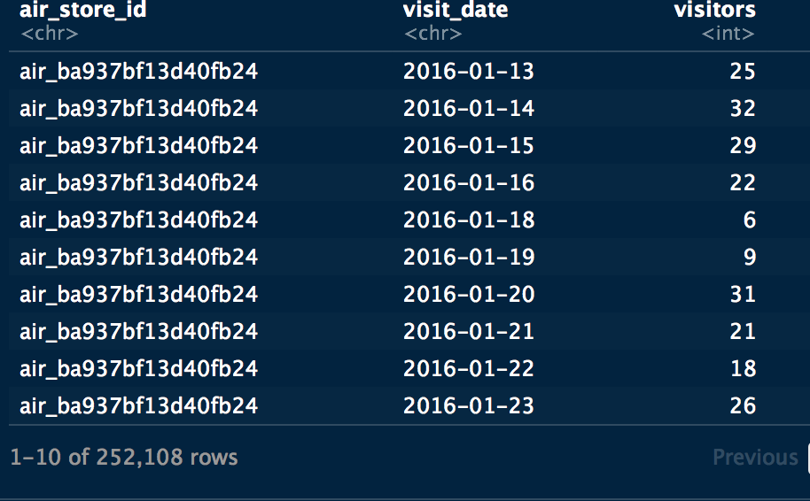
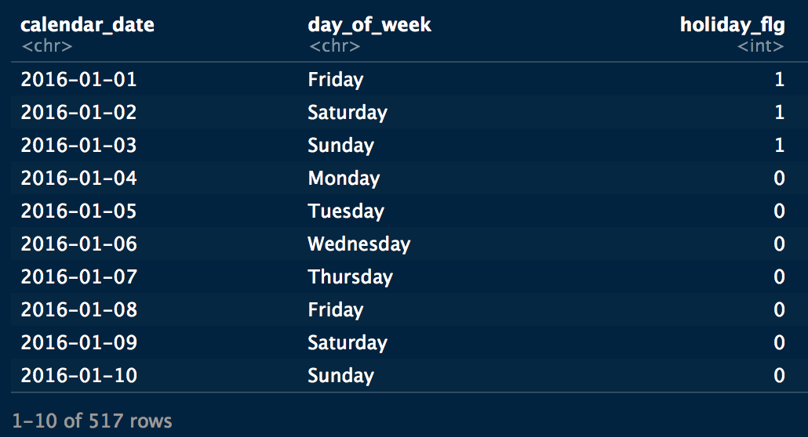
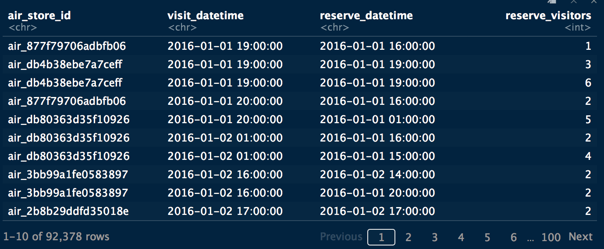
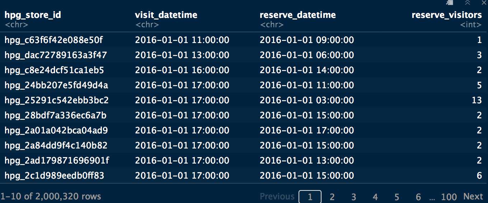
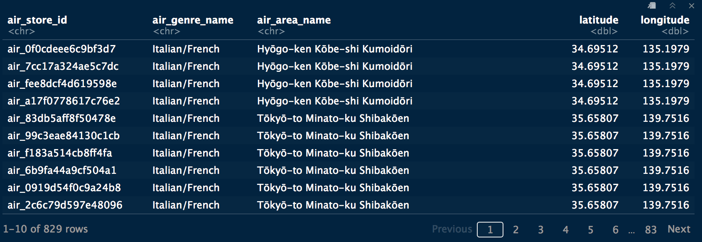
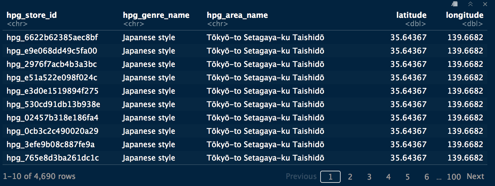
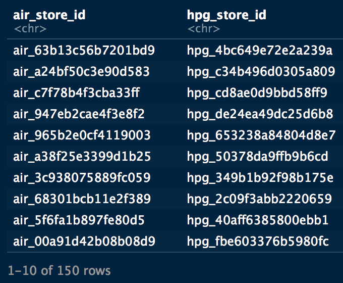
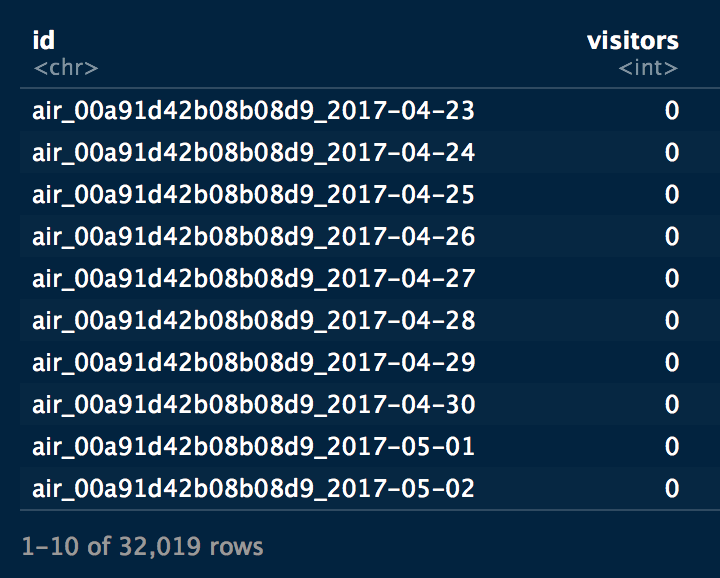

```{r setup, include=FALSE, echo=FALSE}
knitr::opts_chunk$set(echo=TRUE, error=FALSE)
```

# Introduction to the case study {.tabset .tabset-fade .tabset-pills}
This Case of study explores and analyses data sets of restaurants reservations and activities for two distant touristic area in Japan. The data set covers information of two years. 
The goal of this study is to predict restaurant activities depending of dataset history. The challenge is to decipher knowledge about the behaviors of the visitors in two distant areas depending in multiple parameter like weekend, holidays, whether, gender, kind of dishes and times.
The data set comes from kaggle competition named [Recruit restaurant visitor forecasting](https://www.kaggle.com/c/recruit-restaurant-visitor-forecasting). This tutorial is inspired from the winner of this competition which is [Heads or Tails](https://www.kaggle.com/headsortails). All respect and thanks for his work and data exploratory and analysis. It could be considered as a lesson for bigger on data analysis using R programming language. 

## Glimpse of the data sets 
The data comes in the shape of 8 relational files which are derived from two separate Japanese websites that collect user information: “Hot Pepper Gourmet (hpg): similar to Yelp” (search and reserve) and “AirREGI / Restaurant Board (air): similar to Square” (reservation control and cash register). The training data is based on the time range of Jan 2016 - most of Apr 2017, while the test set includes the last week of Apr plus May 2017." The test data intentionally spans a holiday week in Japan called the ‘Golden Week.’ The data description further notes that:”There are days in the test set where the restaurant were closed and had no visitors. These are ignored in scoring. The training set omits days where the restaurants were closed."


<div class = "row">
<div class = "col-md-6">
**air_visit_data.csv: N° visitors per store and per Date**

</div>

<div class = "col-md-6">
**date_info.csv: Essentially flags the Japanese holidays.**


</div>
</div>


<div class = "row">
<div class = "col-md-6">
**air_reserve.csv: Reservations and Visitors made through the air.**

</div>

<div class = "col-md-6">
**hpg_reserve.csv: Reservations and Visitors for hpg location.**

</div>
</div>


<div class = "row">
<div class = "col-md-6">
**air_store_info.csv: details about the air sotres including genre and location.**

</div>

<div class = "col-md-6">

**hpg_store_info.csv: details about the hpg stores including genre and location.**

</div>
</div>


<div class = "row">
<div class = "col-md-6">
**store_id_relation.csv: connects the air and hpg ids**


</div>

<div class = "col-md-6">

**sample_submission.csv: serves as the test set. The id is formed by combining the air id with the visit date.**


</div>

</div>


## Load librairies

```{r include=FALSE, echo=TRUE}
#library(readr)
library(tibble)
library('stringr') # string manipulation
library('data.table') # data manipulation
library(dplyr)
library(lubridate)
library(ggplot2)
library(grid)
library(leaflet)
library(tidyr)
library(ggExtra)
library(ggridges)
```


## Load data

```{r}
air_visit <- as_tibble(fread(str_c("air_visit_data.csv")))
air_reserve <- as_tibble(fread(str_c('air_reserve.csv'))) 
air_store_info <- as_tibble(fread(str_c('air_store_info.csv')))
date_info <- as_tibble(fread(str_c('date_info.csv')))
hpg_reserve <- as_tibble(fread(str_c('hpg_reserve.csv')))
hpg_store_info <- as_tibble((fread(str_c('hpg_store_info.csv'))))
sample_submission <- as_tibble(fread(str_c('sample_submission.csv')))
store_id_relation <- as_tibble(fread(str_c('store_id_relation.csv')))
```

## multiplot function

```{r}
# Define multiple plot function
#
# ggplot objects can be passed in ..., or to plotlist (as a list of ggplot objects)
# - cols:   Number of columns in layout
# - layout: A matrix specifying the layout. If present, 'cols' is ignored.
#
# If the layout is something like matrix(c(1,2,3,3), nrow=2, byrow=TRUE),
# then plot 1 will go in the upper left, 2 will go in the upper right, and
# 3 will go all the way across the bottom.
#
multiplot <- function(..., plotlist=NULL, file, cols=1, layout=NULL) {

  # Make a list from the ... arguments and plotlist
  plots <- c(list(...), plotlist)

  numPlots = length(plots)

  # If layout is NULL, then use 'cols' to determine layout
  if (is.null(layout)) {
    # Make the panel
    # ncol: Number of columns of plots
    # nrow: Number of rows needed, calculated from # of cols
    layout <- matrix(seq(1, cols * ceiling(numPlots/cols)),
                    ncol = cols, nrow = ceiling(numPlots/cols))
  }

 if (numPlots==1) {
    print(plots[[1]])

  } else {
    # Set up the page
    grid.newpage()
    pushViewport(viewport(layout = grid.layout(nrow(layout), ncol(layout))))

    # Make each plot, in the correct location
    for (i in 1:numPlots) {
      # Get the i,j matrix positions of the regions that contain this subplot
      matchidx <- as.data.frame(which(layout == i, arr.ind = TRUE))

      print(plots[[i]], vp = viewport(layout.pos.row = matchidx$row,
                                      layout.pos.col = matchidx$col))
    }
  }
}
```

# Overview: File structure and content {.tabset .tabset-fade .tabset-pills}

## Air visits
There are two mains functions to summarize a dataframe or tibble: 

* `summary`  is useful if with have data frame with numeric value. It computes and display the Min, Max, Media, mean, and quaters of each column. 

* `glimpse` commes from `tibble` package. It displays the summary of the dataset in other way.

```{r}
summary(air_visit)
# verify if is there a missing value
all(is.na(air_visit))
```


```{r}
tibble::glimpse(air_visit)
```


```{r}
# Print the distinct number of stores in air place 
air_visit %>% dplyr::distinct(air_store_id) %>% nrow()
# Print  the N° of distinct datetime for air place
air_visit %>% dplyr::distinct(visit_date) %>% nrow()
```

## Air Reserve

```{r}
summary(air_reserve)
# verify if is there a missing value
all(is.na(air_reserve))
```

```{r}
glimpse(air_reserve)
```


```{r}
# print the distinct store in air place that had reservation
air_reserve %>% dplyr::distinct(air_store_id) %>% nrow()
```
There are  314 of 829 stores that use reservation process in air space.
There are 252,108 reservation for 314 stores

## HPG Reserve

We apply the same code for hpg stores.
```{r}
summary(hpg_reserve)
# verify if is there a missing value
all(is.na(hpg_reserve))
```

```{r}
tibble::glimpse(hpg_reserve)
```

```{r}
# print the distinct store in hpg space
hpg_reserve %>% dplyr::distinct(hpg_store_id) %>% nrow()
```
There are 2,000,320 reservation for 13325 stores. In hpg space, it seems that all restaurants use reservation process. 

## Air Store informations:  genre and location

```{r}
summary(air_store_info)
# verify if is there a missing value
all(is.na(air_store_info))
```

```{r}
tibble::glimpse(air_store_info)
```


```{r}
# print the number of air area in air space
air_store_info %>% dplyr::distinct(air_area_name) %>% nrow()

# print the number of stores in air space
air_store_info %>% dplyr::distinct(air_store_id) %>% nrow()
```

```{r}
# print the number of latitude for stores in air space
air_store_info %>% dplyr::distinct(latitude) %>% nrow()
# print the number of longitude for stores in air space
air_store_info %>% dplyr::distinct(longitude) %>% nrow()
```


```{r}
# print the number of cuisine genre in air space
air_store_info %>% dplyr::distinct(air_genre_name) %>% nrow()
```

## HPG Stores informations: genre and locations

```{r}
summary(hpg_store_info)
# verify if is there a missing value
all(is.na(hpg_store_info))
```

```{r}
tibble::glimpse(hpg_store_info)
```

```{r}
# print le number of latitudes for hpg stores
hpg_store_info %>% dplyr::distinct(latitude) %>% nrow()
# print the number of longitudes for hpg stores
hpg_store_info %>% dplyr::distinct(longitude) %>% nrow()
```


```{r}
# print the number of area names in hpg space
hpg_store_info %>% dplyr::distinct(hpg_area_name) %>% nrow()
# print the number of genre of cuisine un HPG space
hpg_store_info %>% dplyr::distinct(hpg_genre_name) %>% nrow()
```

## Holidayes

```{r}
glimpse(date_info)
# verify if is there a missing value
all(is.na(date_info))
# print the number of days for all periode of this case study
date_info %>% dplyr::distinct(calendar_date) %>% nrow() %>% days()
# print the number of days with holidays
date_info %>% dplyr::distinct(calendar_date, holiday_flg) %>% filter(holiday_flg == "1") %>% nrow() 
```

## Store IDs

```{r}
glimpse(store_id_relation)
```
There are 150 relations between Air (829 stores) and HPG (4690 stores) stores.

## Sample Submission

```{r}
tibble::glimpse(sample_submission)
```

the submission file should be two columns. The first one is the concatenation of store_id and date. the 2sd is the number of visitors.

## Missing Values

```{r}
purrr::map(ls(), is.na)
```

## Reformating dataset
```{r}
# convert date from chracter to date type
air_visit <- air_visit %>% mutate(visit_date = ymd(visit_date))

# convert date_time from character to date_time type
air_reserve <- air_reserve %>% mutate(visit_datetime = ymd_hms(visit_datetime),
                                      reserve_datetime = ymd_hms(reserve_datetime))

# convert date_time from character to date_time type
hpg_reserve <- hpg_reserve %>% mutate(visit_datetime = ymd_hms(visit_datetime),
                                      reserve_datetime = ymd_hms(reserve_datetime))

# convert genre and area name as factor
air_store_info <- air_store_info %>% mutate(air_genre_name = as.factor(air_genre_name),
                                            air_area_name = as.factor(air_area_name))

# convert genre and area name as factor
hpg_store_info <- hpg_store_info %>% mutate(hpg_genre_name = as.factor(hpg_genre_name),
                                            hpg_area_name = as.factor(hpg_area_name))

# convert holiday flag as logical type
date_info <- date_info %>% mutate(holiday_flg = as.logical(holiday_flg),
                                  date = ymd(calendar_date))
```

# Individual feature visualisations {.tabset .tabset-fade .tabset-pills}

Here we have a first look at the distribution of the feature in our individual data files before combining them for a more detailed analysis.

## Air Visits space
```{r}
# distribution of the number of visits per date for air space
 p1 <- air_visit %>%
  group_by(visit_date) %>%
  summarise(all_visitors = sum(visitors)) %>%
  ggplot(aes(visit_date, all_visitors)) +
  geom_line(col = "blue") +
  labs(y = "All visitors", x = "Date")

# plot the density of the nulber of visitors per day (with log)
# 20 seems tobe the must frequent sum of visitors per day
 p2 <- air_visit %>%
   ggplot(aes(visitors)) +
   geom_vline(xintercept = 20, color ="red") +
   geom_histogram(fill = "blue", bins = 30) +
   #xlim(0,150)
   scale_x_log10()

 # plot the median of visitors per week day
 p3 <- air_visit %>%
   mutate(wday = wday(visit_date, label = TRUE)) %>%
   group_by(wday) %>%
   summarise(visits = median(visitors)) %>%
   ggplot(aes(wday, visits, fill = wday)) +
   geom_col() +
   theme(legend.position = "none") +
   labs(x = "Day of the week", y = "Median Visitors")

 # plot the median of visitors per months
 p4  <- air_visit %>%
   mutate(Month = month(visit_date, label = TRUE)) %>%
   group_by(Month) %>%
   summarise(visits = median(visitors)) %>%
   ggplot(aes(Month, visits, fill = Month)) +
   geom_col() +
   theme(legend.position = 'none') +
   labs(x = "MOnth", y = "Median Visitors")

 # plot P1, P2, P3, p4 in the same plot
 layout <- matrix(c(1,1,1,1,2,3,4,4), 2, 4, byrow = TRUE)
 multiplot(p1, p2, p3, p4, layout=layout)
```


We will be forecasting for the last week of April plus May 2017, so let’s look at this time range in our 2016 training data:

```{r}

# chech if is there holidays in period that will be predicted 
holydays <- date_info %>%
  filter(calendar_date > ymd("2016-04-15") & calendar_date < ymd("2016-06-15"), holiday_flg)

# plot the number of visitors per day for the periode from 2016-04-15 to 2016-06-15 wich corresponds to the same periode that we will predict

air_visit %>%
  filter(visit_date > ymd("2016-04-15") & visit_date < ymd("2016-06-15")) %>%
  group_by(visit_date) %>%
  summarise(all_visitors = sum(visitors)) %>%
  ggplot(aes(visit_date, all_visitors)) +
  geom_line() +
  geom_smooth(method = "loess", color = "blue", span = 1/10) +
  labs(y = "All visitors", x = "Date") +
  geom_vline(xintercept = holydays$date, color ="red") 

```

There are 3  holidays that match with a global increase of visits in all air space.

## Air Reservations

```{r}
# split date_time to date, hour and weekday for visits and reservations
foo <- air_reserve %>%
  mutate(reserve_date = date(reserve_datetime),
         reserve_hour = hour(reserve_datetime),
         reserve_wday = wday(reserve_datetime, label = TRUE),
         visit_date = date(visit_datetime),
         visit_hour = hour(visit_datetime),
         visit_wday = wday(visit_datetime, label = TRUE),
         diff_hour = time_length(visit_datetime - reserve_datetime, unit = "hour"),
         diff_day = time_length(visit_datetime - reserve_datetime, unit = "day"))

# plot visits per date
  p1 <- foo %>%
  group_by(visit_date) %>%
  summarise(all_vitisors = sum(reserve_visitors)) %>%
  ggplot(aes(visit_date, all_vitisors)) +
  geom_line() +
  labs(x = "Air visit date")

  # plot visits per time (hour)
  p2 <- foo %>%
    group_by(visit_hour) %>%
    summarise(all_visitors = sum(reserve_visitors)) %>%
    ggplot(aes(visit_hour, all_visitors)) +
    geom_col(fill = "blue") +
    labs(x = "Time from reservation to visit [hours]")

  # plot density of reservation delay
  p3 <- foo %>%
    # limite reservation delay to 7 days
    filter(diff_hour < 24 *7) %>%
    group_by(diff_hour) %>%
    summarise(all_visitors = sum(reserve_visitors)) %>%
    ggplot(aes(diff_hour, all_visitors)) +
    geom_col(fill= "blue") +
    labs(x = "Time from reservation (hours)", y = "all_visitors")

  # plot muliple plot
  layout <- matrix(c(1, 1, 2, 3), 2, 2, byrow = TRUE)
  multiplot(p1, p2, p3, layout = layout)
```

## HPG Reservation exploration

```{r}
# split date_time to date, hour, week day
too <- hpg_reserve %>%
  mutate(visit_date = date(visit_datetime),
         visit_hour = hour(visit_datetime),
         visit_wday = wday(visit_datetime),
         reserve_date = date(reserve_datetime),
         reserve_hour = hour(reserve_datetime),
         reserve_wday = wday(reserve_datetime),
         diff_hour = time_length(visit_datetime - reserve_datetime, unit = "hour"),
         diff_day = time_length(visit_datetime - reserve_datetime, unit = "day")
         )

# plot visits per date
p1 <- too %>%
  group_by(visit_date) %>%
  summarise(all_visitors = sum(reserve_visitors)) %>%
  ggplot(aes(visit_date, all_visitors)) +
  geom_line()

# plot visits per time (hour)
p2 <- too %>%
  group_by(visit_hour) %>%
  summarise(all_visitors = sum(reserve_visitors)) %>%
  ggplot(aes(visit_hour, all_visitors)) +
  geom_col(fill="red")

# plot the density of the delay of reservation
p3 <- too %>%
  group_by(diff_hour) %>%
  summarise(all_visitors = sum(reserve_visitors)) %>%
  ggplot(aes(diff_hour, all_visitors)) +
  geom_col(fill = "red") +
  xlim(0,150)

 layout <- matrix(c(1,1,2,3), 2, 2, byrow = TRUE)
 multiplot(p1, p2, p3, layout = layout)
```

## Air Store info exploration

```{r}
leaflet(air_store_info) %>%
  addTiles() %>%
  addProviderTiles("CartoDB.Positron") %>%
  addMarkers(~longitude, ~latitude,
             popup = ~air_store_id, label = ~air_genre_name,
             clusterOptions = markerClusterOptions()
             )
```


```{r}
## plot the number of restaurant per area name (top 15)
p1 <- air_store_info %>%
  group_by(air_area_name) %>%
  count() %>%
  ungroup() %>%
  top_n(15,n) %>%
  ggplot(aes(reorder(air_area_name, n, FUN = min), n, fill = air_area_name )) +
  geom_col()+
  coord_flip()+
  theme(legend.position = "none") +
  labs(x= "Top 15 area (air_aera_name)", y ="Number restaurants")

# plot the number of the most frequente genre of restaurant
p2 <- air_store_info %>%
  group_by(air_genre_name) %>%
  count() %>%
  #ungroup() %>%
  top_n(15, n) %>%
  ggplot(aes(reorder(air_genre_name, n), n, fill = air_genre_name)) +
  geom_col() +
  coord_flip()+
  theme(legend.position = "none")

layout <- matrix(c(1,2), 2,1, byrow = TRUE)
multiplot(p1,p2, layout = layout)

```

## HPG Store ifo exploration

```{r}
# plot stores localisation
leaflet(hpg_store_info) %>%
  addTiles() %>%
  addProviderTiles("cartoDB.positron") %>%
  addMarkers(~longitude, ~latitude,
             popup = ~hpg_store_id, label = ~hpg_genre_name,
             clusterOptions = markerClusterOptions()
             )
```

```{r}
# plot the number of store by genre
p1 <- hpg_store_info %>%
  group_by(hpg_genre_name) %>%
  count() %>%
  ggplot(aes(reorder(hpg_genre_name, n, FUN = min), n, fill = hpg_genre_name)) +
  geom_col() +
  coord_flip() +
  theme(legend.position = "none") +
  labs(x = "Type of cuisine (hpg_genre_name)", y = "Number of hpg restaurants")

# plot stores per area name
p2 <- hpg_store_info %>%
  group_by(hpg_area_name) %>%
  count() %>%
  arrange(desc(n)) %>%
  head(15) %>%
  ggplot(aes(reorder(x = hpg_area_name, n, FUN = min), n, fill = hpg_area_name)) +
  geom_col() +
  coord_flip() +
  theme(legend.position = "none") +
  labs(x = "Top 15 areas (hpg_area_name)", y = "Number of hpg restaurants")

layout <- matrix(c(1,2), 1,2, byrow=TRUE)
multiplot(p1, p2, layout = layout)

```


## Holidays

```{r}
# plot the number of holidays
date_info %>%
  group_by(holiday_flg) %>%
  count() %>%
  ggplot(aes(x = holiday_flg, y = n, fill = holiday_flg)) +
  geom_col() +
  theme(legend.position = "none")

# plot days and holidays
date_info %>%
  filter(date  > ymd("2017-04-15") & date < ymd("2017-06-01")) %>%
ggplot(aes(x = date, y= holiday_flg, color = holiday_flg)) +
geom_point() +
  theme(legend.position = "none")
```

## Map date for training and testing

```{r}
air_visit_train <- air_visit %>%
  rename(date = visit_date) %>%
  distinct(date) %>%
  mutate(dset= "train")

air_visit_test <- sample_submission %>%
  tidyr::separate(id, c("foo","bar", "date"), sep = "_") %>%
  mutate(date = ymd(date)) %>%
  distinct(date) %>%
  mutate(dset = "test")

air_visit_train <- air_visit_train %>%
                   dplyr::bind_rows(air_visit_test)

year(air_visit_train$date) <- 2017

air_visit_train %>%
  filter(!is.na(date)) %>%
  mutate(year = forcats::fct_relevel(as.factor(year), c("2017","2016"))) %>%
  ggplot(aes(date, year, color = dset)) +
  geom_point(shape = "|", size = 10) +
  scale_x_date(date_labels = "%B", date_breaks = "1 month") +
  #scale_y_reverse() +
  theme(legend.position = "bottom", axis.text.x  = element_text(angle=45, hjust=1, vjust=0.9)) +
  labs(color = "Data set") +
  guides(color = guide_legend(override.aes = list(size = 4, pch = 15)))

```

# Feature relations

## Visitors per genre

```{r}
air_visit %>%
left_join(air_store_info, by = "air_store_id") %>%
  group_by(visit_date, air_genre_name) %>%
  summarise(mean_visitors = mean(visitors)) %>%
  ungroup() %>%
  ggplot(aes(visit_date, mean_visitors, color = air_genre_name)) +
  geom_line() +
  labs(y = "Average number of visitors to 'air' restaurants", x = "Date") +
  theme(legend.position = "none") +
  scale_y_log10() +
  facet_wrap(~ air_genre_name)
```


```{r}
# plot mean visitors par week day by genre cuisine
p1 <- air_visit %>%
left_join(air_store_info, by = "air_store_id") %>%
  mutate(wday = wday(visit_date, label = TRUE)) %>%
  group_by(wday, air_genre_name) %>%
 summarise(mean_visitors = mean(visitors)) %>%
  ggplot(aes(y = mean_visitors, x= air_genre_name, color = wday)) +
  geom_point() +
  theme(legend.position = "left", axis.text.y = element_blank(),
        plot.title = element_text(size = 14)) +
  coord_flip() +
  scale_color_hue()

# plot density of visitors par genre
p2 <- air_visit %>%
  left_join(air_store_info, by = "air_store_id") %>%
  ggplot(aes(visitors, air_genre_name, fill = air_genre_name)) +
  geom_density_ridges(bandwidth = 0.1) +
  scale_x_log10() +
  theme(legend.position = "none") +
  labs(y = "") +
  scale_fill_cyclical(values = c("blue", "red"))

# plot multiplot
layout <- matrix(c(1,1,2,2,2),1,5,byrow=TRUE)
multiplot(p1, p2, layout=layout)
```


## The impact of holidays

```{r}
# joint visit date and holidays
foo <- air_visit %>%
  mutate(calendar_date = as.character(visit_date)) %>%
  left_join(date_info, by = "calendar_date")


# plot boxplot of visitors in day vs holidays
p1 <- foo %>%
  ggplot(aes(holiday_flg, visitors, color = holiday_flg)) +
  geom_boxplot() +
  scale_y_log10() +
  theme(legend.position = "none")


# plot mean visitor per week day in days and holydays
p2 <- foo %>%
  mutate(wday = wday(date, label = TRUE)) %>%
  group_by(wday, holiday_flg) %>%
  summarise(mean_visitors = mean(visitors)) %>%
  ggplot(aes(wday, mean_visitors, color = holiday_flg)) +
  geom_point(size = 4) +
  theme(legend.position = "none") +
  labs(y = "Average number of visitors")


layout <- matrix(c(1,2),1,2,byrow=TRUE)
multiplot(p1, p2, layout=layout)

```
The boxplot shows no significant impact of holydays on visits. During weekend there is not a big difference of visitors. The impact of the holidays appears during week days.

## Restaurants per area and the effect on visitor numbers

```{r}
# plot the genre of stores per area
air_store_info %>%
  #mutate(air_area_name = str_sub(air_area_name, 1, 12))
  group_by(air_area_name) %>%
  count(air_genre_name) %>%
  head(50) %>%
  ggplot(aes(x = air_area_name, y = air_genre_name)) +
  geom_point(aes(size = n)) +
  theme(axis.text.x = element_text(angle=45, hjust = 1, vjust= 0.9))
```
Some area have a few genre of stores and others have much more genres of stores and restaurants.

```{r}
# plot the genre of stores per area for HPG
hpg_store_info %>%
    mutate(area = str_sub(hpg_area_name, 1, 10)) %>%
  group_by(area) %>%
  count(hpg_genre_name) %>%
  head(100) %>%
  ggplot(aes(x= area, y = hpg_genre_name )) +
  geom_point(aes(size = n)) +
  theme(legend.position = "bottom",axis.text.x = element_text(angle=45, hjust = 1, vjust= 0.9))
```

```{r}
# rank stores per genre for air
air_store_info %>%
  group_by(air_genre_name) %>%
  count(air_area_name) %>%
  ggplot(aes(reorder(x= air_genre_name, n, FUN = mean ), y = n)) +
  scale_y_log10() +
  geom_boxplot() +
  geom_jitter(color ="blue") +
  coord_flip() +
  labs(x = "Air genre", y = "Occurences per air area")

```

```{r}

foo <- air_visit %>%
  left_join(air_store_info, by = "air_store_id")

bar <- air_store_info %>%
  group_by(air_genre_name, air_area_name) %>%
  count()

foobar <- hpg_store_info %>%
  group_by(hpg_genre_name, hpg_area_name) %>%
  count()

p1 <- bar %>%
  ggplot(aes(n)) +
  geom_histogram(fill = "blue", binwidth = 1) +
  labs(x = "Air genres per aera")

p2 <- foobar %>%
  ggplot(aes(n)) +
  geom_histogram(fill = "red", binwidth = 1) +
  labs(x = "HPG genres per area")


P3 <- foo %>%
  group_by(air_genre_name, air_area_name) %>%
  summarise(mean_log_visit = mean(log1p(visitors))) %>%
  left_join(bar, by = c("air_genre_name","air_area_name")) %>%
  group_by(n) %>%
  summarise(mean_mlv = mean(mean_log_visit),
          sd_mlv = sd(mean_log_visit)) %>%
  tidyr::replace_na(list(sd_mlv = 0)) %>%
  ggplot(aes(n, mean_mlv)) +
  geom_point(color = "blue", size = 4) +
  geom_errorbar(aes(ymin = mean_mlv - sd_mlv, ymax = mean_mlv + sd_mlv), width = 0.5, size = 0.7, color = "blue") +
  labs(x="Case of identifcation Air genres per area", y = "Mean +/- SD of \n mean Logp1 visitors")


layout <- matrix(c(1,2,3,3),2,2,byrow=TRUE)

multiplot(p1, p2, p3, layout=layout)
```


## Reservations vs Visits

```{r}
# gourp by air store id and count the n° of visitors
foo <- air_reserve %>%
  mutate(visit_date = date(visit_datetime)) %>%
  group_by(air_store_id, visit_date) %>%
  summarise(reserve_visitors_air = sum(reserve_visitors))


# group by gpg store id and count the n° of visitors.
  bar <- hpg_reserve %>%
    mutate(visit_date = date(visit_datetime)) %>%
    group_by(hpg_store_id, visit_date) %>%
    summarise(reserve_visitors_hpg = sum(reserve_visitors)) %>%
    inner_join(store_id_relation, by = "hpg_store_id")

  # join all
  all_reserve <- air_visit %>%
    inner_join(foo, by = c("air_store_id", "visit_date")) %>%
    inner_join(bar, by = c("air_store_id", "visit_date")) %>%
    mutate(reserve_visitors = reserve_visitors_air + reserve_visitors_hpg)

 # plot reservation vs visits
    all_reserve %>%
    filter(reserve_visitors < 120 ) %>%
    ggplot(aes(reserve_visitors, visitors )) +
    geom_point(color = "black", alpha = 0.5) +
    geom_abline(slope = 1, intercept = 0, color = "grey60") +
    geom_smooth(method = "lm", color = "blue") 
  
  #ggExtra::ggMarginal(p,  type = "histogram", fill = "blue", bins=50)


```


```{r}

p1 <- all_reserve %>%
  ggplot(aes(visitors - reserve_visitors)) +
  geom_histogram(binwith = 5 , fill = "black") +
  coord_flip() +
  labs(x = "")


p2 <- all_reserve %>%
  ggplot(aes(visitors - reserve_visitors_air)) +
  geom_histogram(binwidth = 5, fill = "blue") +
  coord_flip() +
  labs(x = "")

p3 <- all_reserve %>%
  ggplot(aes(visitors - reserve_visitors_hpg)) +
  geom_histogram(binwidth = 5, fill = "red") +
  coord_flip() +
  labs(x = "")

p4 <- all_reserve %>%
  ggplot(aes(visit_date, visitors - reserve_visitors)) +
  geom_hline(yintercept = c(150, 0, -250)) +
  geom_line() +
  geom_line(aes(visit_date, visitors - reserve_visitors_air +150), color = "blue") +
  geom_line(aes(visit_date, visitors - reserve_visitors_hpg - 250), color = "red") +
  ggtitle("Visitors - Reserved: all (black), air (blue), hpg (red)")


layout <- matrix(c(4,4,2,4,4,1,4,4,3), 3, 3, byrow = TRUE)
multiplot(p1, p2, p3, p4, layout = layout)

```


<!-- ```{r} -->
<!-- all_reserve %>% -->
<!--   mutate(date = visit_date) %>% -->
<!--   left_join(date_info, by = "date") %>% -->
<!--   ggplot(aes(visitors - reserve_visitors, fill = holiday_flg)) + -->
<!--   geom_density(alpha = 0.5) -->


<!-- ``` -->


<!-- # Feature engineering -->


<!-- ```{r} -->

<!-- air_visit <- air_visit %>% -->
<!--   mutate(wday = wday(visit_date, label = TRUE), -->
<!--          wday = forcats::fct_relevel(wday, c("Mon", "Tue", "Wed", "Thu", "Fri", "Sat", "Sun")), month = month(visit_date, label = TRUE)) -->

<!-- air_reserve <- air_reserve %>% -->
<!--   mutate(reserve_date = date(reserve_datetime), -->
<!--          reserve_hour = hour(reserve_datetime), -->
<!--          reserve_wday = wday(reserve_datetime, label = TRUE), -->
<!--          reserve_wday = forcats::fct_relevel(reserve_wday, c("Mon", "Tue", "Wed", "Thu", "Fri", "Sat", "Sun")), -->
<!--          visit_date = date(visit_datetime), -->
<!--          visit_hour = hour(visit_datetime), -->
<!--          visit_wday = wday(visit_datetime, label = TRUE), -->
<!--          viist_wday = forcats::fct_relevel(visit_wday, c("Mon", "Tue", "Wed", "Thu", "Fri", "Sat", "Sun")), -->
<!--          diff_hour = time_length(visit_datetime - reserve_datetime, unit = "hour"), -->
<!--          diff_day = time_length(visit_datetime - reserve_datetime, unit = "day")) -->


<!-- hpg_reserve %>% -->
<!--   mutate(reserve_date = date(reserve_datetime), -->
<!--          reserve_hour = hour(reserve_datetime), -->
<!--          reserve_wday = wday(reserve_datetime, label = TRUE), -->
<!--          reserve_wday = forcats::fct_relevel(reserve_wday, c("Mon", "Tue", "Wed", "Thu", "Fri", "Sat", "Sun")), -->
<!--          visit_date = date(visit_datetime), -->
<!--          visit_hour = hour(visit_datetime), -->
<!--          visit_wday = wday(visit_datetime, label = TRUE), -->
<!--          visit_wday = forcats::fct_relevel(visit_wday, c("Mon", "Tue", "Wed", "Thu", "Fri", "Sat", "Sun")), -->
<!--          diff_hour = time_length(visit_datetime - reserve_datetime, unit = "hour"), -->
<!--          diff_day = time_length(visit_datetime - reserve_datetime, unit = "day")) -->


<!-- # count stores in area -->
<!-- air_count <- air_store_info %>% -->
<!--   group_by(air_area_name) %>% -->
<!--   summarise(air_count = n()) -->

<!-- hpg_count <- hpg_store_info %>% -->
<!--   group_by(hpg_area_name) %>% -->
<!--   summarise(hpg_count = n()) -->

<!-- # distance -->
<!-- med_coord_air <- air_store_info %>% -->
<!--   summarise_at(vars(longitude:latitude), median) -->

<!-- med_coord_hpg <- hpg_store_info %>% -->
<!--   summarise_at(vars(longitude:latitude), median) -->


<!-- air_coords <- air_store_info %>% -->
<!--   select(longitude, latitude) -->

<!-- hpg_coords <- hpg_store_info %>% -->
<!--   select(longitude, latitude) -->

<!-- air_store_info$dist <- geosphere::distCosine(air_coords, med_coord_air) / 1e3 -->
<!-- hpg_store_info$dist <- geosphere::distCosine(hpg_coords, med_coord_hpg) / 1e3 -->

<!-- # apply counts, dist; add prefecture -->

<!-- air_store_info %>% -->
<!--   mutate(dist_group = as.integer(case_when( -->
<!--     dist < 80  ~ 1, -->
<!--     dist < 300 ~ 2,  -->
<!--     dist < 500 ~ 3, -->
<!--     dist < 750 ~ 4, -->
<!--     TRUE ~ 5 ))) %>% -->
<!--   left_join(air_count, by = "air_area_name") %>% -->
<!--   separate(air_area_name, c("preferture"), sep = " ", remove = FALSE) -->


<!-- ``` -->

<!-- ## Days of the week & months of the year -->

<!-- ```{r} -->
<!-- air_visit %>% -->
<!--   group_by(wday) %>% -->
<!--   summarise(mean_log_visitors = mean(log1p(visitors)), -->
<!--             sd_log_visitors = sd(log1p(visitors))) %>% -->
<!--   ggplot(aes(wday, mean_log_visitors, color = wday)) + -->
<!--   geom_point(size = 4) + -->
<!--   geom_errorbar(aes(ymin = mean_log_visitors - sd_log_visitors, -->
<!--                     ymax = mean_log_visitors + sd_log_visitors, -->
<!--                     color = wday), width = 0.5, size = 0.7 ) + -->
<!--   theme(legend.position = "none") -->


<!-- p2 <- air_visit %>% -->
<!--   mutate(visitors = log1p(visitors)) %>% -->
<!--   ggplot(aes(visitors, wday, fill = wday)) + -->
<!--   ggridges::geom_density_ridges(bandwidth = 0.1) + -->
<!--   scale_x_log10() + -->
<!--   theme(legend.position = "none") + -->
<!--   labs(x= "log1P(visitors", y ="") -->

<!-- p3 <- air_visit %>% -->
<!--   group_by(month) %>% -->
<!--   summarise(mean_log_visitors = mean(log1p(visitors)), -->
<!--             sd_log_visitors = sd(log1p(visitors))) %>% -->
<!--   ggplot(aes(month, mean_log_visitors, color = month)) + -->
<!--   geom_point(size = 4) + -->
<!--   geom_errorbar(aes(ymin = mean_log_visitors - sd_log_visitors, -->
<!--                     ymax = mean_log_visitors + sd_log_visitors, -->
<!--                     color = month), width = 0.5, size = 0.7) + -->
<!--   theme(legend.position = "none") -->

<!-- p4 <- air_visit %>% -->
<!--   mutate(visitors = log1p(visitors)) %>% -->
<!--   ggplot(aes(visitors, month, fill = month)) + -->
<!--   geom_density_ridges(bandwidth = 0.1) + -->
<!--   scale_x_log10() + -->
<!--   theme(legend.position = "none") + -->
<!--   labs(x = "log1p(visitors)", y = "") -->

<!-- layout <- matrix(c(1,2,3,4),2,2,byrow=TRUE) -->

<!-- multiplot(p1, p2, p3, p4, layout=layout) -->
<!-- ``` -->


<!-- # Time series parameters -->

<!-- ```{r} -->


<!-- air_visit %>% -->
<!--   left_join(air_store_info, by = "air_store_id") %>% -->
<!--   group_by(air_store_id, air_genre_name) %>% -->
<!--   summarise(mean_log_visits = mean(log1p(visitors)), -->
<!--             mean_log_visits = mean(log1p(visitors)), -->
<!--             sd_log_visits = sd(log1p(visitors))) %>% -->
<!--   ungroup() -->

<!-- params_ts1 <- function(rownr){ -->

<!--   bar <- air_visit %>% -->
<!--     filter(air_store_id == foo$air_store_id[rownr]) -->
<!--   slope <- summary(lm(visitors ~ visit_date, data = bar))$coef[2] -->
<!--   slope_err <- summary(lm(visitors ~ visit_date, data = bar))$coef[4] -->

<!--   foobar <- tibble( -->
<!--     air_store_id = foo$air_store_id[rownr], -->
<!--     slope = slope, -->
<!--     slope_err = slope_err -->
<!--   ) -->
<!--   return(foobar) -->

<!-- } -->

<!-- params <- params_ts1(1) -->

<!-- for (i in seq(2,nrow(foo))){ -->

<!--   params <- bind_rows(params, params_ts1(i)) -->

<!-- } -->


<!-- ts_params <- foo %>% -->
<!--   left_join(params, by = "air_store_id") -->
<!-- ``` -->


