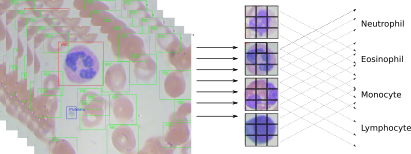

```{r setup, include=FALSE, echo=FALSE}
knitr::opts_chunk$set(echo=TRUE, error=FALSE)
knitr::opts_chunk$set(fig.width=12, fig.height=8) 
```


<center></center>


# Introduction
Medical Image Analysis is a widely used method to screen and diagnose diseases. Depending of the part or tissue of the body would check, we can subset imaging Technics into 2 big methods. First the methods that use rays, like x-ray, Nuclear Magnetic Resonance (NMR) or Scintigraphy. In general, the images generated by these methods are as a photographic film (black and white). The advantage of these methods is that we can observe body through tissues and have access to internal parts without chirurgy. The inconvenient is that these methods uses ionizing radiation (dangerous for health) and mainly expensive. There are at less two kaggle competition with this type of images: [NIH Chest X-rays](https://www.kaggle.com/nih-chest-xrays/data) and [Chest X-Ray Images (Pneumonia)](https://www.kaggle.com/paultimothymooney/chest-xray-pneumonia)
The second kind of medical imaging is applied to all type of tissues or physiological fluid (plasma, blood). The samples are prepared on glass slide and stained with Hematoxylin and eosin stain [(H&E)](https://en.wikipedia.org/wiki/H%26E_stain). This technique is very old and widely used for several medical screening and diagnostics. H&E staining is not expensive but needs Human intervention and the processing takes a while. The interpretation of the images also needs multiple experts (pathologist) to visualize and diagnose slides mainly through microscopes. the analysis remains subjective and could differ between pathologists.

On the other hand, the H&E stains are routinely prepared by technicians who become overwhelmed by the increasing number of samples. Likewise, pathologists are over-worked by the microscopic observation and interpretation, causing overflow that may result in diagnostic error.

## Motivation
A computational grading of slides using learning machine may help to make a pre-screening a hundred or thousand or slides before Human verification.

## load package

```{r include=FALSE, echo=FALSE}
library(EBImage)
library(XML)
library(dplyr)
library(tidyr)
library(DT)
library(OpenImageR)
library(purrr)
library(mxnet)
#library(magrittr)
```

## Dataset description
The images of this competition shows blood cell spread on glass slide and stained by H&E method. We can visualize red blood cell and immune cells. It is easy to make a difference between these two kind of cells. The coloration is not the same, red cells are red but immune cell are purple.  

### Glimpse of digital slide
```{r fig.width=7, fig.height=7}
library(EBImage)
path_to_dataset <- "dataset-master/JPEGImages/"
img <- EBImage::readImage(paste0(path_to_dataset, "BloodImage_00000.jpg"))
img_resize = resize(img, w=128, h=128)

par(mfrow=c(1,2)) # , mai=c(0.1,0.1,0.2,0.1), oma=c(3,3,3,3)
plot(img_resize)
title( main = "plot function")
display(img_resize, method = "raster", all = TRUE, margin = 1)
title( main = "display function")
```

* We observe one purple cell which is a white blood cell. The other cells are read blood cell.

* There are 4 types of immune cells, named also White Blood Cells (WBC). 

### Glimpse of the 4  White Blood Cell types
```{r}
path_to_dataset2 <- "dataset2-master/images/TEST_SIMPLE/"
img_eosinophil <- EBImage::readImage(paste0(path_to_dataset2, "EOSINOPHIL/_0_5239.jpeg"))
img_lymphocyte <- EBImage::readImage(paste0(path_to_dataset2, "LYMPHOCYTE/_0_3975.jpeg")) 
img_monocyte <- EBImage::readImage(paste0(path_to_dataset2, "MONOCYTE/_0_5020.jpeg")) 
img_neutrophil <- EBImage::readImage(paste0(path_to_dataset2, "NEUTROPHIL/_0_1966.jpeg")) 
par(mfrow=c(2,2))
graphics::plot(img_eosinophil)
title(main = "EOSINOPHIL white cell")
plot(img_lymphocyte)
title(main = "LYMPHOCUTE white cell")
plot(img_monocyte)
title(main = "MONOCYTE white cell")
plot(img_neutrophil)
title(main = "NEUTROPHIL white cell")

```

## Description of the First Dataset
The first dataset directory names `dataset-master` contains 3 folders:

* JPEGImages that has 366 jpeg images
* csv file that list the image label and the white cell type that has.
* XML annotation folder that frame the different kind of cells in each image (343 XML files).
+ Green square for red blood cell (RB)
+ Red square for white blood cell (WBC)
+ Blue square for Platelets

Example of image with annotation:
[](https://github.com/Shenggan/BCCD_Dataset/blob/master/example.jpg)  

## Exploration and Transformation of the first dataset

### Transformation of `labels.csv` file
Labels associate cells type. We can find Red Blood Cell (RBC), Platelets, and 4 types of White Blood Cells (WBC). 

We renamed images as its files names. Some image have two kind of WBC. 

We need to crop each cell from image and rang it to associated category.  
```{r}
# glimpse csv file
path_to_csv <- "dataset-master/labels.csv"
label <- read.csv(file = path_to_csv)

# Rename images like files
WBC_seprate_multiple_label <- label %>%
  mutate(file_name = case_when(
    Image %in% 0:9 ~ paste0("BloodImage_0000", Image), 
    Image %in% 10:99 ~ paste0("BloodImage_000", Image),        
    Image %in% 100:999 ~ paste0("BloodImage_00", Image),
    TRUE                    ~ "huh?"
  ))%>%
  select(file_name, Image, Category) %>%
  # Separate categories in the same image
  tidyr::separate_rows(Category)

# Rename differently the cropped cells from the same image
# This step is essential when we woulf join labels with annotations
WBC_seprate_multiple_label <-
  WBC_seprate_multiple_label %>% group_by(file_name) %>%
  mutate(new_file_name = if(n( ) > 1) {paste0(file_name,"_" , row_number( ))} 
         else {paste0(file_name)})

WBC_seprate_multiple_label
```

```{r}
dplyr::glimpse(WBC_seprate_multiple_label )
# glimpse image name 
dplyr::glimpse(list.files("dataset-master/JPEGImages/"))
table(WBC_seprate_multiple_label$Category)
```

* **NB: there is no the same number of labels (441) and images (366)**
* **There is 426 - 411 images with multiple WBC**

### Explore and Transform XML file
```{r}
Path_to_xml_file_9 <- "dataset-master/Annotations/BloodImage_00009.xml"
xml9 <- XML::xmlParse(Path_to_xml_file_9)
xml_df <- XML::xmlToDataFrame(Path_to_xml_file_9)
DT::datatable(xml_df) %>%
  formatStyle(colnames(xml_df), color = 'black')
#print(xml_df[['bndbox']])
```
We converted an example of XML file to dataframe. We find interesting information about the x,y coordinates of cells.

* `bndbox` column show the x and y limits of the annotations. We need to extract xmin, ymin, xmax, and ymax.

* `name` column indicates the type of cells.

Here the coordinate of multiple RBC are poorly represented. We observe a concatenation of 4 coordinates: xmin, xmax, ymin, ymax.

I opened multiple XML file and I did not find WBC cell with its x, y limits. 

You can use `extract_square_of_WBC("dataset-master/Annotations/BloodImage_00019.xml")` function and change the name of the image. 

The output does not have WCB sample. In actual document the code was run with the dataset download from github.


* **I replaced Dataset-master/Annotations  and Dataset_master/JPEGImages  from github**

[link to github](https://github.com/Shenggan/BCCD_Dataset/tree/master/BCCD)

* **At first view it seems updated and xml files have WBC annotations wich is not available for kaggle dataset version**

### Function to extract x, y limits of WBC from xml files
```{r}
# Extract annotation of cell  as dataframe (square limits)
extract_square_of_WBC <- function(file_path){
  xml_obj <- XML::xmlParse(file_path)
  
  xml_obj_df <- bind_cols(  # or cbind()
    ## print the name of cell
    xmlToDataFrame(getNodeSet(xml_obj, "//name"),stringsAsFactors = TRUE),
    # print dimension
    xmlToDataFrame(getNodeSet(xml_obj, "//object/bndbox"), stringsAsFactors = FALSE)
  )
  
  xml_obj_df %>%
    rename( "Cells" = text) %>%
    mutate(xmin = as.numeric(xmin)) %>%
    mutate(ymin = as.numeric(ymin)) %>%
    mutate(xmax = as.numeric(xmax)) %>%
    mutate(ymax = as.numeric(ymax)) %>%
    filter(Cells == "WBC") %>%
    mutate(file_name = basename(file_path))
}
extract_square_of_WBC("dataset-master/Annotations/BloodImage_00019.xml")
```

### Group all x, y limits of WBC into dataframe
```{r}
## get all squares of WBC cell for all images
Path_to_xml_file_list <- list.files("dataset-master/Annotations",full.names = TRUE)
ls_df <- lapply(Path_to_xml_file_list, function(x) extract_square_of_WBC(x))
xy_limits_WCB <- do.call("rbind",ls_df)

DT::datatable(xy_limits_WCB) %>%
  formatStyle(colnames(xy_limits_WCB), color = 'black')
```

* Mainly we have one WBC for each image BUT some image have two type of WBC. for example image 10 has two WCB (BloodImage_00010.xml).

In the next step we need to add annotation/type of each WBC. The annotation is in the dataframe named `WBC_seprate_multiple_label` (see above).

### Explore only images with multiple WBC
```{r}
## Explore only image with multiple WBC
only_image_multiple_WBC <- 
  WBC_seprate_multiple_label[duplicated(WBC_seprate_multiple_label$file_name, fromLast = FALSE) |
                               duplicated(WBC_seprate_multiple_label$file_name, fromLast = TRUE),] 

only_image_multiple_WBC
```

### Merge all needed informations of images with multiple WBC into dataframe
```{r}
## Merge all needed informations of images with multiple WBC into dataframe

path_to_dataset <- "dataset-master/JPEGImages/"

crops_WBC_df  <-
  xy_limits_WCB %>%
  mutate(file_name = gsub(".xml", "", file_name)) %>%
  group_by(file_name) %>%
  mutate(new_file_name = if(n( ) > 1) {paste0(file_name, "_" ,row_number( ))} 
         else {paste0(file_name)}) %>%
  ungroup() %>%
  select(-file_name) %>%
  left_join(only_image_multiple_WBC , by = "new_file_name") %>%
  drop_na() %>%
  mutate(file_path = paste0(path_to_dataset, file_name, ".jpg"))

DT::datatable(crops_WBC_df, 
              options = list(
                initComplete = JS(
                  "function(settings, json) {",
                  "$('body').css({'font-family': 'arial'});",
                  "}"
                )
              )) %>%
  formatStyle(colnames(crops_WBC_df), color = 'black',  `font-size` = '11px')
```


### Function to plot cropped WBC from images
```{r fig.width=2, fig.height=2}
# multiple plot of crops
crop_and_plot <- function(df){
  l <- nrow(df)
  for(i in 1:l){
    attach(df)
    img <- EBImage::readImage(file_path[i])
    par(mfrow=c(1,2))
    plot(img)
    title(main= paste0("Img.",Image[i]), cex.main = 0.5, cex.sub = 0.75)
    plot(img[xmin[i] : xmax[i], ymin[i] : ymax[i],])
    title(main = Category[i], cex.main = 0.5, cex.sub = 0.75)
    detach(df)
  }
}


# l <- nrow(crops_WBC_df)
# par(mfrow = c(l,1))
crop_and_plot(crops_WBC_df)


```


* At this step We can avoid image with two kinds of WBC. 
* We can crop all WBC and get our unicellular dataset.

Now we will crop all WBC for all images and class them to its categories. 


### Merge all needed informations of all images in dataset-master into dataframe

```{r}
# we need: `xy_limits_WCB` and `WBC_seprate_multiple_label` dataframes

path_to_dataset <- "dataset-master/JPEGImages/"

all_crops_WBC_df  <-
  xy_limits_WCB %>%
  mutate(file_name = gsub(".xml", "", file_name)) %>%
  group_by(file_name) %>%
  mutate(new_file_name = if(n( ) > 1) {paste0(file_name, "_" ,row_number( ))} 
         else {paste0(file_name)}) %>%
  ungroup() %>%
  select(-file_name) %>%
  left_join(WBC_seprate_multiple_label , by = "new_file_name") %>%
  # remove all rows with any NA value , x, y, label.
  drop_na() %>%
  mutate(file_path = paste0(path_to_dataset, file_name, ".jpg"))

DT::datatable(all_crops_WBC_df, editable = TRUE, 
              options = list(
                initComplete = JS(
                  "function(settings, json) {",
                  "$('body').css({'font-family': 'arial'});",
                  "}"
                )
              )) %>%
  formatStyle(colnames(all_crops_WBC_df), color = 'black',  `font-size` = '11px')
```

* In `dataset-master/labels.csv` file we showed, that the image_00117 (line 119) does not have label. After verification we annotated it as `EOSINOPHIL`.

### Function used to crop WBC from images

We use a dataframe that contains all needed information : x, y limits of WBC, Category, image file path.

```{r comment=FALSE, warning=FALSE}

#path_to_dataset <- "dataset-master/JPEGImages/"

crop_and_rename <- function(df){
  l <- nrow(df)
  all_crops <- NULL
  #attach(df)
  for(i in 1:l){
    
    img <- EBImage::readImage(df$file_path[i])
    
    all_crops[[i]] <- img[df$xmin[i] : df$xmax[i], df$ymin[i] : df$ymax[i],]
    names(all_crops)[[i]] <- paste0(df$Category[i],"_", i)
  } 
  #detach(df)
  return(all_crops)
  
}
all_crops <- crop_and_rename(all_crops_WBC_df)

attach(all_crops_WBC_df)
par(mfrow=c(1,4))
plot(all_crops[[2]])
title(main = Category[2], cex.main = 2, cex.sub = 0.75)
plot(all_crops[[12]])
title(main = Category[12], cex.main = 2, cex.sub = 0.75)
plot(all_crops[[22]])
title(main = Category[22], cex.main = 2, cex.sub = 0.75)
plot(all_crops[[9]])
title(main = Category[9], cex.main = 2, cex.sub = 0.75)
detach(all_crops_WBC_df)
```

### Glimpse of some crops

We have 368 crops for 4 types of WBC. Each crop is and imageData format used by the main R image packages.


```{r}
all_crops[8:12]
```


### Dataset Augmentation

#### Function generates 10 images with small modification: the input is a ImageData

The crops are stored in a list as ImageData. We have 368 images for 4 WBC.
```{r comment=FALSE, warning=FALSE, fig.width=8, fig.height=6 , include=TRUE, echo=FALSE}
# img input is a ImageData from a list ls. Each ImageData has a name. 
# to acces to the name we need to use  one braket ls[].
# But to access to the array we need double brakets ls[[]]
# in the input of img_augmentation we use img with one braket
# and acces to the array by ls[1][[names(ls[1])]]@.Data

img_augmentation <- function(img){
  
  # random rotations
  samp_rot = sample(c(seq(10, 120, 30), seq(180, 360, 30)), 10, replace = FALSE)
  
  # random shift of rows
  samp_shif_rows = sample(seq(-50, 50, 10), 10, replace = FALSE)
  
  # random shift of columns
  samp_shif_cols = sample(seq(-50, 50, 10), 10, replace = FALSE)
  
  # random flips
  samp_flip <- sample(c("horizontal", "vertical"), 10 , replace = TRUE)
  
  ## access directly to the array ImageData@.Data
  im <- img[[names(img)]]@.Data
  
  #img <- EBImage::channel(all_crops[1], "gray")
  im <- OpenImageR::rgb_2gray(im)
  
  # resize image
  #im <- EBImage::resize(img, 128, 128, filter = "bilinear")
  
  im_aug = lapply(1:length(samp_rot), function(x) 
    
    OpenImageR::Augmentation(im, flip_mode = samp_flip[x], #crop_width = 20:460, crop_height = 30:450, 
                 
                 resiz_width = 28, resiz_height = 28, resiz_method = 'bilinear', 
                 
                 #shift_rows = samp_shif_rows[x], shift_cols = samp_shif_cols[x], 
                 
                 rotate_angle = samp_rot[x], rotate_method = 'bilinear', zca_comps = 0, 
                 
                 zca_epsilon = 0.0, image_thresh = 0.0, verbose = F))
  ## name each image
  names(im_aug) <- lapply(1:length(samp_rot), function(x) paste0(names(img),"_", x))
  
  return(im_aug)
}


sample_im_aug <- img_augmentation(all_crops[1])

## Visualise generated crops
par(mfrow=c(2,length(sample_im_aug)/2))
lapply(1:length(sample_im_aug), function(x) { plot(EBImage::Image(sample_im_aug[[x]]))
  title(main = names(sample_im_aug[x]), cex.main = 1, cex.sub = 0.75)
}
) 


```


#### Augmentation of all crops (368) of unicellular (WBC) dataset
```{r}

all_crops_with_augmentation <- lapply(1:length(all_crops), function(x) img_augmentation(all_crops[x]))

names(all_crops_with_augmentation) <- lapply(1:length(all_crops), function(x)  names(all_crops[x]))

str(all_crops_with_augmentation[c(1:2)]) 

```

* At this step we generated 10 x 368 images. 
* The unicellular dataset is stored as a list of 368 child lists. 
* In each child list there are 10 generated images.
* To plot an example from a list of list we need to specify the index of the first list, followed by the index of the name of child list (always 1) and the index of image.

### Plot image from a list of list
```{r  fig.width= 3, fig.height= 3 }
# plot le third image of the second list
plot(EBImage::Image(all_crops_with_augmentation[2][[1]][[3]]))
```


#### How many crops per Category of unicellular dataset?

We will count the list of crops without augmentation. 
If we consider the augmentation preprocessing, we could multiply the size by 10.

```{r}
neutrophil_dataset_idx <- sapply(names(all_crops_with_augmentation), 
                                 function(vec) {grepl("neutrophil", vec, ignore.case=TRUE)})
basophil_dataset_idx <- sapply(names(all_crops_with_augmentation), 
                               function(vec) {grepl("basophil", vec, ignore.case=TRUE)})
eosinophil_dataset_idx <- sapply(names(all_crops_with_augmentation), 
                                 function(vec) {grepl("eosinophil", vec, ignore.case=TRUE)})
lymphocyte_dataset_idx <- sapply(names(all_crops_with_augmentation), 
                                 function(vec) {grepl("lymphocyte", vec, ignore.case=TRUE)})

monocyte_dataset_idx <- sapply(names(all_crops_with_augmentation), 
                                 function(vec) {grepl("monocyte", vec, ignore.case=TRUE)})

data.frame(
  neutrophil = length(all_crops_with_augmentation[neutrophil_dataset_idx]),
  basophil = length(all_crops_with_augmentation[basophil_dataset_idx]),
  eosinophil = length(all_crops_with_augmentation[eosinophil_dataset_idx]),
  lymphocyte = length(all_crops_with_augmentation[lymphocyte_dataset_idx]),
  monocyte = length(all_crops_with_augmentation[monocyte_dataset_idx])
)
```
* The dataset has only 30 images from basophil WBC.


#### Random sampling, Split Testing and Training datasets
```{r}
basophil_dataset <- all_crops_with_augmentation[basophil_dataset_idx]
eosinophil_dataset <- all_crops_with_augmentation[eosinophil_dataset_idx]
neutrophil_dataset <- all_crops_with_augmentation[neutrophil_dataset_idx]
lymphocyte_dataset <- all_crops_with_augmentation[lymphocyte_dataset_idx]
monocyte_dataset <- all_crops_with_augmentation[monocyte_dataset_idx]

# Random sampling
#str(lapply(basophil_dataset,  function(x) {sample(x,3)}))

## generate index for samling
test_idx <- sample(seq(1,10), 3, replace = FALSE)
train_idx <- seq(1,10)[-test_idx]

# Fixed index sampling to avoid redoncy between traing and testing datasets 
eosinophil_dataset_test <- lapply(eosinophil_dataset, "[", test_idx)
neutrophil_dataset_test <- lapply(neutrophil_dataset, "[", test_idx)
basophil_dataset_test <- lapply(basophil_dataset, "[", test_idx)
lymphocyte_dataset_test <- lapply(lymphocyte_dataset, "[", test_idx)
monocyte_dataset_test <- lapply(monocyte_dataset, "[", test_idx)

eosinophil_dataset_train <- lapply(eosinophil_dataset, "[", train_idx)
neutrophil_dataset_train <- lapply(neutrophil_dataset, "[", train_idx)
basophil_dataset_train <- lapply(basophil_dataset, "[", train_idx)
lymphocyte_dataset_train <- lapply(lymphocyte_dataset, "[", train_idx)
monocyte_dataset_train <- lapply(monocyte_dataset, "[", train_idx)

# sample_size <- c(1, 1, 2)
# 
# selected_vals <- purrr::map2(
#   .x = my_list_of_lists,
#   .y = number_to_select,
#   .f = function(x,y) base::sample(x, y)
#   )
```

#### Merge Training lists and testing lists (loop is very slow!)

```{r}
## do.call also works but generate cancatenated names of matrix LIST.list.
#testing_dataset <- do.call(c,c(basophil_dataset_test, eosinophil_dataset_test, neutrophil_dataset_test, lymphocyte_datase_test))

test_dataset_list <- purrr::flatten(c(basophil_dataset_test, eosinophil_dataset_test, 
                                      neutrophil_dataset_test, lymphocyte_dataset_test, monocyte_dataset_test))

train_dataset_list <- purrr::flatten(c(basophil_dataset_train, eosinophil_dataset_train,
                                       neutrophil_dataset_train, lymphocyte_dataset_train, monocyte_dataset_train))

#ls1 <- purrr::flatten(basophil_dataset_test)

# This fonction takes a list of images (matrix) and convert them to a vector into dataframe.
# This function can resize image before storage
img2vec_slow <- function(list, w = 28, h = 28){
  
  df <- data.frame(matrix(ncol = (w * h), nrow = 0))
  
  # Set names. The first column is the labels, the other columns are the pixels.
  colnames(df) <-   paste("pixel", c(1:(w*h) ))
  
  for(k in 1: length(list)){
    
    # resize image if needed 
    EBImage::resize(list[[k]], w = w, h = h)
    
    # Coerce matrix to a vector
    img_vector <- as.vector(list[[k]])
    # add avector to a row
    df[nrow(df) + 1,] <- img_vector
    
  }
  # add rownames with labels
  rownames(df) <- names(list)
  return(df)
}


#train_dataset_df <- img2vec_slow(train_dataset_list, w=180, h=180)
#test_dataset_df <- img2vec_slow(test_dataset_list, w = 180, h = 180)

#ptm <- proc.time()
#res <- img2vec_slow(ls1)
#print(proc.time() - ptm)


```

* loop is very slow process
* Try to avoid lood and use `sapply`

#### Merge Training lists and testing lists (sapply is very speed!)

```{r}

f <- function(x, w = w, h = h){
    # resize image if needed 
    EBImage::resize(x, w = w, h = h)
    
    # Coerce matrix to a vector
    img_vector <- as.vector(x)
    
    # add avector to a row
   # df[nrow(df) + 1,] <- img_vector
  
     return(img_vector)
}

img2vec <- function(list, w = 180, h = 180){
  
  df <- data.frame(matrix(ncol = (w * h), nrow = 0))
  
  df <- sapply(list, f, w, h)
  
  # Set names. The first column is the labels, the other columns are the pixels.
  #colnames(df) <-   paste("pixel", c(1:(w * h) ))
  
  return(as.data.frame(t(df)))
}


train_dataset_df <- img2vec(train_dataset_list, w=28, h=28)
test_dataset_df <- img2vec(test_dataset_list, w = 28, h = 28)

ls1 <- purrr::flatten(basophil_dataset_test)
ptm <- proc.time()
res <- img2vec(ls1)
print(proc.time() - ptm)
```


#### glimpse of train and test datasets

```{r}
test_dataset_df[7:20, 1:9]

```


#### Plot image from dataframe (testing or training Datastes)

```{r fig.width= 3, fig.height= 3}
vec2img <- function(df, nrow, w= 180, h = 180, main = "if needed", xlab = "if needed"){
  
  i <- EBImage::Image(as.numeric(df[nrow,]))
  
  dim(i) <- c(w, h, 1)
  #i <- EBImage::resize(i, w= w, h= h)
  plot(i)
  title(main = main, xlab = xlab ,cex.main = 1, cex.sub = 0.75)
}

vec2img(test_dataset_df, 212, 28, 28)
```


### Deep learning using `mxnet` Package


#### Formating datasets to arrays

```{r}

train_dataset_df <- img2vec(train_dataset_list, w=28, h=28)
test_dataset_df <- img2vec(test_dataset_list, w = 28, h = 28)

## It is the fast way to transform rownames
tmp_rowname_test <- rownames(test_dataset_df)
labels <- stringr::str_extract(tmp_rowname_test, "\\w+[^_\\d]")
rownames(test_dataset_df) <- NULL
Test <- cbind(labels, test_dataset_df)

tmp_rowname_train <- rownames(train_dataset_df)
labels <- stringr::str_extract(tmp_rowname_train, "\\w+[^_\\d]")
rownames(train_dataset_df) <- NULL
Train <- cbind(labels, train_dataset_df)

#Set up train and test arrays
train <- data.matrix(Train)
train_x <- t(train[, -1])
train_y <- train[, 1]
train_array <- train_x
dim(train_array) <- c(28, 28, 1, ncol(train_x))

test <- data.matrix(Test)
test_x <- t(test[, -1])
test_y <- test[, 1]
test_array <- test_x
dim(test_array) <- c(28, 28, 1, ncol(test_x))

table(train[,1])
```
* The classes are converted to number with
* ** 1 == Basophil **
* ** 2 == Eosinophil **
* ** 3 == Lymphocite **
* ** 4 == Monocyte **
* ** 5 == neutrophil **

### Set training parameters

```{r}
require(mxnet)
data <- mx.symbol.Variable('data')
# 1st convolutional layer
conv_1 <- mx.symbol.Convolution(data = data, kernel = c(5, 5), num_filter = 20)
tanh_1 <- mx.symbol.Activation(data = conv_1, act_type = "tanh")
pool_1 <- mx.symbol.Pooling(data = tanh_1, pool_type = "max", kernel = c(2, 2), stride = c(2, 2))
# 2nd convolutional layer
conv_2 <- mx.symbol.Convolution(data = pool_1, kernel = c(5, 5), num_filter = 50)
tanh_2 <- mx.symbol.Activation(data = conv_2, act_type = "tanh")
pool_2 <- mx.symbol.Pooling(data=tanh_2, pool_type = "max", kernel = c(2, 2), stride = c(2, 2))
# 1st fully connected layer
flatten <- mx.symbol.Flatten(data = pool_2)
fc_1 <- mx.symbol.FullyConnected(data = flatten, num_hidden = 500)
tanh_3 <- mx.symbol.Activation(data = fc_1, act_type = "tanh")
# 2nd fully connected layer
fc_2 <- mx.symbol.FullyConnected(data = tanh_3, num_hidden = 40)
# Output. Softmax output since we'd like to get some probabilities.
NN_model <- mx.symbol.SoftmaxOutput(data = fc_2)
```

### Built a Model
```{r}

# Pre-training set up
#-------------------------------------------------------------------------------

# Set seed for reproducibility
mx.set.seed(100)

# Device used. CPU in my case.
devices <- mx.cpu()

# Training
#-------------------------------------------------------------------------------
ptm <- proc.time()
# Train the model
model <- mx.model.FeedForward.create(symbol = NN_model,       # The network schema
                                     X = train_array,         # Training array
                                     y = train_y,             # Labels/classes of training dataset
                                     ctx = devices,
                                     num.round = 150,
                                     array.batch.size = 20,  # number of array in the batch size
                                     learning.rate = 0.02,
                                     momentum = 0.9,
                                     optimizer = "sgd",
                                     eval.metric = mx.metric.accuracy,
                                     #initializer=mx.init.uniform(0.05),
                                     epoch.end.callback = mx.callback.log.train.metric(100))

print(proc.time() - ptm)
```

### Summary of the model

```{r}
summarymxnet <- summary(model$arg.params)
 data.frame(do.call(rbind, list(summarymxnet))) %>% 
  tibble::rownames_to_column("layers")
```


### Test Model
```{r}
#Predict labels
predicted <- predict(model, test_array)
predicted <- mxnet:::predict.MXFeedForwardModel(model = model, X = test_array)
# Assign labels
predicted_labels <- max.col(t(predicted)) -1
# Get accuracy
table(test_y, predicted_labels) 
```

```{r}
# remember the size of images used for testing
table(test[,1])
```

* Category `1` corresponding to `Basophil` category seems to have the worst rate. The model was identify 1/9 image.
* It is expected because the datasets of basophil is samll.
* Eosinophi 163/270
* Lymphocyte 103/114
* Neutrophil 575/645
* The model was predict 95 False Positive (FP) Neutrophil and 65 FP Eosinophil.


### Compute the means of identical labels, located in the diagonal

```{r}
## get means of identical labels, located in the diagonal
sum(diag(table(test_y,predicted_labels)))/length(test_y)
```

* **We identify  81% of the test dataset images**

### Visualize predicted class and compare them to original class from testing dataset

```{r fig.width=5, fig.height=5}
# class arg could be: "BASPPHIL", "NEUTROPHIL", "LYMPHOCYTE", "EOSINOPHIL"
# n_img is the number of image would you want to plot.
# If could be the sum of predicted images and image for testing for one class.

plot_result <- function(class = "BASOPHIL", n_img = 10){

  par(mfrow=c(4,5))

  lapply(1:n_img, function(i){

    ## generate index for each class/folder
    key0 <- strsplit(unique(labels), ",")
    df_index <- data.frame(index = rep(seq_along(key0), sapply(key0, length)), ID = unlist(key0))
    idx <- df_index[which(df_index[,2] == class),1]
    
    ## we would like to select classes 3 
    
    
    selected_vec_test <- test_y[test_y == idx]
    
    selected_vec_predicted <- which(predicted_labels == idx)
    
    
    vec2img(Test[selected_vec_test,][,-1],i,w= 28, h= 28, main = class, xlab = "to test")
    
    vec2img(Test[selected_vec_predicted,][,-1],i,w= 28, h= 28, main = paste(selected_vec_predicted %in% selected_vec_test), xlab = "predicted")

})
}

plot_result(class = "BASOPHIL", 10)
```

* The unique predicted basophil is FALSE, Hahahaha :-)

## Description of the second dataset  
The second dataset directory named `dataset2-master` contains image folder for each class of WBC and csv file that label images.


