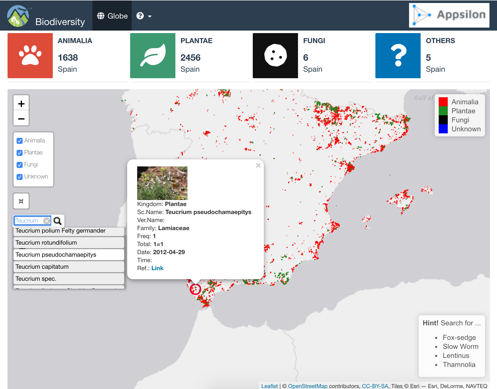
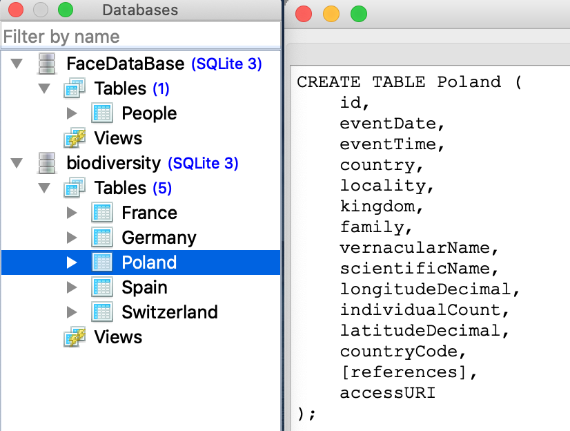
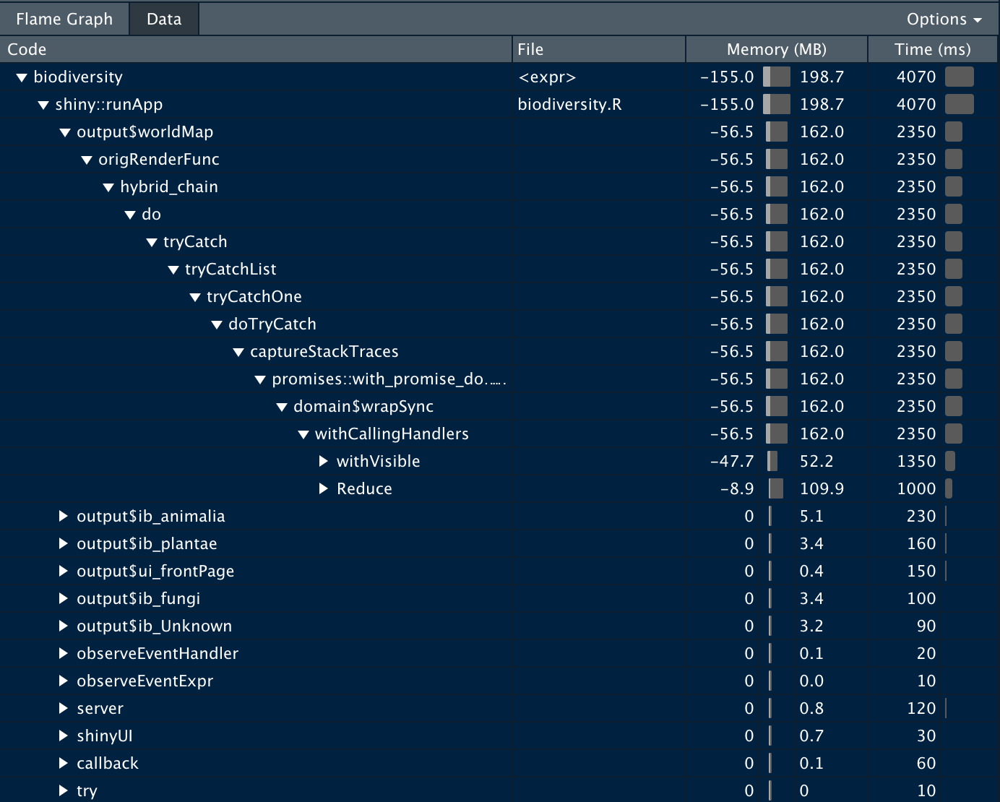
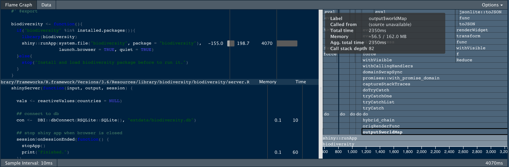
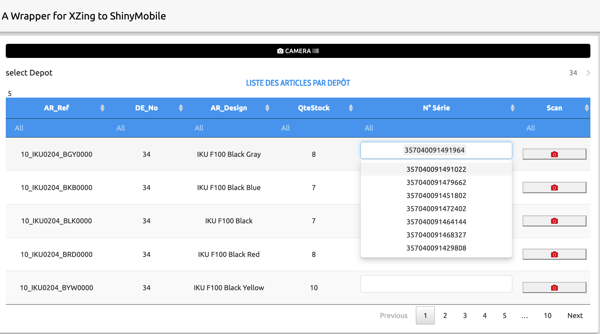
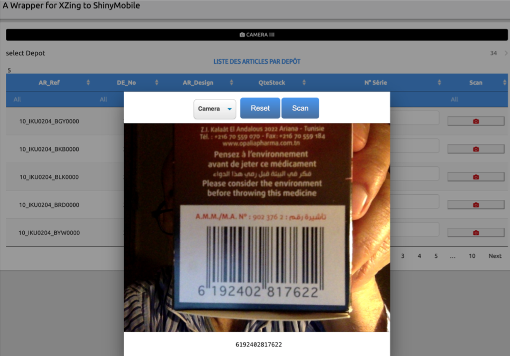
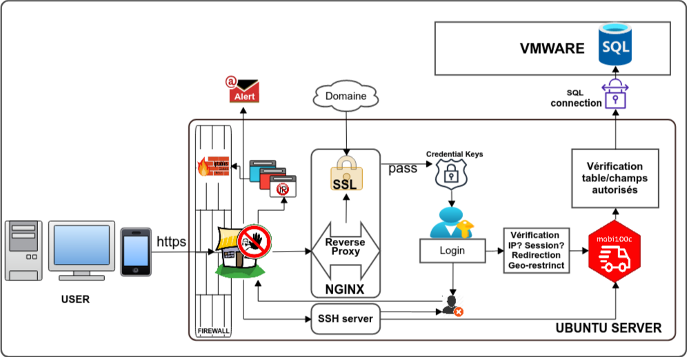
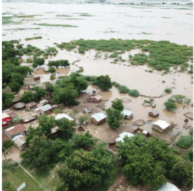
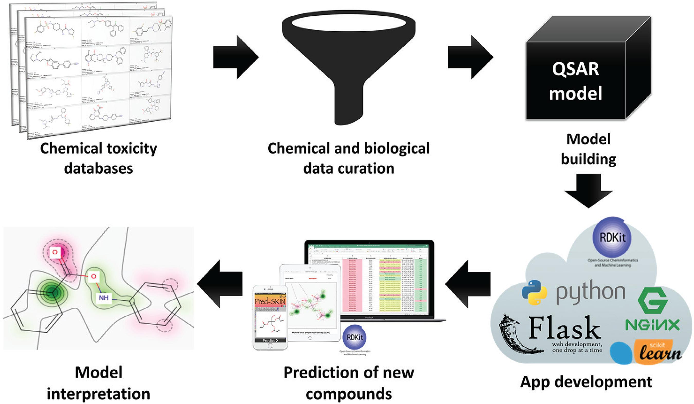
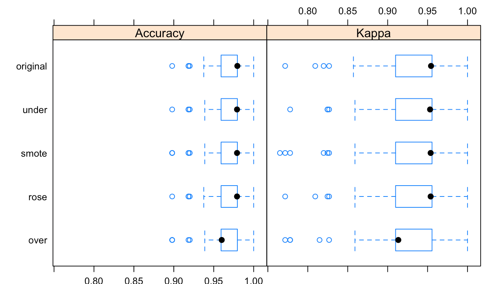

This document illustrate how we can improve ShinyApp  Style, and performance.
The  assignment consists of developing a shiny app  that tracks encounter animals and plants species in the world.
The dataset comes from two csv large files (4G, 2.4G) which can not open with an ordinary computer.

To demonstrate how we can improve recativities and play around skilling shiny app, We will walk through survey sections and try to site concrete example.


```{r, message=FALSE}
library(remotes)
library(tictoc)
library(RSQLite)
library(tidyverse)
library(geojson)
library(geojsonio)
library(data.table)
library(profvis)
library(DT)
library(promises)
library(future)
```


# Shiny Framework

## Shiny: Building complete shiny apps (end to end)

The Shiny App named `biodiversity` I that developed during assignment, is a full R package that responds to CRAN/Bioconductor criteria. It is named biodiversity. It uses a map with multiple layers. The species are marked with different color in the map. User can view/hide any kingdom, search any species using keywords and the app return matched species and focus on select one.

To install and run `biodiversity` shiny app, just run these code, or try the [demo](https://kmezhoud.shinyapps.io/biodiversity/)

```{r, eval=FALSE}

#install_github("kmezhoud/biodiversity")
library(biodiversity)
biodiversity::biodiversity()
```



## Shiny Performance: Making Shiny apps fast(er) and scalable

### Loading data
As we said, the dataset is two csv files with about 6.5G. The first option to deal with this, is to convert the csv files to `sqlite` database for example.

#### Use Database instead any files formats: csv, rds, ...

{width=50%}

In reality, using DB instead csv file is not enought to scale the App to 1000s of users. It  is importante use Faster function, like here:

#### Use Faster Function: `apply` family versus `looping`

```{r}
con <-  DBI::dbConnect(RSQLite::SQLite(), "../../../DATA/Concours/Appsilon/biodiversity/biodiversity/inst/biodiversity/extdata/biodiversity.db") 

countries_list <- NULL
tic(msg = "###  LOOPING PROCESS  ###")
for (i in DBI::dbListTables(con)){
    countries_list[[i]] <- tbl(con,i) %>% as_tibble() 
  }
toc()

countries_list <- NULL
tic(msg = "### LAPPLY PROCESS  ###")
countries_list <- lapply(DBI::dbListTables(con), function(x) tbl(con,x) %>% as_tibble)
toc()
```

In general it is better to use `apply` family function instead `looping`.

#### Relief the package from extra data

In our case, we need to load `geo.json` file map. Mainly, this kid of files have a metadata that can to become heavier. Here,  we compared to file with different metadata countain. The first one is heavy and  located at `/extdata` folder, and the other loaded directly from the url source. 

```{r}
##  Load Map SLOW  
tic(msg = "###  From File  ###")
countries_map <- geojson_read("../../../DATA/Concours/Appsilon/countries.geojson", what = "sp")
toc()

  ##  Load map FASTER
tic(msg = "###  From link  ###")
  countries_map <- geojson_read("https://raw.githubusercontent.com/johan/world.geo.json/master/countries.geo.json", what = "sp")
  toc()
  
```
Nice! In the next steps we will improve the map loading by `Caching`.


### Pre-processing

#### Filtering Manner at the top of processing

We can compare multiple ways to filter our data. Here we tried three methods (`grepl`, `%in%`, `str_detect`, `data.table`, and `DT`) and we will select the faster one.

```{r}
 set.seed(34)
countries <-  c("Poland", "Switzerland")
tic("###  USING grepl  ###")
 biodiversity_data<- countries_list %>% 
                     rbindlist() %>%
                     filter(grepl(paste0(countries, collapse = "|"), country, ignore.case = TRUE))

toc()

tic("###  USING %in%  ###")
biodiversity_data <- countries_list %>% 
                     rbindlist() %>%
                     filter( country %in% countries )

toc()


tic("###  USING str_detect  ###")

biodiversity_data <- countries_list %>% 
                     rbindlist() %>%
                     filter( str_detect(country, countries))
     
toc()


tic("###  USING data.table  ###")

biodiversity_data <- countries_list %>%
                     rbindlist() %>% as.data.table()

 biodiversity_data <-    biodiversity_data[country == paste0(countries, collapse ="|")]
toc()

tic("###  USING DT  ###")
biodiversity_data <- countries_list %>%
                     rbindlist() %>% as.data.table()

 biodiversity_data <-  biodiversity_data[grepl(paste0(countries, collapse ="|"), country)]

 toc()
```


### Profiling

While adding countries to the database, the app become slow, mainly during ploting the map. The bottleneck become bigger when there are more and more circles markers (encounters) to plot on the map. 

**Note**

In the case of `biodiversity` package, the loading inputs (Map and Tables), the Processing, and the building of the map with circles seems not to be the bottleneck. It should be the displaying process of the screen. We will process to analyse this hypothesis.
We will use `profvis`  package to screen when the code takes a lot of memory.

```{r}
profvis::profvis({biodiversity::biodiversity()})
```

<!--{width=50%}{width=50%}-->
<!-- -->
The blue color in the profiling indicates that the `output$wotldMap` is the most heavy computing.

We will try to Analyze thoroughly using `tictoc`.

### Catching repeated process during plotting

User can select a country to focus on and search for species. 
When the user wants to iterate the choice of the country, a popup appears and wait for input country. Here we can catch previous plot and wait if the user/users (session/application level) reselect the same country, then the app can return it without computing.

#### `bindCache()` of `renderleaflet()`

We just added ` %>% bindCache(vals$countries, cache = "session")` to the end of `renderleaflet()`.

```{r eval = FALSE}
vals <- reactiveValues(countries = NULL) 

  ## Listening OK button
  observeEvent(input$ok, {
    if (!is.null(input$countries_id) && nzchar(input$countries_id)) {
      vals$countries <- input$countries_id
      removeModal()
    } else {
      showModal(popupModal(failed = TRUE))
    }
  })
  
  
output$worldMap <- renderLeaflet({
     ...
      for (i in input$countries_id){
      #Put each table in the list, one by one
      table_list[[i]] <- tbl(con,i) %>% as_tibble()
      
      ...
    }
  
}) %>% bindCache(vals$countries, cache = "session")
```

**Note** 

Adding `%>% bindCache(vals$countries, cache = "session")` to the `rendereaflet()`, we catche its all processes ran with a specific `vals$countries`. If the user select a new `vals$countries`, le computing will be done, if not the app returns catched object. Concretely, we do not view progress bar for loading data, preprocessing and ploting the map.

We used a caching at **session level**. We can generalize the cache at the **application level** and memorize the object for multiple user by setting `%>% bindCache(vals$countries, cache = "app")`.

```{r}
library(biodiversityBindCache)
biodiversityBindCache::biodiversityBindCache()
```

**Steps of this demo**: Query Poland, Poland, Switzerland, Switzerland, Poland.

Only the first query on each country has computing steps.

You can see the **Loading Map for ...** is done for Poland and Switzerland which is not necessary. In the next step, we will cache it by `memoise`.

#### `Memoise` functions

The same result can be obtained by using `memoise` function. Here we will generate a BAD function inside `renderLeaflet` just to see how it works.

```{r, eval=FALSE}
output$worldMap <- renderLeaflet({
  
  leaflet_fun <- function(countries_id){
     ...
      for (i in input$countries_id){
      #Put each table in the list, one by one
      table_list[[i]] <- tbl(con,i) %>% as_tibble()
      
      ...
      }
    
  }

## memorize at the session level
m_leaflet_fun <- memoise::memoise(leaflet_fun, cache = session$cache)
  
}) 

m_leaflet_fun(input$countries_id)
```

**Note**

The argument used in memoise function is the input country (selected country). In this case, all processing will run only if a new country was selected by user. In the other hand, like in previous example `bindCache()`, each country will be proceed only the first time.


```{r}
library(biodiversityMemoise)
biodiversityMemoise::biodiversityMemoise()
```

**Steps**: Query Poland, Poland, Switzerland, Switzerland, Poland.

Only the first query on each country has computing steps.

To  memoize the process at Application level we need to change the argument `cache`  by `m_leaflet_fun <- memoise::memoise(leaflet_fun, cache = getShinyOption("cache"))`


Reading geojson map takes a while to load. And, it is reloaded in each country which is not necessary. To memoize the map we can do this:

```{r}
    geojson_read_fun <- function(url){
      
      #withProgress(message = 'Loading Map ...', value = 20, {
        
        ##  Load Map source : https://datahub.io/core/geo-countries#r
        #countries_map <- geojson_read("extdata/countries.geojson", what = "sp")
        ##  Load map Faster
        geojson_read(url, what = "sp")
  
      #})
    }
    
    m_geojson_read_fun <- memoise::memoise(geojson_read_fun)
    
```


```{r}

  tic(paste0("Loading Map for ", "Poland"))
  countries_map <- m_geojson_read_fun("https://raw.githubusercontent.com/johan/world.geo.json/master/countries.geo.json")
  toc()

```

**Note**

Nice!  If you can see in the last run of `biodiversityMemoise::biodiversityMemoise()`, the **Loading Map... ** was consumed about 4.6~sec. The following query have elapsed time 0s. 

### Asynchronous programming

Actually, I did not find a way to use `promises` and `future` to improve loading data or renderLeaflet. Since integrating `promises` to shiny is used generally within outputs, reactive expressions, and observers.

In our case, `renderLeaflet` is an exception of shiny Outputs. it exepects a value like `renderText()` or `renderPlot()` but needs two data type to plot the map (geo.json) and to enrich it with biodiversity data.

We can improve loading  data or map, but we can not use them as a `promise` class. It take a long time to convert them. like:

```{r}
  tic("NORMAl Loding the Map " )
    #countries_map <- geojson_read("https://raw.githubusercontent.com/johan/world.geo.json/master/countries.geo.json",what = "sp")
    countries_map <- geojson_read("../../../DATA/Concours/Appsilon/countries.geojson", what = "sp")
  toc()
  
  tic("FUTURE Loading the Map " )
  countries_map <- future({
    #countries_map <- geojson_read("https://raw.githubusercontent.com/johan/world.geo.json/master/countries.geo.json",what = "sp")
    geojson_read("../../../DATA/Concours/Appsilon/countries.geojson", what = "sp")
  })
  toc()
  
  tic("convert Map FUTURE using value()")
  countries_map <- value(countries_map)
  toc()
  

  tic("NORMAL Load data")
  biodiversity_data <-   read_rds("../../../DATA/Concours/Appsilon/biodiversity-data/full_data_Poland_Switzerland_Germany_France_Spain_USA.rds")
  toc()
  
  tic("FUTURE Load data")
  biodiversity_data_fu <-future({
    read_rds("../../../DATA/Concours/Appsilon/biodiversity-data/full_data_Poland_Switzerland_Germany_France_Spain_USA.rds")
  })
  toc()
  
  tic("Converting data FUTURE using Value()")
  biodiversity_data <- value(biodiversity_data_fu)
  print(paste0("Table dimension: ", dim(biodiversity_data)))
  toc()
```


## Shiny Beautiful UI: Making Shiny apps (more) beautiful 

Here an example of how we can play with `css` and `js` files to improve the beauty of Shiny App. Also we can add beauty documentation using `markdown` or `Rmarkdown`.

```{r, eval = FALSE}

shinyUI(fluidPage(theme = shinytheme("flatly"), title = "Biodiversity", #superhero, flatly
                    
                  # Add CSS files
                  includeCSS(path = "www/AdminLTE.css"),
                  includeCSS(path = "www/shinydashboard.css"),
                  tags$head(includeCSS("www/styles.css")),
                  ## Include Appsilon logo at the right of the navbarPage
                  tags$head(tags$script(type="text/javascript", src = "logo.js" )),
                  ## Include Biodiversity logo
                  navbarPage(title=div(img(src="biodiversity.png", height = "50px", widht = "50px",
                                           style = "position: relative; top: -14px; right: 1px;"),
                                       "Biodiversity"),
                             
                             
                             tabPanel("Globe",icon = icon('globe'),
                                      div(class="outer",
                                          tags$head(includeCSS("www/styles.css")),
                                          
                                          uiOutput('ui_frontPage')
                                      )),
                             
                             navbarMenu("", icon = icon("question-circle"),
                                        tabPanel("About",icon = icon("info"),
                                                 withMathJax(includeMarkdown("extdata/help/about.md"))
                                        ),
                                        tabPanel("Performance",icon = icon("creative-commons-sampling"),
                                                 withMathJax(includeMarkdown("extdata/help/performance.md"))
                                        ),
                                        tabPanel("Help",  icon = icon("question"),
                                                 withMathJax(includeMarkdown("extdata/help/help.md"))), 
                                        tabPanel(tags$a(
                                          "", href = "https://github.com/kmezhoud/biodiversity/issues", target = "_blank",
                                          list(icon("github"), "Report issue")
                                        )),
                                        tabPanel(tags$a(
                                          "", href = "https://github.com/kmezhoud/biodiversity", target = "_blank",
                                          list(icon("globe"), "Resources")
                                        ))
                             )
                   
                                       
                  )
))


```


We can add a transparent layer with button, collapsable table and plotly. Like this piece of code to generate transparent panel with button over the Map:

```{r, eval = FALSE}
    column(width = 12,#style='height:200px',
           div(class="outer",
               tags$head(includeCSS("www/styles.css")),
               leafletOutput("worldMap", height = "600px"),
               absolutePanel(id = "panel_id", class = "panel panel-default",
                             top = 300, left = 20, width = 45, fixed=FALSE,
                             draggable = TRUE, height =  45 ,
                             # Make the absolutePanla collapsable
                             #HTML('<button data-toggle="collapse" data-target="#popup_id">Country</button> '),
                             #tags$div(id = 'popup_id',  class="collapse",#style='background-color:transparent; border-color: transparent',
                             div(actionButton(inputId = "popup_id",label = "",
                                               icon = icon("globe"),
                                               style='background-color:transparent; border-color: transparent',),
                                 style = "font-size:100%") 
                             #)
               ),
               
               
           )
    )
```


## Javascript for Shiny: Extending Shiny with advanced functionalities

I can site a wrapper of zxing JS library to shinyApp. The goal is to read barcode using smartphone/laptop camera [link](https://github.com/kmezhoud/shinyQuaggaJS/tree/zxing-js). 

The [demo](https://kmezhoud.shinyapps.io/shinyXZing/_w_8de908dc/) shows a complex  DT table with multiple gadgets:

1- SelectInput in each row

2- buttons in each row to run barcode reader using camera.

user can scroll serial number or scan barcode to match the serial number. Each button is recognize its row_id.

 

Below the camera frame, the gadget returns the serial number of scanned barcode. I added a sound signal **BIP** to inform the user that is OK. The returned serial number goes automatically to specific cell in the DT.

# Generic key skills

## Software Testing: Delivering high quality solutions thanks to testing

Mainly, shiny Apps that I developed are  a full R package with:

1- build, test, check processes during development

2- Functions documents 

3- Vignette for user

If the task is a part of a big project hosted in github:

1- Clone the github:branch

2- Make changes and features for the solution

3- Build, Test, Check

4- Pull request

## Quick Prototyping: Quick prototyping in at least one technology 

I'm using my background and examples that I developed during previous years. 

Also I can use useful packages like: `geolm`, `shinydashboard`, `shiny.sementic`, `shinymobile` to accelerate prototyping. 

## Advanced Data Visualization 

A- Screenshots of 6 shiny Apps:  [Shiny Apps Screenshot.pdf](https://drive.google.com/file/d/1-f1mC24cR6ArQkmsXeHYw-aAj0pOrNVw/view?usp=sharing)

B- Examples of EDA :

  1- [Flood Prediction In Malawi](https://kmezhoud.github.io/learn_by_example/Flood_prediction_Malawi/Flood_Prediction_Malawi.html)

  2- [Restaurants reservation and costumers behaviours](https://kmezhoud.github.io/learn_by_example/RestaurantEDA/RestaurantEDA.html)
  
  3- [Sales Count Prediction per shops for the next month](https://kmezhoud.github.io/learn_by_example/predict-future-sales/predict_future_sales.html)

  4- [Instacart Market Basket Analysis](https://kmezhoud.github.io/learn_by_example/instacart_market_basket_analysis/instacart_market_basket.html)

# Fullstack {.tabset .tabset-fade .tabset-pills}

## Fullstack Python 

I used Spyder IDE to develop web app with python. I tried Django and Flash. But I am more comfortable with Rstudio and shiny.

1- [Generate a python script that lists all the repeats equal or longer than 9 bases in double strand dna sequences](https://kmezhoud.github.io/Yubsis/Yubsis.html)

2 - [Survival Lung Cancer Event prediction](https://kmezhoud.github.io/learn_by_example/lung_cancer_survival_time/lung_cancer_survival_time.html)

3- [Flood Prediction In Malawi](https://kmezhoud.github.io/learn_by_example/Flood_prediction_Malawi/Flood_Prediction_Malawi.html)

4- [Antifungal Activity prediction for new chemical compunds]( https://kmezhoud.github.io/learn_by_example/QSAR_antiFungal/qsar_antifungal.html)

5- [Fraud transaction prediction](https://www.kaggle.com/kmezhoud/abnormal-transaction-detection)

## Fullstack Javascript 

I did not have the time to dive in javascript, since I can wrap a JS library to Shiny.

Case study: 
A wrapper of zxing JS library to shinyApp to read barcode using camera. [(github)](https://github.com/kmezhoud/shinyQuaggaJS/tree/zxing-js), [(demo)](https://kmezhoud.shinyapps.io/shinyXZing/_w_8de908dc/)


# Deployment

## Shiny Infrastructure: Knowledge of infrastructure solutions for Shiny 

**Local infrastructure**

The infrastructure of shiny app is like R package.  Maybe, to give support, please see the infrastructure of [shiny app package](https://github.com/kmezhoud/biodiversity) develeped during assignment step (private but appsilon-hiring is collaborator) . 

**Deployment purpose:**

1- When using shiny server (using local or cloud ubuntu server), the app can be installed as a package or deployed at `/srv/shiny-server/app_name`. 

2- As a docker image: `docker run -d -p  3838:3838 kmezhoud/biodiversity:0.1`

3- As a kubernetes image

**Deployment setting:**

1- nginx or traefik

2- Port and redirection

3- firewall, iptable, and email alert

4- reverse proxy, and SSL domain certificate

5- keyring sensitive code like: login detail, IP address, tables and column names of the database.

I can site an example of shiny mobile app named [mobi100c](https://kmezhoud.shinyapps.io/mobi100c/). It is developed to make easy the ordering processes between customers, retailers, and Stores with central Azure database and different login profiles. (login:WASSIM, pwd:1)



## RStudio Products 

I am familiar with digitalOcean and ubuntu server to deploy RStudio and Shiny server.
Integrate automatic reporting using Rmarkdown, and run python code in R environment.

## AWS infrastructure

Depending on the following easy tutorial to host R Shiny on AWS, I think, it seems to be similar to DigitalOcean cloud computing services which I was installed and host R Shiny package. Today, the app is not working and need updates.

[How to host an R Shiny App on AWS cloud in 7 simple steps](https://towardsdatascience.com/how-to-host-a-r-shiny-app-on-aws-cloud-in-7-simple-steps-5595e7885722)

But in the following code, a glimpse of `mobi100c` deployement:

```{bash, eval = FALSE}
#add user with root privilege
adduser kirus
gpasswd -a kirus sudo
su - kirus
# install nginx
sudo apt-get update
sudo apt-get -y install nginx
# Set virtual domain name
# add source for most recent version of R  for ubuntu 18.04
sudo sh -c 'echo "deb http://cran.rstudio.com/bin/linux/ubuntu bionic-cran40/" >> /etc/apt/sources.list'
gpg --keyserver keyserver.ubuntu.com --recv-key E298A3A825C0D65DFD57CBB651716619E084DAB9
gpg -a --export E298A3A825C0D65DFD57CBB651716619E084DAB9 | sudo apt-key add -
# install R
sudo apt-get update
sudo apt-get -y install r-base
# install useful packages
sudo apt-get -y install libcurl4-gnutls-dev libxml2-dev libssl-dev
sudo su - -c "R -e \"install.packages('promises', repos='http://cran.rstudio.com/')\""
# install rstudio server
sudo apt-get install gdebi-core
wget https://download2.rstudio.org/server/bionic/amd64/rstudio-server-1.4.1106-amd64.deb
sudo gdebi rstudio-server-1.4.1106-amd64.deb
10.11.12.121:8787/

# install shiny server
sudo su - -c "R -e \"install.packages('shiny', repos='http://cran.rstudio.com/')\""
sudo su - -c "R -e \"install.packages('rmarkdown', repos='http://cran.rstudio.com/')\""
wget https://download3.rstudio.org/ubuntu-14.04/x86_64/shiny-server-1.5.15.953-amd64.deb
sudo gdebi shiny-server-1.5.15.953-amd64.deb
http://10.11.12:3838/
Sudo apt-get install synaptic
#  Install an SSL Certificate with Let’s Encrypt
sudo apt-get install git
git clone https://github.com/letsencrypt/letsencrypt
cd letsencrypt

#Now before we install the certificate, we have to stop our web server (NGINX). In the code below, replace yourdomain.com #with your actual domain name that you registered for this site.

$ sudo service nginx stop
$ sudo ./letsencrypt-auto certonly –standalone -d yourdomain.com -d http://www.yourdomain.com

#If all goes well, it should have installed your new certificates in the /etc/letsencrypt/live/yourdomain.com folder.

# Configure the Reverse Proxy on NGINX
$ sudo nano /etc/nginx/nginx.conf
#And add the following lines near the bottom of the main http block,
 just before the section labeled “Virtual Host Configs”. 


# Setting Appropriate Permissions
$ sudo groupadd shiny-apps
$ sudo usermod -aG shiny-apps kirus
$ sudo usermod -aG shiny-apps shiny
$ cd /srv/shiny-server
$ sudo chown -R kirus:shiny-apps .
$ sudo chmod g+w .
$ sudo chmod g+s .

# set shiny-server.conf
nano /etc/shiny-server/shiny-server.conf
## Add the following section
location /mobi100c {
 app_dir /usr/local/lib/R/site-library/mobi100c/mobi100c;
 log_dir /var/log/shiny-server;
 directory_index on;
 }

```


## Google Cloud infrastructure

I thing the must difficule step is to build a docker image beofre to host it in GCS. I build a Docker image for shiny App developped during Assignment. You can run it.

```{bash, eval= FALSE}
docker run -d -p  3838:3838 kmezhoud/biodiversity:0.1
```

Here some references of how to do:

1- [googleComputeEngineR](https://cloudyr.github.io/googleComputeEngineR/articles/shiny-app.html)

2- [How to put a Shiny app into production](https://anderfernandez.com/en/blog/put-shiny-app-into-production/)

3- [Dockerizing and Deploying a Shiny Dashboard on Google Cloud](https://towardsdatascience.com/dockerizing-and-deploying-a-shiny-dashboard-on-google-cloud-a990ceb3c33a)

4- [DIY Attribution Dashboard Using R Shiny & Google Cloud Computing](https://www.empiricalpath.com/insights/article-attribution-dashboard/)

## Azure infrastructure

I think the straight way to host a Shiny application is to use a [docker](https://www.puresourcecode.com/programming-languages/r/deploying-dockerized-r-shiny-apps-on-microsoft-azure/) image.

- [Build Scalable R Shiny Apps with Azure and Docker](https://joetorres531.medium.com/build-an-enterprise-ready-r-shiny-app-with-azure-and-docker-a87c73028d97)

# Machine Learning


1- [Flood Prediction In Malawi](https://kmezhoud.github.io/learn_by_example/Flood_prediction_Malawi/Flood_Prediction_Malawi.html#xgboost-regression-with-python)

2- [Biological Activities prediction of new chemical compound](https://kmezhoud.github.io/learn_by_example/QSAR_antiFungal/qsar_antifungal.html)

3- [Dealing with unbalanced data in machine learning](https://kmezhoud.github.io/learn_by_example/unbalanced_multi_class/unbalanced_multiclass.html)

4- [Survival Lung Cancer Event](https://kmezhoud.github.io/learn_by_example/lung_cancer_survival_time/lung_cancer_survival_time.html)

5- [Instacart Market Basket Analysis - APRIORI algorithme](https://kmezhoud.github.io/learn_by_example/instacart_market_basket_analysis/instacart_market_basket.html)

6- [Fraud transaction prediction](https://kmezhoud.github.io/learn_by_example/Fraud_detection/IEEE-CIS/IEEE-CIS.html)


<a href="https://kmezhoud.github.io/learn_by_example/Flood_prediction_Malawi/Flood_Prediction_Malawi.html" target = "_blank">

</a>

<a href="https://kmezhoud.github.io/learn_by_example/QSAR_antiFungal/qsar_antifungal.html" target = "_blank">

</a>

<a href="https://kmezhoud.github.io/learn_by_example/unbalanced_multi_class/unbalanced_multiclass.html" target = "_blank">

</a>

<a href="https://kmezhoud.github.io/learn_by_example/lung_cancer_survival_time/lung_cancer_survival_time.html" target = "_blank">

</a>


<a href="https://kmezhoud.github.io/learn_by_example/instacart_market_basket_analysis/instacart_market_basket.html" target = "_blank">

</a>

<a href="https://kmezhoud.github.io/learn_by_example/Fraud_detection/IEEE-CIS/IEEE-CIS.html" target = "_blank">

</a>
