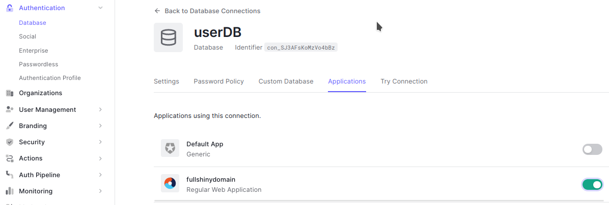
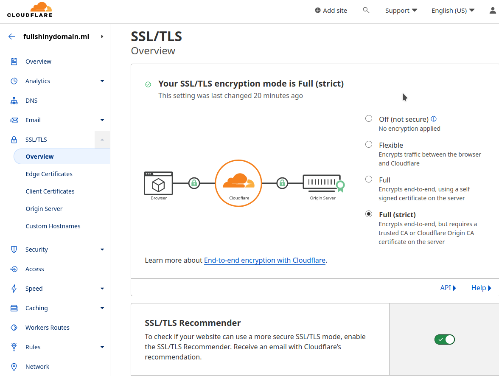
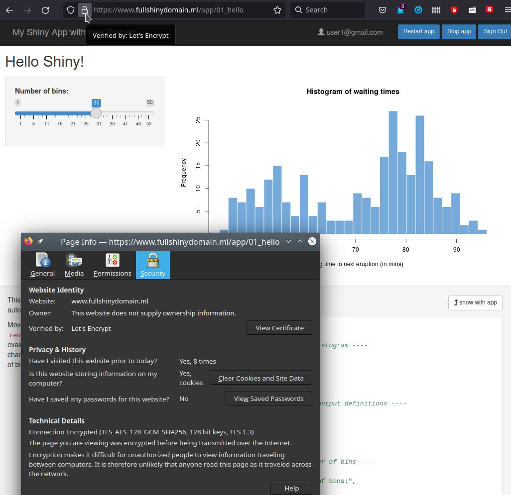

<center>
{width=400px}
</center>


# Dockerize a shinyProxy with multiple Loggin/Shiny App

## Setting docker with shinyproxy

on an Ubuntu 16.04 LTS, 18.04 LTS and 20.04 LTS or a CentOS 7, RHEL 7, CentOS 8 and RHEL 8 system (or a similar system that uses systemd) with Docker installed from the Docker repositories, one can change the configuration using:

```{bash, eval=FALSE , engine="sh"}
sudo systemctl edit docker

#  and paste

[Service]
ExecStart=
ExecStart=/usr/bin/dockerd -H unix:// -D -H tcp://127.0.0.1:2375

# Or edit 
sudo vi /lib/systemd/system/docker.service

# #nd change revelant line

ExecStart=/usr/bin/dockerd -H unix:// -D -H tcp://127.0.0.1:2375

# and restat Docker
systemctl daemon-reload
sudo systemctl restart docker
```

For more detail, please see this shinyproxy [documentation](https://www.shinyproxy.io/documentation/getting-started/#docker-startup-options).


If shinyproxy failed to start container maybe is caused by denied permission to docker.sock. We need to add permission to the docker.sock

```{bash, eval=FALSE , engine="sh"}
## add permissions to docker.sock
sudo chmod 666 /var/run/docker.sock
##or
#sudo chown $USER:docker /run/docker.sock

```

## build our shinyproxy image with  default shiny Apps

* Create new file named `Docker` and paste this chunk

```{bash, eval=FALSE , engine="sh"}
FROM openanalytics/shinyproxy:2.6.1

COPY application.yml /opt/shinyproxy/application.yml

WORKDIR /opt/shinyproxy/
CMD ["java", "-jar", "/opt/shinyproxy/shinyproxy.jar"]
```


* Create a new file named `application.yml` and paste this chunk.

```{bash, eval=FALSE , engine="sh"}
server:
  forward-headers-strategy: native
  secure-cookies: true # usefull for callback url in SAML2 authentification
proxy:
  title: My Shiny App with free Domain
  landing-page: /
  heartbeat-rate: 10000
  heartbeat-timeout: 60000
  #bind-address: 127.0.0.1 ## disturbe the connect to shinyproxy
  port: 8080
  hide-navbar: false
  template-path: ./template
  container-log-path: /container-logs
  authentication: simple
  same-site-cookie: None ## usefull to avoid callback url error
  users:
  - name: admin
    password: admin
    groups: admins
  - name: user1
    password: user1
    groups: entreprise1
  - name: user2
    password: user2
    groups: entreprise2
  docker:
      #url: http://localhost:8080  disturbe running the container of the app
      internal-networking: true
  specs:
  - id: 01_hello
    display-name: Hello Application
    description: Application which demonstrates the basics of a Shiny app
    container-cmd: ["R", "-e", "shinyproxy::run_01_hello()"]
    container-image: openanalytics/shinyproxy-demo
    access-groups: entreprise1
    container-network: sp-example-net
  - id: 06_tabsets
    container-cmd: ["R", "-e", "shinyproxy::run_06_tabsets()"]
    container-image: openanalytics/shinyproxy-demo
    access-groups: entreprise2
    container-network: sp-example-net

logging:
  file:
    shinyproxy.log

```


* built the docker image of our application and run it. We need to pull `openanalytics/shinyproxy-demo` image to run defaut shiny apps in shinyproxy.

```{bash, eval=FALSE , engine="sh"}
# create internal/local network
docker network create sp-example-net
# Build and image named  fullShinyDomain
docker build . -t fullshinydomain
docker pull openanalytics/shinyproxy-demo
# run the image
docker run -d -v /var/run/docker.sock:/var/run/docker.sock --net sp-example-net -p 8080:8080 fullshinydomain
```


* Use your favorite web browser and go to `localhost:8080`


{width=300px} {width=550px}

## Setting SAML authentification with Auth0 web service

### Auth0 web service Settings 

For more secure loggin process, I will use [Auth0](https://auth0.com/) web service. ShinyProxy supports authentication and authorization using an IDP (Identity Provider) conforming to the [SAML 2.0](https://www.shinyproxy.io/documentation/configuration/#saml-20) specification.

First of all we need to signup to  [Auth0](https://auth0.com/).

* Create a regular Web Applications named `fullshinydomain`


* Create a new data base to store users loggin specifications


* Connect the data base to to our application.



* These settings control how end-users can access the application in the context of the organizations that they belong to. We set `both` for individual person or team member of organisation.


* go to the user management section and create the two user1 and user2.  We will associate the two users to two enterprises like in our first version of application.yaml file.

{width=500px}

* Create the organizations (Entreprise1, Entreprise2) and add members (User1, User2)

 


* Do the same for Entreprise 2 and User2.


* Enable connection of Organisation to user Database. kept disable the Auto-Membership.

* Enable connections to allow organization members to access your applications. These connections will be displayed on the Entreprise 1 organization’s log-in prompt.

  

* Enable connection for organization


* Kept disable Auto-Membership


* Comeback to user management setting and associate each user to  respective enterprise in `app_metadata` field


* Activate SAML 2 in Application and setup callback `url of Application` and `audience`.


* Copy connection parameter


* Comeback to settings tab and go to Application URIs section. Paste loggin URI and set localhost in URLs.


* Check if members have access to application.


### Setting Shinyproxy with Auth0 web service

Now it is time to comeback to application.yaml file and introduce new authentication system using SAML option

* idp-metadata-url: it is  Domain/samlp/metadata/clientID

* app-entity-id: it is the application domain. We can find it in : application -> Settings -> Domain

* client_id : we can find it at: application -> Settings -> client ID.

```{bash, eval=FALSE , engine="sh"}
authentication: saml
saml:
    idp-metadata-url: https://dev-tpt1bng7.us.auth0.com/samlp/metadata/2f5KdpXxQcg15SBzDwCz1yWLE4bAaqDv
    force-authn: true
    app-entity-id: urn:dev-tpt1bng7.us.auth0.com
    app-base-url: http://localhost:8080
    name-attribute: http://schemas.xmlsoap.org/ws/2005/05/identity/claims/emailaddress
    roles-attribute: http://schemas.auth0.com/shinyproxy_roles
    logout-url: https://dev-tpt1bng7.us.auth0.com/v2/logout?client_id=2f5KdpXxQcg15SBzDwCz1yWLE4bAaqDv&returnTo=http://localhost:8080/

```


Rebuild our new version  and go to the localhost:8080. You will be redirected to something like: https://dev-tpt1bng7.us.auth0.com/u/login?state=ClientID


```{bash, eval=FALSE , engine="sh"}
# Build and image named  fullShinyDomain
docker build . -t shinyproxy
# run the image
docker run -d -v /var/run/docker.sock:/var/run/docker.sock --net sp-example-net -p 8080:8080 shinyproxy
```


* Browse to `localhost:8080`


* Now we can logging to our applications with  Auth0 configuration.


# Docker compose a ReverseProxy, Shinyproxy and Shiny Apps

The goal of this step is to hide sensitive ports of shinyproxy and shiny applications and expose only port of our reverseproxy to the host machine.

The default port of nginx is `80`.  At the end we will access our app at `localhost:80` or simplest `localhost`.

We need:

* Docker-compose the images of $nginx$ and $shinyproxy$, 

* A Dockerfile to built reverseproxy based on nginx and

* nginx.conf file to setup the reserveproxy

we will move shinyproxy file to a folder named shinyproxy and create a new folder named reverseproxy and create on it a Dockerfile of the our new reverseproxy:

The structure of the folders will be:

+ fullshinydomain/
  + docker-compose
  + resevseproxy/
    - Dockerfile
    - nginx.cong
  + shinyproxy/
    - application.yml
    - Dockerfile

```{bash, eval=FALSE , engine="sh"}

FROM nginx:alpine

COPY /reverseproxy/nginx.conf /etc/nginx/nginx.conf

```

**Note**  Do not forget to modify the the path of `application.yaml` file in `Dockerfile` like this `COPY /shinyproxy/application.yml /opt/shinyproxy/application.yml`


 During the build process, our nginx configuration file will be copied into the image. We will comeback to our nginx.conf file.

Now we need to compose our two images of the $reverseproxy$ and $shinyproxy$ in docker-compose file, like this.

```{bash, eval=FALSE , engine="sh"}
version: '3.3'
services:
    reverseproxy:
        image: reverseproxy
        container_name: reverseproxy
        build:
          context: ./reverseproxy
          dockerfile: Dockerfile
        ports:
            - '80:80'
            #- 443:443
        restart: on-failure

    shinyproxy:
      image: fullshinydomain:latest
      container_name: shinyproxy
      build:
        context: ./shinyproxy
        dockerfile: Dockerfile
      ports:
        - '8080:8080'
      depends_on:
        - reverseproxy
      volumes:
        - /var/run/docker.sock:/var/run/docker.sock
        
networks:
  default:
    external:
      name: sp-example-net


```


* The `reverseproxy` service will use an image that we’ll create shortly with the new Dockerfile. The `shinyproxy` service is our web application. We have two choice use prebuild image or rebuild it in each run.

* In nginx.conf file we need this configuration.

```{bash, eval=FALSE , engine="sh"}

worker_processes 1;

events { worker_connections 1024; }

http {

    sendfile on;

    upstream shinyproxy-shinyApp {
      server shinyproxy:8080;
    }


   server {
      listen 80;
      listen [::]:80;

      location / {
          proxy_pass         http://shinyproxy-shinyApp;
          proxy_http_version 1.1;
          proxy_set_header Upgrade $http_upgrade;
          proxy_set_header Connection "upgrade";
          proxy_read_timeout 600s;

          proxy_redirect    off;
          proxy_set_header  Host             $http_host;
          proxy_set_header  X-Real-IP        $remote_addr;
          proxy_set_header  X-Forwarded-For  $proxy_add_x_forwarded_for;
          proxy_set_header  X-Forwarded-Protocol $scheme;
      }
   }

}

```


* First of all, notice the upstream declarations. We have one upstream because we have one web application. The server inside each of the upstreams represents where to find each of the applications.

* The hostname must match the service name found in the docker-compose.yml file.

* After defining the upstream servers we need to tell NGINX how to listen and how to react to requests.

* If we try to access the host machine via port ``8080``, NGINX will act as a reverse proxy and serve whatever is in the `proxy_pass` definition. In the above scenario we have `shinyproxy-shinyApp` which is the name of one of our upstream servers. This means the `shinyproxy` service will be served at port `80` and not `8080`.

* and therefore we have to update all configurations with `localhost:8080` by `localhost:80`. Notably, in the `docker-compose` file and in the Settings tab of our fullshinydomain appication in Auth0 web service.

* Before we can launch our containers, we need to build our reverse proxy image. This can easily be accomplished by executing the following command:

```{bash, eval=FALSE , engine="sh"}

## build reverseproxy image
docker build -f ./reverseproxy/Dockerfile -t reverseproxy .

## Build and run reverseproxy and web service

docker-compose up --build -d

```


* Note after login, the url does not show any ports (`localhost` without `:8080`).


# Deploy a Docker Compose in the Cloud (Digital Ocean)

[Digital Ocean](https://www.digitalocean.com/) allows to deploy dockerized shiny app at any scale. unfortunately, there is no free lunch on the App Platform.

[Digital Ocean](https://www.digitalocean.com/) remains the cheapest platform. 


* After login, We start by creating a new docker droplet with installed `docker CE` and `docker-compose` packages. 

* go to create Droplet --> Marketplace --> search for docker solution.

* We set the cheapest configuration for this demo. This is enough to run simultaneously several Shiny applications whose sum of their RAM memories does not exceed 1GB. We need ssh keys authentication to access to the new OS by Terminal.

 

* The summary of our new cloud server looks like this:


* The IP address of our new cloud server is `204.4821.56`. we will use `ssh` protocol and its IP address to connect to our server.

* Enable IPv6. We need to power OFF the cloud server and restart it.


# Get Free Domain from freenom.com

* browse to [freenom.com](https://my.freenom.com), and  create an account.

* services --> Register a new Domain --> Check Availability --> select free Domain --> checkout order


# Get Domain certification from Cloudflare web service


* Select Free Plan.

* login to cloudflare, add a site with domain name, select free plan

* set A, AAAA, CNAM like this:


* Change servernames in freenom.com like indicated in Cloudflare

 

## Generating Origin Certificates for Full (strict) SSL/TLS Encryption

### generate certificate from cloudflare:

* go to SSL/TLS --> Origin Server --> Create Certificate --> add *.mobi100c.ml , mobi100c.ml in Hostname, RSA 2048, 15 years.


### Activate SSL/TSL


### Create new folder for certifate named `origin_cert_from_cloudflare` and follow these two nex steps before to push `OK`.

* copy origine certificate from cloudfalre and paste it to new file named `fullshinydomaine.ml.crt`.

In reverseproxy dockerfile we will add `COPY /origin_cert_from_cloudflare/fullshinydomain.ml.crt /etc/ssl/certs/`

* copy Private Key and paste it to new file named `fullshinydomain.ml.key`

In reverseproxy dockerfile we will add `COPY  /origin_cert_from_cloudflare/fullshinydomain.ml.key /etc/ssl/private/`


### Allow HTTPS


### A few more steps in cloudflare

set up restrictive SPF, DKIM, and DMARC records  and submit.


### check FULL(strict) option in SSL/TLS clouflare tab and allow SSL/TLS Recommender



# update dockefile and application.yml files with new domain name and  SSL certifcate

## add the path of the key and certificate to dockerfile of our reverseproxy

```{bash, eval=FALSE , engine="sh"}
FROM nginx:alpine

COPY nginx.conf /etc/nginx/nginx.conf

# Copy private key and certificate
COPY /origin_cert_from_cloudflare/fullshinydomain.ml.crt /etc/ssl/certs/
COPY  /origin_cert_from_cloudflare/fullshinydomain.ml.key /etc/ssl/private/
```


## add the path of the key and certificate to nginx.conf


```{bash, eval=FALSE , engine="sh"}
worker_processes 1;

events { worker_connections 1024; }

http {

    sendfile on;

    upstream shinyproxy-shinyApp {
      server shinyproxy:8080;
    }


   server {
      listen 80;
      listen [::]:80;
      listen 443 ssl;
      listen [::]:443 ssl;

      ## The location of the public and private certificate
      ssl_certificate /etc/ssl/certs/fullshinydomain.ml.crt;
      ssl_certificate_key /etc/ssl/private/fullshinydomain.ml.key;

      ssl_protocols       TLSv1 TLSv1.1 TLSv1.2;

      server_name  fullshinydomain.ml;
  
      ## How to Change Default Index Page on Nginx 
      #root           /var/www/html;
      #index          index_fullshinydomain.html;

      location / {
          proxy_pass         http://shinyproxy-shinyApp;
          proxy_http_version 1.1;
          proxy_set_header Upgrade $http_upgrade;
          proxy_set_header Connection "upgrade";
          proxy_read_timeout 600s;

          proxy_redirect    off;
          proxy_set_header  Host             $http_host;
          proxy_set_header  X-Real-IP        $remote_addr;
          proxy_set_header  X-Forwarded-For  $proxy_add_x_forwarded_for;
          proxy_set_header  X-Forwarded-Protocol $scheme;

          #try_files $uri $uri/ =404;
      }
   }

}

```


## Replace `http://localhost` by `https://www.fullshinydomain.ml` in `application.yml` file

```{bash, eval=FALSE , engine="sh"}
  saml:
    idp-metadata-url: https://dev-tpt1bng7.us.auth0.com/samlp/metadata/2f5KdpXxQcg15SBzDwCz1yWLE4bAaqDv
    force-authn: true
    app-entity-id: urn:dev-tpt1bng7.us.auth0.com
    app-base-url: https://www.fullshinydomain.ml
    name-attribute: http://schemas.xmlsoap.org/ws/2005/05/identity/claims/emailaddress
    roles-attribute: http://schemas.auth0.com/shinyproxy_roles
    logout-url: https://dev-tpt1bng7.us.auth0.com/v2/logout?client_id=2f5KdpXxQcg15SBzDwCz1yWLE4bAaqDv&returnTo=https://www.fullshinydomain.ml
```


## Replace `http://localhost` by `https://www.fullshinydomain.ml` in our application in [Auth0](https://auth0.com).


* Also ins ettings


## Rebuild images

docker-compose up --build -d
```{bash, eval=FALSE , engine="sh"}

# Build and run simoultaniously the two images

docker-compose up --build -d

# OR 

#Rebuild the new version of Application
docker build -f ./shinyproxy/Dockerfile -t kmezhoud/fullshinydomain:shinyproxy .
# Rebuild the ne wversion of our reverseproxy
docker build -f ./shinyproxy/Dockerfile -t kmezhoud/fullshinydomain:reverseproxy .

## Login to dockerHub
docker login

docker push kmezhoud/fullshinydomain:reverseroxy
docker push kmezhoud/fullshinydomain:shinyproxy
```


* But before, We need to create a new `ocean-docker-compose.yml` that can use direct images without there build.


```{bash, eval=FALSE , engine="sh"}
version: '3.3'
services:
    reverseproxy:
        image: kmezhoud/fullshinydomain:reverseproxy
        container_name: reverseproxy
        ports:
            - '80:80'
            #- 443:443
        restart: on-failure

    shinyproxy:
      image: kmezhoud/fullshinydomain:shinyproxy
      container_name: fullshinydomain
      ports:
        - '8080:8080'
      depends_on:
        - reverseproxy
      volumes:
        - /var/run/docker.sock:/var/run/docker.sock
        
networks:
  default:
    external:
      name: sp-example-net


```

* Copy docker-compose.yml file to cloud server

* Login to the server

* Pull images

* give permission to docker.sock

* Run the images

```{bash, eval=FALSE , engine="sh"}
## copy docker-compose.yml to server /home
scp ocean-docker-compose.yml root@204.48.21.56:/home/docker-compose.yml

# connect to server
ssh root@204.48.21.56
cd /home
docker pull kmezhoud/fullshinydomain:reverseproxy
docker pull kmezhoud/fullshinydomain:shinyproxy

sudo chmod 666 /var/run/docker.sock

docker-compose up -d
```

* Browse to https://wwww.fullshinydomain.ml 

* Login/password using user1@gmail.com/user1/gmail.com or user2@gmail.com/user2@gmail.com



