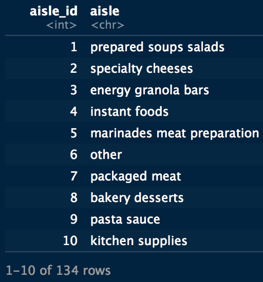
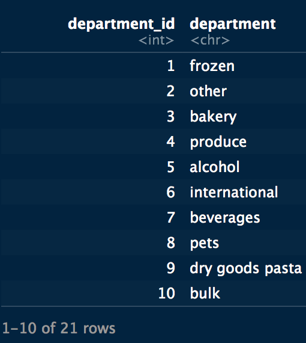
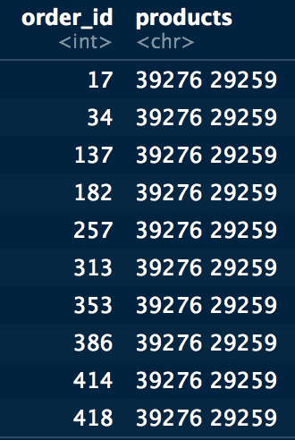
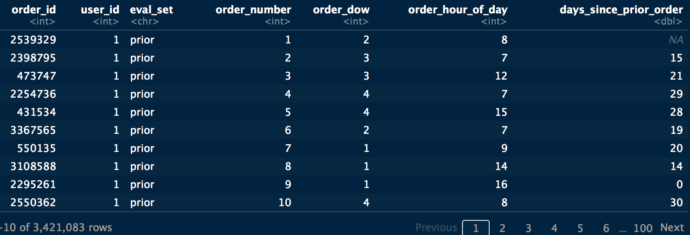
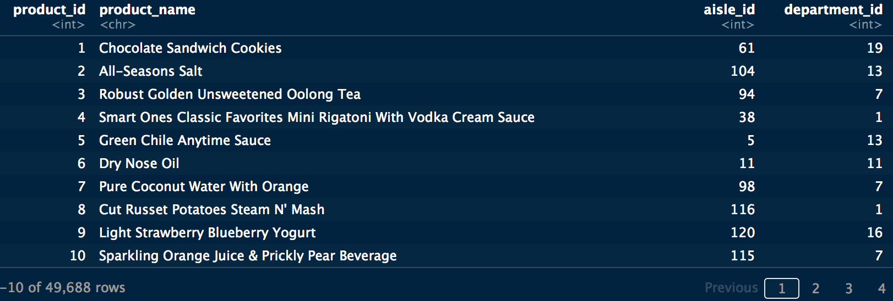
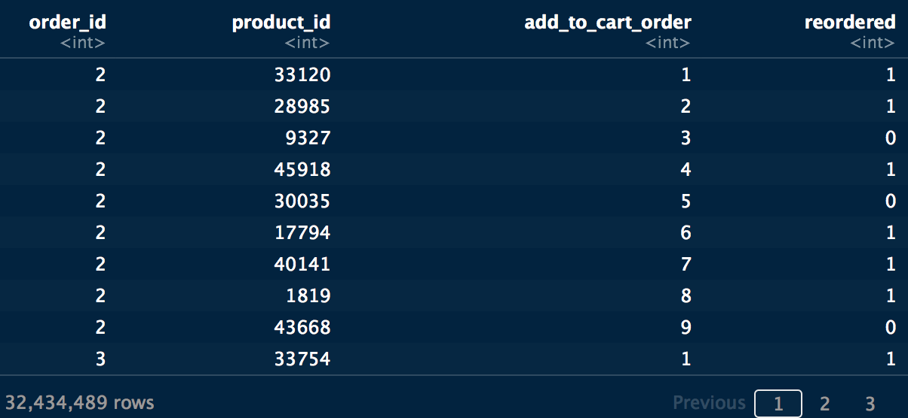
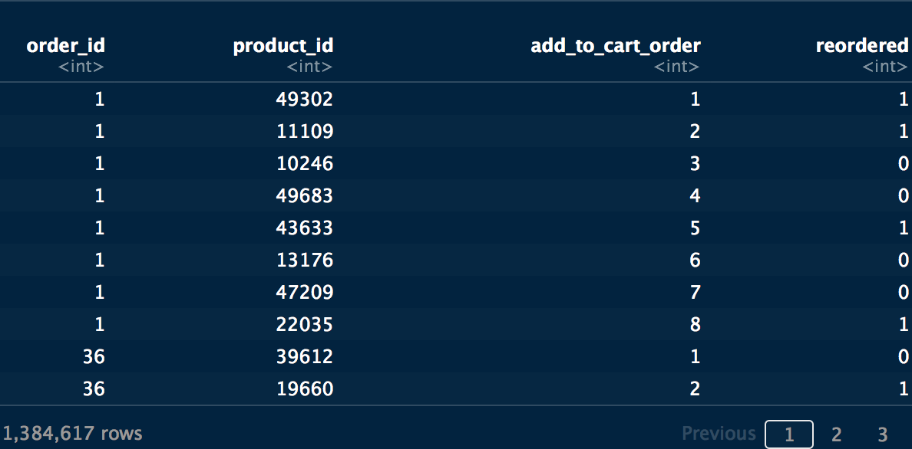

```{r setup, include=FALSE, echo=FALSE}
knitr::opts_chunk$set(echo=TRUE, error=FALSE)
```

# Introduction  to the dataset
The dataset for this competition is a relational set of files describing customers' orders over time. **The goal of the competition is to predict which products will be in a user's next order**. The dataset is anonymized and contains a sample of over 3 million grocery orders from more than 200,000 Instacart users. For each user, we provide between 4 and 100 of their orders, with the sequence of products purchased in each order. We also provide the week and hour of day the order was placed, and a relative measure of time between orders. For more information, see the [blog post](https://tech.instacart.com/3-million-instacart-orders-open-sourced-d40d29ead6f2) accompanying its public release.

## Load Packages

```{r include=FALSE, echo=TRUE}
library(data.table)
library(DT)
library(dplyr)
#library(plyr)
library(lubridate)
library(ggplot2)
library(grid) # for multiple plot

```

## Function for multiple plot
```{r}
# Define multiple plot function
#
# ggplot objects can be passed in ..., or to plotlist (as a list of ggplot objects)
# - cols:   Number of columns in layout
# - layout: A matrix specifying the layout. If present, 'cols' is ignored.
#
# If the layout is something like matrix(c(1,2,3,3), nrow=2, byrow=TRUE),
# then plot 1 will go in the upper left, 2 will go in the upper right, and
# 3 will go all the way across the bottom.
#
multiplot <- function(..., plotlist=NULL, file, cols=1, layout=NULL) {

  # Make a list from the ... arguments and plotlist
  plots <- c(list(...), plotlist)

  numPlots = length(plots)

  # If layout is NULL, then use 'cols' to determine layout
  if (is.null(layout)) {
    # Make the panel
    # ncol: Number of columns of plots
    # nrow: Number of rows needed, calculated from # of cols
    layout <- matrix(seq(1, cols * ceiling(numPlots/cols)),
                    ncol = cols, nrow = ceiling(numPlots/cols))
  }

 if (numPlots==1) {
    print(plots[[1]])

  } else {
    # Set up the page
    grid.newpage()
    pushViewport(viewport(layout = grid.layout(nrow(layout), ncol(layout))))

    # Make each plot, in the correct location
    for (i in 1:numPlots) {
      # Get the i,j matrix positions of the regions that contain this subplot
      matchidx <- as.data.frame(which(layout == i, arr.ind = TRUE))

      print(plots[[i]], vp = viewport(layout.pos.row = matchidx$row,
                                      layout.pos.col = matchidx$col))
    }
  }
}
```

## Load files
```{r}
aisles <- data.table::fread("aisles.csv")
departments <- data.table::fread("departments.csv")
order_prior <- data.table::fread("order_products__prior.csv")
order_train <- data.table::fread("order_products__train.csv")
orders <- data.table::fread("orders.csv")
products <- data.table::fread("products.csv")
sample_sub <- data.table::fread("sample_submission.csv")
```

## Files glimpse

<div class = "row">
<div class = "col-md-4">
**The list of aisles**


</div>

<div class = "col-md-4">
**The list of departments**

</div>

<div class = "col-md-4">
**Example of sample submission**

</div>
</div>


<!-- #<div class = "row"> -->
<!-- <div class = "col-md-6"> -->
**The list of orders: order_dow' is the day of week. user 1 has 11 orders, 1 of which is in the train set, and 10 of which are prior orders. **
  


<!-- </div> -->

<!-- <div class = "col-md-6"> -->
**The list of Products**

<!-- </div> -->
<!-- </div> -->

**order_Prior: Contains previous order contents for all customers 'reordered' indicates that the customer has a previous order that contains the product**



**Order_Train: in each order, products were added de the card by priority. some products were reordered**



## Reformating Datasets

```{r}

aisles <- aisles %>%
          mutate(aisle = as.factor(aisle))

departments <- departments %>%
               mutate(department = as.factor(department))


order_prior <- order_prior %>%
               mutate(reordered = as.logical(reordered)) #%>%
               #mutate(product_id = as.factor(product_id))

order_train <- order_train %>%
               mutate(reordered = as.logical(reordered))

orders <- orders %>%
          mutate(eval_set = as.factor(eval_set)) %>%
          mutate(w_day = wday(order_dow , label = TRUE)) %>% # +1: weekdays have the interval [0:6] an dnot [1:7]
          mutate(user_id = as.factor(user_id))

products <- products %>%
            mutate(product_name = as.factor(product_name))
```

# Market Basket analysis
In this first section, we would try explore the of details of the orders, the content of baskets, the best sold items.

## Regroup items per basket
In each orders, costumers bougth multiple items forming a basket. We will regroup the orders per basket.

We need to join orders by order_id and then by products_id.
This code take a while.
```{r}
# transactions <- orders %>%
#   left_join(order_prior, by = "order_id") %>%
#   left_join(products, by = "product_id")
# 
# baskets <- transactions %>%
#            plyr::ddply(c("order_id", "user_id"),
#               function(df1) paste(df1$product_name,
#                                   collapse = ","))
# 
# colnames(baskets) <- c("Order_id","user_id","Baskets")
# baskets <- readRDS("baskets.RDS")
# tibble::glimpse(baskets)
# saveRDS(object = baskets, file = "baskets.RDS")

```

## View the distribution of orders / transactions (hours and week days)

```{r  include=TRUE, echo=FALSE, comment=FALSE, warning=FALSE}
## time of ordering
p1 <- orders %>%
  ggplot(aes(x = order_hour_of_day)) +
    geom_histogram( stat="count", color= "blue") # ,bins = 24

## days of ordering
p2 <- orders %>%
  ggplot(aes(x = w_day)) +
  geom_histogram( stat= "count", color = "green")

## interval of days before Reordering
p3 <- orders %>%
  ggplot(aes(x = days_since_prior_order)) +
  geom_histogram(bins = 30, color = "yellow")


 # plot P1, P2, P3, p4 in the same plot
 layout <- matrix(c(1,2,3,3), 2, 2, byrow = TRUE)
 multiplot(p1, p2, p3, layout=layout)
```

we find:
The main orders were done during the working hours of the day (8:17h). 
We assume that `NA` corresponds to `saturday`. A clear effect of the orders number is shown durinr the weekend.
We observe a interval of reordering of 30 days. During this cycle we observe a picks at the dat 7, 15 and 30. 
We can observe more ordering during weekends during a month. But we can aloso observe diffrence of the number of orderinf between weekends. 


## plot the number of prior , train, and test orders
```{r include=TRUE, echo=FALSE, comment=FALSE, warning=FALSE}
## count the number of prior orders
p3 <- orders %>%
  filter(eval_set == 'prior') %>%
  ggplot(aes(order_number)) +
  geom_histogram(stat = "count", color = "red")

p2 <- orders %>%
  filter(eval_set == 'train') %>%
  ggplot(aes(order_number)) +
  geom_histogram(stat = "count", color = "green")

p1 <- orders %>%
  filter(eval_set == 'test') %>%
  ggplot(aes(order_number)) +
  geom_histogram(stat = "count", color = "blue")

 # plot P1, P2, P3 in the same plot
 layout <- matrix(c(1,2,3,3), 2, 2, byrow = TRUE)
 multiplot(p1, p2, p3, layout=layout)
```

We have more prior (200000) orders, than traiun (15000) than test (7500).
We observe a pick at 100 orders number for test and train samples. 

## plot the number of items per order

```{r  comment=FALSE, warning=FALSE}
prior <- order_prior %>%
  group_by(order_id) %>%
  dplyr::summarise(n_orders = n()) %>%
  ggplot(aes(x= n_orders)) +
  geom_histogram(bins = 50, color = "yellow")+
  xlim(0,50) +
  labs(title = "Prior orders") +
  xlab("number of items per order") +
  ylab("n° orders")
  
train <- order_train %>%
  group_by(order_id) %>%
  dplyr::summarise(n_orders = n()) %>%
  ggplot(aes(x= n_orders)) +
  geom_histogram(bins = 50, color = "orange") +
  xlim(0,50) +
  labs(title = "Train orders") +
  xlab("number of items per order") +
  ylab("n° orders")

 # plot P1, P2, P3 in the same plot
 layout <- matrix(c(1, 2), 1, 2, byrow = TRUE)
 multiplot(prior, train, layout=layout)

```

We find:
The most frequent nbr of order is about 5-6 items for the Prior and Train datasets.
Ordering 25 items seems to be an exception. 

## Top costomers for Top products

```{r comment=FALSE, warning=FALSE}
# top costumers that purchased the largest number of items 
#the dataset is limited to 100 items maximum per costumer
top_costumers_items <- orders %>%
  group_by(user_id) %>%
  dplyr::summarise(n_orders = length(order_id)) %>%
  filter(n_orders < 100) %>%
  top_n(50, wt = n_orders) %>%
  #arrange(freq) %>%
  ggplot(aes(x = reorder(user_id, - n_orders), y = n_orders)) +
  theme(axis.text.x = element_text(angle=45, hjust=1)) +
  geom_point() +
  labs(title = "Top costumers which buy more items") +
  xlab("user_id") +
  ylab("nbr items")


top_costumers_visits <- orders %>%
  #filter(user_id == 123) %>%
  group_by(user_id) %>%
  dplyr::summarise(n_visits = last(order_number)) %>%
  filter(n_visits < 100) %>%
  top_n(20, n_visits) %>%
  ggplot(aes(x = user_id, y = n_visits)) +
  theme(axis.text.x = element_text(angle=45, hjust=1)) +
  geom_col() +
  labs(title = "Number of visits per costumers") +
  xlab("User_id") +
  ylab("Order Number")
  

 top20_item_prior <- order_prior %>%
   group_by(product_id) %>%
   dplyr::summarise(n = n()) %>%
  top_n(20, wt = n) %>%
  left_join(products, by = 'product_id') %>%
  ggplot(aes(x = reorder(product_name, - n) , y = n )) +
  #coord_flip() +
  theme(axis.text.x = element_text(angle=45, hjust=1)) +
  geom_col( color = "green") +
  labs(title = "Top 20 products for Prior orders") +
  xlab("product_id") +
  ylab("n° orders")


  top20_item_train <- order_train %>%
  group_by(product_id) %>%
   dplyr::summarise(n = n()) %>%
  top_n(20, wt = n) %>%
  left_join(products, by = 'product_id') %>%
  ggplot(aes(x = reorder(product_name, - n) , y = n )) +
  #coord_flip() +
  theme(axis.text.x = element_text(angle=45, hjust=1)) +
  geom_col( color = "red") +
  labs(title = "Top 20 products for train orders") +
  xlab("product_id") +
  ylab("nbr orders")
  
  
  # plot P1, P2, P3, p4 in the same plot
 layout <- matrix(c(1,2,3,4), 2, 2, byrow = TRUE)
 multiplot(top_costumers_visits, top_costumers_visits,  top20_item_prior,top20_item_train, layout=layout)

```


## Top reordered items

```{r comment=FALSE, warning=FALSE}

reordered_train <- order_train %>% 
  filter(reordered == TRUE) %>%
  group_by(product_id) %>% 
  dplyr::summarise(freq = n()) %>% 
  top_n(10, wt = freq) %>%
  left_join(products, by = 'product_id') %>%
    ggplot(aes(x = reorder(product_name, - freq) , y = freq )) +
  theme(axis.text.x = element_text(angle=45, hjust=1)) +
  geom_col( color = "red") +
  labs(title = "Top reordered items for train data set") +
  xlab("product name") +
  ylab("Reordered frequency")
  
  
reordered_prior <- order_prior %>% 
  filter(reordered == TRUE) %>%
  group_by(product_id) %>% 
  dplyr::summarise(freq = n()) %>% 
  top_n(10, wt = freq) %>%
  left_join(products, by = 'product_id') %>%
    ggplot(aes(x = reorder(product_name, - freq) , y = freq )) +
  theme(axis.text.x = element_text(angle=45, hjust=1)) +
  geom_col( color = "blue") +
  labs(title = "Top reordered items for prior data set") +
  xlab("product name") +
  ylab("Reordered frequency")


  # plot P1, P2, P3, p4 in the same plot
 layout <- matrix(c(1,2), 1, 2, byrow = TRUE)
 multiplot(reordered_train, reordered_prior, layout=layout)
```

We find:
The main difference is in `Organic Whole Milk` which is not in the top 10 products in train orders.

## Which items added the first to the card

```{r comment=FALSE, warning=FALSE}
first_item_to_cart_prior <-
order_prior %>%
  filter(add_to_cart_order == 1) %>%
  #filter(product_id == "345") %>%
  group_by(product_id, reordered) %>%
  dplyr::summarise(n_first = n()) %>%
  arrange(desc(n_first)) %>%
  head(10) %>%
 # dplyr::top_n(10, wt = n_first) %>% doesn't work
  left_join(products, by = 'product_id') %>%
  ggplot(aes(x = product_name, y =  n_first)) +
   theme(axis.text.x = element_text(angle=45, hjust=1)) +
  geom_col(aes(fill = reordered)) +
  labs(title = "Top first added items to the cart (Prior)") +
  xlab("product name") +
  ylab("frequency of added the first to the cart")


first_item_to_cart_train <-
order_train %>%
  filter(add_to_cart_order == 1) %>%
  #filter(product_id == "345") %>%
  group_by(product_id, reordered) %>%
  dplyr::summarise(n_first = n()) %>%
  arrange(desc(n_first)) %>%
  head(10) %>%
 # dplyr::top_n(10, wt = n_first) %>% doesn't work
  left_join(products, by = 'product_id') %>%
  ggplot(aes(x = product_name, y =  n_first)) +
   theme(axis.text.x = element_text(angle=45, hjust=1)) +
  geom_col(aes(fill = reordered)) +
  labs(title = "Top first added items to the cart (Train)") +
  xlab("product name") +
  ylab("frequency of added the first to the cart")


  # plot P1, P2, P3, p4 in the same plot
 layout <- matrix(c(1,2), 1, 2, byrow = TRUE)
 multiplot(first_item_to_cart_prior, first_item_to_cart_train, layout=layout)
  
```

we find:
In general only the reordered items are added at the bigening  of shopping. 
Only few cases with banana are not ordered for the first time and added the first to the cart.