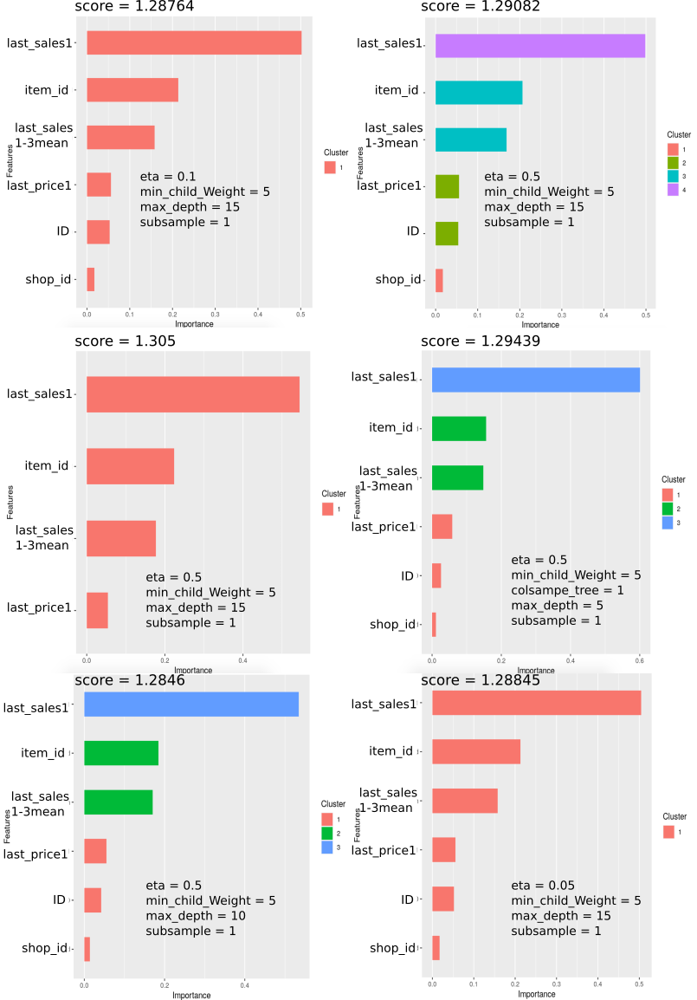

```{r, echo=FALSE}
knitr::opts_chunk$set(error = TRUE)
```

## Laod packages
```{r, echo=FALSE}
library(tidyverse)
library(DT)
library(data.table)
library(lubridate)
library(magrittr)
library(DataExplorer)
library(ggplot2)
library(plotly)
library(Matrix)
library(xgboost)
```

# Scores Versus Parameters: Resume of 6 runs
I tried several configuration to improve te score. The best one is the first one.
I did not save to parameters For the best score, It was a testing For my first submission. 
After that I can not obtain less than `1.28`  ':-))))'.





## read & reduce files sizes
```{r}
# sales_train <- fread("sales_train.csv")
# test <- fread("test.csv")
# sample_submission <- fread("sample_submission.csv")
# item <- fread("items.csv")
# item_categories <- fread("item_categories.csv")
# shops <- fread("shops.csv")
# 
# saveRDS(sales_train, "dataset/sales_train.rds")
# saveRDS(test, "dataset/test.rds")
# saveRDS(sample_submission, "dataset/sample_submission.rds")
# saveRDS(item, "dataset/item.rds")
# saveRDS(item_categories, "dataset/item_categories.rds")
# saveRDS(shops, "dataset/shops.rds")

```

```{r}
sales_train <- readRDS("dataset/sales_train.rds")
test <- readRDS("dataset/test.rds")
sample_submission <- readRDS("dataset/sample_submission.rds")
item <- readRDS("dataset/item.rds")
item_categories <- readRDS("dataset/item_categories.rds")
shops <- readRDS("dataset/shops.rds")
```

### Explore Sales train
```{r}
glimpse(sales_train)
```
### Glimpse test
```{r}
glimpse(test)
```

### Glimpse item
```{r}
glimpse(item)
```

### Glimpse item_categories
```{r}
glimpse(item_categories)
```

### Glimpse shops
```{r}
glimpse(shops)
```

### Glimpse submission file
```{r}
glimpse(sample_submission)
```

## Merge dataframe & Explore

```{r}
train <- sales_train %>%
  left_join(item, by = "item_id") %>%
  left_join(item_categories, by = "item_category_id") %>%
  left_join(shops, by = "shop_id")

rm(sales_train, item, item_categories, shops)
invisible(gc())
DataExplorer::plot_intro(train)
```

### Explore correlation
```{r}
plot_correlation(train)
```

## Item_id versus shop_id
```{r}
train %>%
  select(shop_id, item_id) %>%
  head()
```
* one `shop_id` can has multiple `item_id`
* the same  formula `f(shop_id,item_id)` is repeated several time during the period.

## How many shops and items?

```{r}
paste("In test data, tere is :", test %>% select(shop_id) %>% unique %>% count(), " shops")
paste("In test data there is: ",test %>% select(item_id) %>% unique() %>% count(), " items")
```

## How many items per shop_id?
```{r}
p <- train  %>%
  mutate(date = dmy(date)) %>%
  mutate(shop_id = as.character(as.factor(shop_id))) %>%
  select(date, shop_id, item_id) %>%
  group_by(date,shop_id) %>%
  summarise(n_items = sum(n_distinct(item_id))) %>%
  ggplot()+
  aes(x = date, y = n_items, fill = shop_id) +
  geom_col() +
  scale_x_date(date_labels="%b %y",date_breaks  ="1 month") +
  theme( axis.text.x  = element_text(angle=45, hjust=1, vjust=0.9))

ggplotly(p)

```

* There is some season of the freq items sales per shop
* this saeson is related to date.
* always shops with orange color have sold more items than shops with pink color. This means that for example shops 0, 1, 2 have more items that shops 54, 55, 56 during any date during this dataset.

## What kind of items we have?
```{r}
train %>%
  select(item_category_id, item_name) %>%
  group_by(item_category_id) %>%
  count() %>%
  arrange(item_category_id) %>% summary()
```

* It seems like Fnac shop in Russia 
* there is 84 caterogies and 21807 items descriptions
* The freq can increase until 31340 but the mean is about 134 items and the median is about 32 items.


## How many categories per shop?
Get idea about the size of shops.

```{r, fig.width=7}
train %>%
  select(shop_id, item_category_id) %>%
  group_by(shop_id) %>%
  summarise(n_cat = n_distinct(item_category_id)) %>%
  ggplot() +
  aes(x = shop_id, y =n_cat, fill= n_cat ) %>%
  geom_col()+
  theme( axis.text.x  = element_text(angle=45, hjust=1, vjust=0.9))
```
* Most shops have more than 40 categories.

## Which categories that have more transactions?

```{r fig.width=7}
train %>%
  group_by(item_category_id) %>%
  summarise(n_transactions = sum(item_cnt_day)) %>%
  ggplot() +
  aes(x= as.factor(item_category_id), y = n_transactions) +
  geom_col() +
  theme( axis.text.x  = element_text(angle=45, hjust=1, vjust=0.9))
```
* caterogies: 40 has the first rank. After: 30, 55, 19, 37, 71, 28, 23.
* some categories have zero or few solds.


## Which Categories have few transactions

```{r}
train %>%
  group_by(item_category_id) %>%
  summarise(n_transactions = sum(item_cnt_day)) %>%
  arrange(n_transactions) %>%
  filter(n_transactions < 1000)
```

* Maybe we can consider that categories with less that 1000 sold during the study are not important for prediction.

We can play with question and answers and plot a lot of graphes.... But

## What is the goal?
Submission file has `ID` and `item_cnt_day columns`.   The `ID` is a (Shop, Item) tuple that we can find in test file.

## How can identify ID in train dataset?
Each `ID` is an unique cancatenation of `shop_id` and `item_id`. 

```{r}
test <- test %>%
  mutate(IDx = paste(shop_id, item_id, sep = "_"))
head(test)
```

## Other ID exist in train dataset and does not exist in test dataset?
**IDx minus ID is IDs that do not exist in submission file **
```{r}
p <- train %>%
  mutate(IDx = paste(shop_id, item_id, sep = "_")) %>%
  full_join(test, by= c("shop_id","item_id" ,"IDx")) %>% 
  select(date_block_num ,shop_id, item_id, IDx, ID, item_cnt_day) %>%
  mutate(item_id = as.factor(as.character(item_id))) %>%
  filter(is.na(ID)) %>%
  group_by(date_block_num, shop_id) %>%
  #summarise(item_cnt_month = sum(item_cnt_day)) %>%
  summarise(n_item = n_distinct(item_id)) %>%
  ggplot() +
  aes(x = date_block_num, y = n_item, fill = shop_id) +
  geom_col()
  
  

ggplotly(p)
```

* The items without ID decrease during the time series 


## ID with sales History
```{r}
p1 <- train %>%
  mutate(IDx = paste(shop_id, item_id, sep = "_")) %>%
  full_join(test, by= c("shop_id","item_id" ,"IDx")) %>% 
  select(date_block_num ,shop_id, item_id, IDx, ID, item_cnt_day) %>%
  mutate(item_id = as.factor(as.character(item_id))) %>%
  filter(!is.na(ID)) %>%
  filter(!is.na(date_block_num)) %>%
  group_by(date_block_num, shop_id) %>%
  summarise(n_item = n_distinct(item_id)) %>%
  ggplot() +
  aes(x = date_block_num, y = n_item, fill = shop_id) +
  geom_col()

ggplotly(p1)
```


## ID without sales past
```{r}
train %>%
  mutate(IDx = paste(shop_id, item_id, sep = "_")) %>%
  full_join(test, by= c("shop_id","item_id" ,"IDx")) %>% 
  select(date_block_num ,item_category_id, shop_id, item_id, IDx, ID, item_cnt_day) %>%
  #mutate(item_id = as.factor(as.character(item_id))) %>%
  #mutate(shop_id = as.factor(as.character(shop_id))) %>%
  filter(!is.na(ID)) %>% 
  filter(is.na(date_block_num)) %>%
  select(ID) %>%
  n_distinct()
```

OOO! There is 102796/214200 (48%) of ID in test and in train but do not have past sales.


## Look for Item informations of ID without past sale

```{r}
train %>%
  mutate(IDx = paste(shop_id, item_id, sep = "_")) %>%
  full_join(test, by= c("shop_id","item_id" ,"IDx")) %>% 
  filter(!is.na(ID)) %>% 
  filter(is.na(date_block_num)) %>% 
  summary
```

* Not informations about ID without Sales past.


## test ID versus sample_submission ID
```{r}
test %>%
  full_join(sample_submission, by= "ID") %>% summary
```

* Identical ID are present in test and Sample_submission.

**The goal is to predict a monthly amount of `item_cnt_dat`**

## Item_test versus item_train

```{r}
item_test <- unique(test$item_id)
item_train  <- unique(train$item_id)
item_in_test_in_train <- item_test[item_test %in% item_train]
item_in_test_not_train <- item_test[!item_test %in% item_train]
paste("there is sales history of ", round((length(item_in_test_in_train)*100)/length(item_test)), "% of items in dataset  test" )
```


## Shops_test versus Shops_train

```{r}
shop_test <- unique(test$shop_id)
shop_train <- unique(train$shop_id)
shop_in_test_in_train <- shop_test[shop_test %in% shop_train]
shop_test_not_train <- shop_test[!shop_test %in% shop_train]
paste("there is sales history of ",round((length(shop_in_test_in_train)*100)/length(shop_test)), "% of shops in  test dataset " )
```

## item_shop_test versus item_shop_train

```{r}
item_shop_test <- test %>%   mutate(IDx = paste(shop_id, item_id, sep = "_")) %>% select(IDx)  %>% as.list
item_shop_train <- train %>% mutate(IDx = paste(shop_id, item_id, sep = "_")) %>% select(IDx) %>% as.list

item_shop_in_test_in_train <- item_shop_test$IDx[item_shop_test$IDx %in% item_shop_train$IDx]
item_shop_in_test_not_train <- item_shop_test$IDx[!item_shop_test$IDx %in% item_shop_train$IDx]
paste("there is sales history of", round((length(item_shop_in_test_in_train)*100)/length(item_shop_test$IDx)), "%  of item_shop pairs in test dataset")

```


## History study of item_shop pairs that exist in test & train dataset

```{r}
train_ID_with_history <- train %>%
  mutate(IDx = paste(shop_id, item_id, sep = "_")) %>%
  full_join(test, by= c("shop_id","item_id" ,"IDx")) %>% 
  filter( IDx %in% item_shop_in_test_in_train ) %>%
  select(date, date_block_num, ID, item_cnt_day, item_price) %>%
  group_by(date_block_num, ID) %>%
  summarise(item_cnt_month = sum(item_cnt_day))

train_ID_with_history  %>% head(20)
```


## List of ID with History
```{r}
ID_in_test_in_train <- train %>%
  mutate(IDx = paste(shop_id, item_id, sep = "_")) %>%
  full_join(test, by= c("shop_id","item_id" ,"IDx")) %>% 
  filter( IDx %in% item_shop_in_test_in_train ) %>%
  select(ID)  %>% unique

ID_in_test_in_train$ID %>% head(100)
```


## Compute the monthly item_cnt_day

```{r}
train %>%
  mutate(IDx = paste(shop_id, item_id, sep = "_")) %>%
  left_join(test, by= c("shop_id","item_id" ,"IDx")) %>% 
  select(date, date_block_num ,shop_id, item_id, IDx, ID, item_cnt_day) %>%
  na.omit(ID) %>%
  mutate(date_block_num = as.factor(date_block_num),ID= as.factor(ID)) %>%
  group_by(date_block_num, ID) %>%
  summarise(item_cnt_month = sum(item_cnt_day)) %>%
  arrange(desc(item_cnt_month)) %>%
  head()
```

* During month 33 (Nov 2015) we have 2253 transactions of ID 37296. Reminber ID is shop_item encoding.

## Plot the count of monthly sold ID with more that 100 transaction per month

```{r, fig.width=7}
p <- train %>%
  mutate(IDx = paste(shop_id, item_id, sep = "_")) %>%
  left_join(test, by= c("shop_id","item_id" ,"IDx")) %>% 
  select(date, date_block_num ,shop_id, item_id, IDx, ID, item_cnt_day) %>%
  na.omit(ID) %>%
  mutate(date_block_num = as.factor(date_block_num), ID= as.factor(ID)) %>%
  group_by(date_block_num, ID) %>%
  summarise(item_cnt_month = sum(item_cnt_day)) %>%
  filter(item_cnt_month > 100) %>%
  ggplot() +
  aes(x = date_block_num, y =item_cnt_month, fill = ID) +
  geom_col() 
 # theme( axis.text.x  = element_text(angle=45, hjust=1, vjust=0.9))

ggplotly(p)
```
* We have 34 months start from Jan 2013 and end on November 2015.
* We have to predict the monthly count of ID during December 2015.
* The trainning dataset has two december of 2013 (11) and 2014 (23).
* A particular PIC exists during September 2013 which is not present during 2014 and 2015.
* A dramatic decrease of sold during June-September during 2014-2015 compared to 2013.
* An important increase of sold during September and November of ID 37296.
* An important decrease of ID 46360 during 2015 compared 2013-2014.

The goal is to predict the next bar plot of December 2015.
There is 214200 ID in test and sample_submission.

## What is ID 37296?
* Доставка до пункта выдачи (Boxberry): Delivery to pick-up point (Boxberry)
* Доставка товара: Delivery of goods
* Интернет-магазин ЧС: Emergency Shop Online
```{r}
train %>%
  mutate(IDx = paste(shop_id, item_id, sep = "_")) %>%
  left_join(test, by= c("shop_id","item_id" ,"IDx")) %>% 
  na.omit(ID) %>%
  filter(ID == "37296") %>%
  ggplot() +
  aes(x=date_block_num, y= item_price, color = item_price) +
  geom_point()
```
The goal on this plot is to check if the price of the Boxberry is in sold or not during the last months. 

## What is ID 46360
* Фирменный пакет майка 1С Интерес белый (34x42) 45 мкм: Chemise de paquet entreprise 1C intérêt blanc (34 * 42) 45 microns
* Подарки - Сумки, Альбомы, Коврики д/мыши: Cadeaux - Sacs, Albums, Tapis de souris
* Подарки - Сумки, Альбомы, Коврики д/мыши: Cadeaux - Sacs, Albums, Tapis de souris
* Москва ТЦ ""Семеновский"": Centre commercial de Moscou "" Semenovsky ""
```{r}
p <- train %>%
  mutate(IDx = paste(shop_id, item_id, sep = "_")) %>%
  left_join(test, by= c("shop_id","item_id" ,"IDx")) %>% 
  na.omit(ID) %>%
  filter(ID == "46360") %>%
  ggplot() +
  aes(x=date_block_num, y= item_price, color = item_price) +
  geom_point()

p
```
The decrease of item_cnt_day is not related to price. 


## Trend of transactions per month

```{r}
p <- train %>%
  mutate(IDx = paste(shop_id, item_id, sep = "_")) %>%
  left_join(test, by= c("shop_id","item_id" ,"IDx")) %>% 
  select(date, date_block_num ,shop_id, ID, item_cnt_day) %>%
  mutate(date_block_num = as.factor(date_block_num), shop_id= as.factor(shop_id)) %>%
  na.omit(ID) %>%
  group_by(date_block_num, shop_id) %>%
  summarise(transactions = sum(item_cnt_day)) %>%
  ggplot() +
  aes(x = date_block_num, y = transactions, fill = shop_id) +
  geom_col()

ggplotly(p)
```

* The trend of total transaction is in increase.

## Trend of the amount of total item_prise purchased per shop
```{r}
p <- train %>%
  mutate(IDx = paste(shop_id, item_id, sep = "_")) %>%
  full_join(test, by= c("shop_id","item_id" ,"IDx")) %>% 
  select(date, date_block_num ,shop_id, ID, item_price,item_cnt_day) %>%
  mutate(date_block_num = as.factor(date_block_num), shop_id= as.factor(shop_id)) %>%
  #na.omit(ID) %>%
  mutate(Amount = ifelse((item_cnt_day <= 0)|(item_price <= 0), 0, item_price*item_cnt_day)) %>%
  group_by(date_block_num, shop_id) %>%
  summarise(total_amount = sum(Amount)) %>%
  ggplot() +
  aes(x = date_block_num, y =total_amount, fill = shop_id) +
  geom_col()

ggplotly(p)
```

Also, I think there is an increase trend of the total amount per month.

## What about  seasonality, trend, and cycle?
**rucm package can extract seasonal characteristics from time series.**
### Monthly Transactions Number trend
```{r}
library(xts)
library(rucm)

df <- train %>%
  mutate(IDx = paste(shop_id, item_id, sep = "_")) %>%
  full_join(test, by= c("shop_id","item_id" ,"IDx")) %>% 
  filter( IDx %in% item_shop_in_test_in_train ) %>%
  select(date, date_block_num, ID, item_cnt_day, item_price) %>%
  group_by(date_block_num, ID) %>%
  summarise(item_cnt_month = sum(item_cnt_day))


## convert df as time series (ts)
Transactions <- ts(df$item_cnt_month/10,
             start = 0,
             end = 33,
             frequency = 1)

model_trans <- ucm(formula = Transactions~0, data = Transactions, level = TRUE,season = TRUE, season.length = 3, slope = TRUE)

{plot(Transactions) +
## plot 
lines(model_trans$s.level, col = "blue") +
### plot Prediction Transactions number for the x N months
lines(predict(model_trans$model, n.ahead = 10), col = "red")+
abline(reg=lm(Transactions~time(Transactions)), col = "green")}

```

### ggplot prediction of the number of transaction for the next Months
```{r}
pred <- predict(model_trans$model, n.ahead = 17)
pred_df <- cbind(time =34:50, as.data.frame(pred))

ggplot(df) +
  geom_line(aes(x = date_block_num , y = item_cnt_month)) +
  geom_line(data = pred_df, aes(x = time, y = fit), color = "red") +
  geom_abline(slope = model_trans$s.slope, intercept = 2000, color = "blue")
             
```
* This plot does not take in account the seasonality.

### Monthly Amount Trend

```{r}
df <- train %>%
  mutate(IDx = paste(shop_id, item_id, sep = "_")) %>%
  full_join(test, by= c("shop_id","item_id" ,"IDx")) %>% 
  filter( IDx %in% item_shop_in_test_in_train ) %>%
  select(date, date_block_num ,shop_id, ID, item_price,item_cnt_day) %>%
  group_by(date_block_num) %>%
  summarise(Mean_Monthly_Amount = sum(item_price)/sum(item_cnt_day))
  


## convert df as time series (ts)
Mean_Monthly_Amount <- ts(df$Mean_Monthly_Amount,
             start = 0,
             end = 33,
             frequency = 1)

model_amount <- ucm(formula = Mean_Monthly_Amount~0,
                    data = Mean_Monthly_Amount, 
                    level = TRUE, season = TRUE, 
                    season.length = 3, slope = TRUE)

{plot(Mean_Monthly_Amount)
lines(model_amount$s.level, col = "blue")+
abline(reg=lm(Mean_Monthly_Amount~time(Mean_Monthly_Amount)), col = "green")}
```

```{r}
pred_amount <- predict(model_amount$model, n.ahead = 17)
pred_amount_df <- cbind(time =34:50, as.data.frame(pred_amount))

ggplot(df) +
  geom_line(aes(x = date_block_num, y = Mean_Monthly_Amount)) +
  geom_line(data = pred_amount_df, aes(x = time, y = fit), color = "red") +
  geom_abline(slope = model_amount$s.slope, intercept = 400,color = "blue")
```

# AutoCorrelation Function (ACF) and target lags

## Function to get best lags of each ID
```{r}
 #library(xts)

## df must have ID, date_block_num, item_cnt_month columns
get_lag <- function(id, df, lag.max = 12, plt = FALSE){
  
  tmp <- df %>% filter(ID == id)
  
  tmp <- tmp %>%
    select(date_block_num, item_cnt_month) %>%
    complete(date_block_num = seq(min(df$date_block_num), max(df$date_block_num)), 
     fill = list(item_cnt_month = NA))
  
  
  ## convert df to time serie
  tmp_ts <-  ts(tmp$item_cnt_month, start=c(2013, 1), end=c(2015,11), frequency=12)

  ## get acf
  autocorr <- acf(tmp_ts, lag.max , na.action = na.pass, plot = plt)
  
  ## get best rate
  best_rate <- which.max(autocorr$acf[autocorr$acf!=max(autocorr$acf)] )

  ## get best lag
  best_lag <- autocorr$lag[-1][best_rate]
  
  return(best_lag)
  
}


tictoc::tic()
best_lags <- sapply(X = as.character(ID_in_test_in_train$ID[sample(1:111404, 2000, replace = FALSE)]),
                   FUN=get_lag, df=train_ID_with_history)
tictoc::toc()


```

```{r}
lags_unlist <- unlist(best_lags)
plot(lags_unlist[lags_unlist>0.4]*12, ylab="Months", xlab = "Number of items", main = "Distribution of significant lags of 2000 items/shops pairs") 


```

```{r}
paste("Mean of significant lags is ",lags_unlist[lags_unlist>0.4] %>%  median *12, " Months")
```
**1 corresponds to 12 months. 0.67 ==> 12 * 0.67 = 8 Months**


## Visualize significant threshold (dashed blue line)
```{r}
get_lag("58138",train_ID_with_history, lag.max = 8, plt = TRUE)
```


## add date and item_category_id columns to test dataset
```{r}
test <- test %>%  mutate(IDx = paste(shop_id, item_id, sep = "_"))
test["item_category_id"] <- NA
## add item_category_id from train

  test <- train %>%
  mutate(IDx = paste(shop_id, item_id, sep = "_")) %>%
  full_join(test, by= c("shop_id","item_id" ,"IDx")) %>%
  mutate(item_category_id = coalesce(as.integer(item_category_id.x), as.integer(item_category_id.y))) %>%  
  distinct(ID, .keep_all = TRUE) %>%
  mutate(date_block_num = as.integer(34)) %>%
  select(date_block_num, ID, IDx, item_id, shop_id, item_category_id) %>%
  filter(!is.na(ID))
  
test %>% head
```


## Add ID to train dataset
```{r}
train_only_ID <- train %>%
  mutate(IDx = paste(shop_id, item_id, sep = "_")) %>%
  full_join(test, by= c("shop_id","item_id" ,"IDx")) %>%
  mutate(item_category_id = coalesce(as.integer(item_category_id.x), as.integer(item_category_id.y))) %>%
  mutate(date_block_num = coalesce(as.integer(date_block_num.x), as.integer(date_block_num.y))) %>%
  select(date_block_num, ID, IDx, shop_id, item_id, item_category_id, item_cnt_day, item_price) %>%
  filter(!is.na(ID)) %>%
  filter(date_block_num <34) 
  
train_only_ID %>% summary
```


# Feature Engineering
## Create lag and sliding window variables using the RcppRoll package
Before creating these new features, we must order the data set by date so the lag value is the previous date. There are a wide variety of statistical features we could create here. Here we will create three new features using the unit_sales column: lag_1 (1-day lag), 2 , 3,  avg_1 (1-day rolling mean) and avg_2 (3-day rolling mean).


```{r}

  full <- train_only_ID %>%
  full_join(test, by= c("ID","shop_id","item_id" ,"IDx", "item_category_id", "date_block_num")) %>%
  select(date_block_num, ID, item_id, shop_id, item_cnt_day, item_price, item_category_id ) %>%
  mutate(item_cnt_day = ifelse(item_cnt_day < 0, 0, item_cnt_day)) %>%
  mutate(item_cnt_day = ifelse(item_cnt_day > 20, 20, item_cnt_day)) %>%
  mutate(item_cnt_day = ifelse(is.na(item_cnt_day), 0, item_cnt_day)) %>% 
  mutate(item_price = ifelse(item_price < 0, 0, item_price)) %>%
  mutate(item_price = ifelse(is.na(item_price), 0, item_price))
  
  # Do scaling
  #scale.cols <-  c( "item_cnt_day", "item_price")
  #full <- as.data.table(full)[, (scale.cols) := lapply(.SD, scale), .SDcols = scale.cols]
  
  summary(full)
```


## Data Cleansing
The evaluation metric of the competition is LRMSE (Log Root Mean Squared Error). The reason for using this metric is to scale the impact of inaccurate predictions. Using the log penalizes predicting 1 when the actual is 6 more than predicting 40 when the actual is 45. We convert unit_sales to log unit_sales here .


## log1P transformation of train and merge with test 

```{r}
full_feature <- full %>%
  dplyr::arrange(date_block_num) %>%
  dplyr::group_by(shop_id, item_id, date_block_num, ID) %>%  #   , item_category_id)
  dplyr::summarise(
    target = log1p(sum(item_cnt_day, na.rm = TRUE)),        # sclae with log1p
    mean_price = log1p(mean(item_price, na.rm = TRUE))      # sclae with log1p
    ) %>%  
    dplyr::ungroup() %>%
    dplyr::arrange(shop_id, item_id, date_block_num) %>% # , item_category_id)
    dplyr::mutate(
      last_sales1 = lag(target, 1),
      last_sales2 = lag(target, 2),
      last_sales3 = lag(target, 3),
      #avg_1 = lag(RcppRoll::roll_meanr(target, 1), 1),
      #last_sales4 = lag(target, 4),
      last_price1 = lag(mean_price, 1),
      #last_price2 = lag(mean_price, 2),
      #last_price3 = lag(mean_price, 3),
      last_sales1_3_mean = (last_sales1 + last_sales2 + last_sales3 )/3
      ) #%>%
    #dplyr::filter(date_block_num == 34 - 1)
  

summary(full_feature)
```

## Split train and test
```{r}

  
test_feature <- full_feature %>% #
  select(date_block_num, shop_id, item_id,  target,  everything()) %>% # last_sales1_4_mean item_category_id ,
  dplyr::arrange(date_block_num) %>%
  filter(date_block_num == c(34)) 

train_feature <-  full_feature %>% 
  select(date_block_num, shop_id, item_id,  target,   everything()) %>% #last_sales1_4_mean,  item_category_id ,
  dplyr::arrange(date_block_num) %>%
  filter(date_block_num < 34) 

```


```{r}
# ytrain <- train_feature$target
# ytest <- test_feature$target
# 
# xtrain <- train_feature %>% select(-target) %>% as.matrix()
# 
# xtest <- test_feature %>% select(-target) %>% as.matrix()
# 
# #preparing matrix 
#  dtrain <- xgb.DMatrix(data = new_tr,label = labels) 
#  dtest <- xgb.DMatrix(data = new_ts,label=ts_label)
# 
#  # calculate modeling
# xgb <- xgboost(data = xtrain, 
#                label = ytrain,
#                booster = "gbtree",
#                objective = "reg:linear",
#                eval_metric = "rmse",
#                eta = 0.1,
#                max_depth = 6, 
#                nround=10, 
#                nthread = 3)

```

## Xgboost Modeling
```{r}
target <- train_feature$target

ID <- test$ID

#Returns object unchanged if there are NA values
previous_na_action<- options('na.action')
options(na.action='na.pass')

trainMatrix <- sparse.model.matrix(target ~ last_sales1 +  item_id  + last_price1 + last_sales1_3_mean  ,  # +  item_category_id + avg_1 last_sales2 
                                   data = train_feature,
                                   contrasts.arg = c( 'ID', 'item_id', 'shop_id'),  
                                   sparse = TRUE, sci = FALSE) #, 'item_category_id'
                                   #contrasts.arg = lapply(train_feature[,c('ID','shop_id', 'item_id')], contrasts, 
                                    #                      contrasts=FALSE),sparse = FALSE, sci = FALSE)
#Create input for xgboost
trainDMatrix <- xgb.DMatrix(data = trainMatrix, label = train_feature$target)

testMatrix <- sparse.model.matrix(target ~ last_sales1 +  item_id + last_price1 +  last_sales1_3_mean, # item_category_id + avg_1  last_sales2 
                                  data = test_feature,
                                  contrasts.arg = c('ID' ,'shop_id', 'item_id'), #, 'item_category_id'
                                  sparse = TRUE, sci = FALSE)
#Create input for xgboost
testDMatrix <- xgb.DMatrix(data = testMatrix, label = test_feature$target)


params <- list(booster = "gbtree",
               objective = "reg:linear",
               eval_metric = "rmse",
               eta=0.5, # 58 round train-rmse:0.347514+0.000495	test-rmse:0.372750+0.001166
               # gamma=1,   # [79]	train-rmse:0.322082+0.000747	test-rmse:0.354592+0.000740 (Best score)
               max_depth = 10,
               subsample = 0.5,
               min_child_weight = 5
               
               )

library(parallel)
 # parallel calculation
  N_cpu = parallel::detectCores()

#Cross-validation
xgb.tab <- xgb.cv(data = trainDMatrix,
                  param = params,
                  maximize = FALSE, nrounds = 1000,
                 nthreads = N_cpu, nfold = 5, early_stopping_round = 10)


#Number of rounds
num_iterations = xgb.tab$best_iteration

xgboost_tree <- xgb.train(data = trainDMatrix
                               , param = params
                               , maximize = FALSE, evaluation = 'rmse', nrounds = num_iterations)

## xgb.train is an advanced interface for training an xgboost model. 
## The xgboost function is a simpler wrapper for xgb.train.
# # modling
# set.seed(17)
#model_xgb <- xgboost(param = params, data = as.matrix(select(train_feature, -target )), label = train_feature$target ,
#                        nrounds = which.min(xgb.tab$evaluation_log$test_rmse_mean),
#                        nthread = N_cpu, importance = TRUE)

#xgb.importance(model = xgboost_tree)

importance <- xgb.importance(feature_names = colnames(trainMatrix), model = xgboost_tree)
ggplotly(xgb.ggplot.importance(importance_matrix = importance))
```


## Prediction
```{r}
pred_tree <-  predict(xgboost_tree, testDMatrix)
summary(pred_tree)
summary(exp(pred_tree))

submission1 <- data.frame(
  ID = ID,
  item_cnt_month = pred_tree
)


submission_scale %>% arrange(ID) %>% summary

fwrite(submission1, file = "submission1.csv")
```


## Setting params with mlr package 

```{r}
# library(mlr)
# Train_mlr <- as.data.frame(train_with_features)
# Test_mlr <- as.data.frame(Test)
# 
# ## store Id column and remove it from the train and test data
# Test_mlr['item_cnt_month'] <- 0
# 
# testId = Test_mlr$ID
# Train_mlr$ID = Test_mlr$ID = NULL
# 
# Train_mlr$IDx <- as.factor(Train_mlr$IDx)
# Test_mlr$IDx <- as.factor(Test_mlr$IDx)
# ## create mlr task and convert factors to dummy features
# trainTask = makeRegrTask(data = Train_mlr, target = "item_cnt_month")
# trainTask = createDummyFeatures(trainTask)
# testTask = makeRegrTask(data = Test_mlr, target = "item_cnt_month")
# testTask = createDummyFeatures(testTask)
# 
# 
# ##  Error: vector memory exhausted (limit reached?)
```


# Notes: Parameters versus Features importance plots

I tried to understand how can tune xgboost parameters to get best rmse score.

## How to plot feature importance with ggplot
```{r}
clusters <- Ckmeans.1d.dp::Ckmeans.1d.dp(importance$Importance, c(1:10))
Clusters <- clusters$cluster %>% as.character() %>% as.factor()
  
tex <- paste0("eta = 0.5,\nmax_depth = 11,\nsubsample = 1,\nmin_child_weight = 5" )

importance %>%
ggplot() +
aes(x =  reorder(Feature, Importance), y = Importance , fill =Clusters ) +
geom_col() +
coord_flip() +
geom_text(x=6, y=0.2, label=tex, hjust = 'left') +
labs(title = "score = 1.29")
```


# Naive forecasting from this [kernel](https://www.kaggle.com/junota/predict-future-sales-naive-forecasting-xgboost)

```{r}
train %>%
  mutate(IDx = paste(shop_id, item_id, sep = "_")) %>%
  left_join(test, by= c("shop_id","item_id" )) %>% 
  select(date, date_block_num ,shop_id, item_id, ID, item_cnt_day) %>%
  na.omit(ID) %>%
  dplyr::group_by(shop_id, item_id, date_block_num) %>%
  dplyr::summarise(total_num_sales = sum(item_cnt_day, na.rm = TRUE)) %>%
  dplyr::ungroup() %>%
  dplyr::filter((date_block_num == 33)) %>%
  dplyr::mutate(item_cnt_month = ifelse((total_num_sales < 0), 0,
                                        ifelse(total_num_sales > 20, 20, total_num_sales))) %>%
  dplyr::left_join(test, by = c("shop_id", "item_id")) %>%
  dplyr::select(ID, item_cnt_month) %>% head
```
